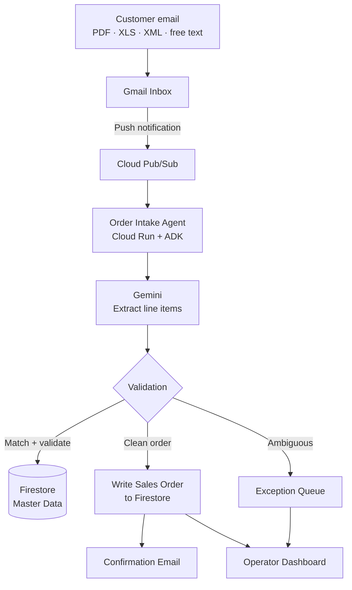

# Presentation Content — Order Intake Agent (for Kimi Slides)

> **Event:** Hack or Relay 5.0
> **Product scope for this deck:** Order Intake Agent only. No PO Confirmation.
> **How to use:** Each `## Slide N` block is one slide. Paste the whole file into Kimi Slides; it will infer slide breaks from the `## Slide` markers. Layout hints for Kimi are noted in italics under each slide title.
> **Placeholders:** Items in `[FILL: ...]` are stakeholder-supplied and should be replaced before presenting.

---

## Slide 1 — Title

*Layout hint: centered title slide, no body.*

**Title:** [FILL: Final project name — working title is "Order Intake Agent"]
**Subtitle:** The inbox, automated.
**Footer:** Hack or Relay 5.0 · [FILL: Team name] · [FILL: Date]

---

## Slide 2 — The Problem, The Product, The Audience

*Layout hint: three short stacked sections on one slide, each with a bold heading and 2–3 bullets.*

**The problem**
- B2B customers still place orders by email — free text, PDFs, spreadsheets, XML — not through clean APIs.
- A human reads every one, retypes line items into the ERP, matches products to the catalog, checks prices and quantities, and writes back a confirmation.
- The work is slow, error-prone, and almost entirely pattern-matching.

**What we're building**
- **Order Intake Agent** — an AI agent that watches a shared inbox, understands incoming orders in any format, matches line items to the product catalog, validates them, writes a clean sales order, and replies to the customer.
- Ambiguous orders don't get guessed at — they go to an exception queue where an operator decides.

**Who it's for**
- Mid-market B2B distributors, wholesalers, and manufacturers whose order desk lives in an inbox.
- Primary operator: customer service / order entry staff. Primary buyer: [FILL: Head of Operations / Supply Chain Director].

---

## Slide 3 — Tech Stack

*Layout hint: a single clean table, or a 2-column "layer → technology" list. No narrative text.*

| Layer | Technology |
|---|---|
| Agent framework | **Google ADK** (Agent Development Kit) |
| Reasoning model | **Gemini** |
| Data layer | **Firestore** (master data + sales orders + dashboard feed) |
| Event bus | **Cloud Pub/Sub** (Gmail push → agent trigger) |
| Compute | **Cloud Run** (stateless agent hosting) |
| Inbox integration | **Gmail API** (read inbound, send confirmations) |
| Frontend | **Firebase Hosting** + SPA dashboard |
| Language | **Python 3.13** |

**Note for technical audience:** For the demo, Firestore stands in for the ERP — "write to ERP" means "write to Firestore." A production deployment would add a thin adapter to the customer's system of record.

---

## Slide 4 — Workflow

*Layout hint: **two-column slide**. LEFT column = the Mermaid diagram, rendered large. RIGHT column = the narrative below. Keep the diagram and narrative side-by-side.*

**LEFT — Diagram**

**RIGHT — Explanation**

An order arrives in a shared Gmail inbox in whatever format the customer prefers — a free-text email, a scanned PDF, a spreadsheet, or an XML file. Gmail's push notification fires a Pub/Sub event that wakes the agent running on Cloud Run.

The agent reads the message and any attachments and hands them to Gemini, which extracts the structured line items — product references, quantities, delivery dates, and any special instructions — regardless of how the customer formatted them.

Each extracted line is then checked against the product catalog stored in Firestore. Exact matches pass straight through. Fuzzy matches are scored. Quantities, prices, and customer-specific rules are validated in the same step.

From here the agent makes a clean, binary decision. If the order is unambiguous, a sales order is written to Firestore and a confirmation email goes back to the customer automatically. If anything is unclear — an unrecognized product, a price that looks wrong, an incomplete address — the order lands in an exception queue on the operator dashboard, where a human takes over. The operator sees exactly what the agent saw and what it was unsure about, so the handoff is instant.

The dashboard is the single pane of glass for the order desk: live view of everything the agent has processed, everything waiting on a human, and the full audit trail for each decision.

---

## Slide 5 — Why It Works, Why It's Different, How It Makes Money

*Layout hint: three short columns or three stacked sections on one slide.*

**Real-world feasibility**
- Unstructured-document understanding is a solved problem in 2026 — Gemini handles messy PDFs and free-text emails well enough for production.
- The integration surface is narrow: Gmail in, Firestore out. No on-prem plumbing required for a pilot.
- Failure mode is safe: the agent either writes a clean order or routes to a human. Nothing irreversible happens without confidence.
- The work being displaced is already a line item on the customer's payroll, which makes ROI easy to model.

**What makes it different**
- **Format-agnostic.** Not an OCR pipeline with hand-tuned templates — one agent that reasons across free text, PDF, spreadsheets, and XML through the same extraction path.
- **Human-in-the-loop by design.** The exception queue is a first-class surface, not an afterthought. Operators stay in control of anything ambiguous.
- **Demo-able in two minutes.** A judge can send a real email and watch the sales order land in the dashboard before a slide transition finishes.
- **Google-Cloud-native.** ADK + Gemini + Firestore + Pub/Sub is the intended-path stack, not a retrofit.

**Business model — B2B SaaS**
- Sold to distributors, wholesalers, and mid-market manufacturers.
- Priced on volume: [FILL: per order processed, with a monthly minimum — confirm].
- Single-tenant deployment per customer; data isolation is non-negotiable in this buyer segment.
- Not freemium, not ad-supported, not B2C. The value unit is recovered operator hours — that's an enterprise budget line.

---

## Slide 6 — The Demo

*Layout hint: short, confident slide. Title plus 4–5 bullets. No diagram.*

**Title:** What we're showing you right now

- A real customer email lands in a real Gmail inbox.
- The agent reads it, extracts the line items, and matches them against a realistic product catalog.
- A clean sales order appears in Firestore and the operator dashboard updates live.
- A confirmation email goes back to the customer — end to end, no human in the loop.
- One deliberately ambiguous order is included so you can see the exception path and how operator feedback closes the loop.

---

## Appendix — Notes for the presenter

- Slide 4 is the spine of the deck — budget the most spoken time here. The diagram does the work; the narrative fills in tone.
- Slide 5 is dense by design (three sections on one slide). Don't read every bullet — pick one from each column and let the slide support the point.
- The "Firestore is the ERP" note on Slide 3 is honesty for technical judges. Keep it.
- If asked about PO follow-up or supplier confirmation, that's explicitly out of scope for this deck — redirect to "we're focused on the intake half of the order lifecycle."
