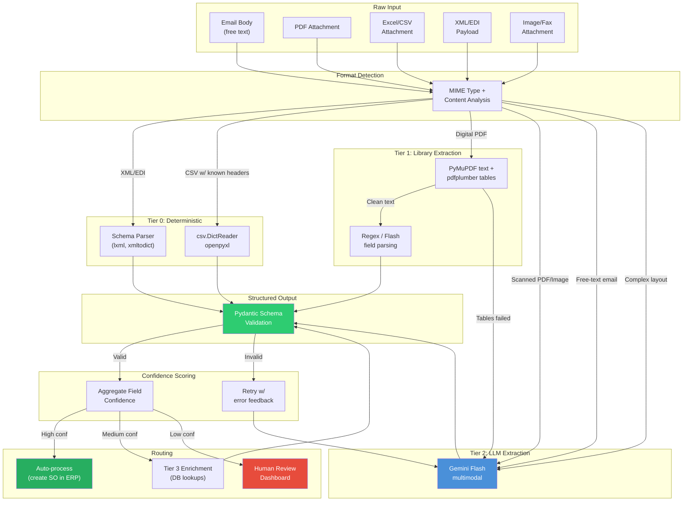

# Multi-Format Document Processing

> [!info] Context — Part of [[Glacis-Agent-Reverse-Engineering-Overview]]. Depth level: 2. Parent: [[Glacis-Agent-Reverse-Engineering-Order-Intake-Agent]]

Orders do not arrive in one format. They arrive in every format. A single shared inbox might contain free-text email bodies ("Hey, need 200 units of Dark Roast 5lb by Friday"), PDF attachments (formal purchase orders with line item tables), Excel spreadsheets (distributor reorder templates), CSV dumps from legacy EDI connectors, XML payloads from the rare customer who actually integrated, and scanned images of faxed handwritten forms. Glacis's whitepaper describes a $10B manufacturer whose customer service reps spent 8-15 minutes per order manually reading these formats and typing them into the ERP. The AI agent does it in under 60 seconds. This note explains how.

The core design insight: this is not one problem, it is a tiered extraction problem. Most formats have cheap deterministic solutions. The LLM handles what cheap methods cannot. Running every document through Gemini Flash works, but it wastes tokens on problems that `openpyxl` or `csv.DictReader` solve for free.

---

## The Problem

### The Format Zoo

Every customer sends orders differently, and they will never standardize. This is the Anti-Portal principle from [[Glacis-Agent-Reverse-Engineering-Anti-Portal-Design]] applied to inbound documents: the system adapts to humans, never the other way around. Here is what actually arrives in a shared order inbox:

| Format | % of Orders (typical) | Extraction Difficulty | Example |
|--------|:--------------------:|:--------------------:|---------|
| Structured Excel/CSV | 15-25% | Low | Distributor reorder template with SKU, qty, date columns |
| Digital-native PDF | 20-30% | Medium | Formal PO with embedded text layer, tables, headers |
| Free-text email body | 15-25% | Medium-High | "Please ship 50 cases of item #4420 to our DC in Atlanta" |
| Scanned/image PDF | 10-20% | High | Photographed or faxed PO, no text layer |
| XML/EDI | 5-10% | Trivial | Structured payloads, direct field mapping |
| Mixed (email + attachment) | 10-20% | High | Email says "see attached PO" but also contains special instructions not in the PDF |

The difficulty is not just extraction accuracy. It is the combinatorial explosion of variations within each format. Pallet's engineering blog documents 500+ BOL templates in active use across North American carriers alone. For purchase orders the number is worse — every customer has their own template. The Glacis whitepaper describes 17+ alternative field label variations that their extraction prompts must handle: "Quantity" vs "Qty" vs "QTY" vs "Qty Ordered" vs "Order Qty" vs "Units" vs "Pcs" vs "Pieces" vs "Count" vs "Amount" vs "No. of Units" and so on. A rule-based system needs a rule for each one. An LLM understands them all because it understands what the field *means*, not what the label *says*.

### Why Traditional OCR Fails

The two-stage OCR pipeline — convert pixels to text, then apply template rules to extract fields — has compounding failure modes. Stage 1 (OCR accuracy) drops below 80% for handwritten dock forms, creased paper, smartphone photos. Stage 2 (template matching) fails whenever a new customer sends an unfamiliar layout. A 90% success rate at each stage compounds to 81% end-to-end. For supply chain operations where a single wrong SKU routes inventory to the wrong warehouse, 81% is not close to acceptable.

Alan Engineering's production pipeline blog (March 2026) identified a subtler problem: even when OCR text is perfect, you lose layout context. A PDF table where "Qty: 200" sits directly below "Item: 4420" has an implicit spatial relationship that plain OCR text destroys. The multimodal approach — feeding both the OCR transcription *and* the document image to the LLM — preserves this relationship. Their finding: "Transcription provides reliable text; image provides visual layout context." Together they beat either alone.

---

## First Principles

This is a tiered extraction problem. The design principle is simple: use the cheapest method that produces reliable output for each format, escalate to more expensive methods only when cheap ones fail.

**Tier 0 — Deterministic (free).** Structured formats with known schemas. XML/EDI payloads parse directly into structured data with a schema definition. CSV and well-formed Excel files with known column headers extract via `openpyxl` or `csv.DictReader`. No LLM needed. Zero cost. Near-perfect accuracy.

**Tier 1 — Library extraction (near-free).** Digital-native PDFs with embedded text layers. PyMuPDF (`fitz`) extracts the text for free — Gemini does not even charge tokens for embedded text in PDFs. For PDFs with clear tabular structure, `pdfplumber` or `camelot` can extract tables into DataFrames. The text is clean and complete; the challenge is parsing it into the right fields. A lightweight LLM call (Gemini Flash) or even regex patterns can handle the parsing.

**Tier 2 — LLM extraction (cheap).** Documents that require visual understanding: scanned PDFs, images, handwritten forms, and complex multi-layout templates. This is where Gemini Flash earns its keep. ~258 tokens per page for image processing. A 3-page PO costs roughly $0.002 with Flash pricing. The model handles 500+ template variations without any template configuration because it understands document semantics, not pixel coordinates.

**Tier 3 — LLM extraction with enrichment (moderate).** Ambiguous documents that need cross-reference context to resolve. An email body that says "same order as last week" requires looking up the previous order. A PO that uses customer-specific SKUs ("DMR-5LB") requires mapping against the product master. This tier combines Tier 2 extraction with database lookups and a second LLM pass for resolution.

**Tier 4 — Human review (expensive).** Documents where automated confidence is below threshold. Illegible handwriting, contradictory information within the document, formats never seen before. The agent routes these to the operator dashboard with the original document displayed alongside the best-effort extraction, low-confidence fields highlighted. The operator corrects, the correction feeds back into the learning loop.

The critical design decision: **separate pure parsing from post-processing enrichment**. Alan Engineering learned this the hard way. Their operators enriched extraction results with context from external lookups (customer history, product catalogs) and used those enriched results as few-shot training examples. When those examples entered the prompt, the LLM learned to hallucinate values it had never seen in the document — because the training examples contained values that did not come from the document. The fix is architectural: Tier 2 extraction produces *only* what the document says. Tier 3 enrichment adds *only* what the database says. They never merge until both are independently validated.

---

## How It Actually Works

### The Pipeline



### Step-by-Step Walkthrough

**Step 1: Format Detection.** The entry point receives a raw message from the Gmail API via Pub/Sub (see [[Glacis-Agent-Reverse-Engineering-Email-Ingestion]]). Format detection is not guesswork — MIME types tell you what the attachment is. `application/pdf` is a PDF. `application/vnd.openxmlformats-officedocument.spreadsheetml.sheet` is an Excel file. `text/csv` is CSV. `text/plain` or `text/html` with no attachment is an email body order. The one nuance: a PDF might be digital-native (has embedded text) or scanned (image-only). PyMuPDF's `page.get_text()` returns empty for scanned PDFs — that is your signal to escalate to Tier 2.

```python
import fitz  # PyMuPDF

def classify_pdf(pdf_bytes: bytes) -> str:
    """Determine if PDF is digital-native or scanned."""
    doc = fitz.open(stream=pdf_bytes, filetype="pdf")
    total_text = sum(len(page.get_text().strip()) for page in doc)
    if total_text > 50:  # arbitrary but effective threshold
        return "digital_native"
    return "scanned"
```

**Step 2: Tier 0/1 Extraction.** For structured formats, extraction is deterministic. Excel files with known column headers map directly to order fields. CSV files parse with `csv.DictReader`. XML payloads validate against a schema. For digital-native PDFs, PyMuPDF extracts the full text and `pdfplumber` attempts table extraction. If the tables parse cleanly into DataFrames with recognizable column headers, a quick Gemini Flash call (or regex) maps them to order line items.

```python
import openpyxl
from pydantic import BaseModel, Field
from typing import Optional
from datetime import date

class OrderLineItem(BaseModel):
    sku: str
    description: Optional[str] = None
    quantity: float
    unit_price: Optional[float] = None
    requested_date: Optional[date] = None

class ExtractedOrder(BaseModel):
    customer_name: Optional[str] = None
    po_number: Optional[str] = None
    line_items: list[OrderLineItem]
    ship_to_address: Optional[str] = None
    special_instructions: Optional[str] = None
    confidence: float = Field(ge=0.0, le=1.0)

def extract_from_excel(file_bytes: bytes, column_map: dict) -> ExtractedOrder:
    """Tier 0: Deterministic extraction from Excel with known column mapping."""
    wb = openpyxl.load_workbook(io.BytesIO(file_bytes), read_only=True)
    ws = wb.active
    headers = [cell.value for cell in ws[1]]

    items = []
    for row in ws.iter_rows(min_row=2, values_only=True):
        row_dict = dict(zip(headers, row))
        items.append(OrderLineItem(
            sku=str(row_dict.get(column_map.get("sku", "SKU"), "")),
            description=row_dict.get(column_map.get("description", "Description")),
            quantity=float(row_dict.get(column_map.get("quantity", "Qty"), 0)),
            unit_price=row_dict.get(column_map.get("unit_price", "Price")),
        ))

    return ExtractedOrder(line_items=items, confidence=0.95)
```

The `column_map` parameter is key. Each customer's Excel template has different column headers. The first time a customer sends an Excel order, a human maps the columns. That mapping is stored in Firestore against the customer profile. Every subsequent order from that customer uses the stored mapping — zero LLM cost, near-perfect accuracy.

**Step 3: Tier 2 LLM Extraction.** For scanned PDFs, images, free-text emails, and any document where Tier 0/1 failed, the document goes to Gemini Flash. The extraction prompt follows the pattern from [[Supply-Chain-Gemini-Vision-Documents]] — per-field confidence scoring, anti-hallucination instructions, and optional context enrichment. The critical addition for the Glacis build: the prompt includes 17+ field label variations so the model maps any label to the canonical field name.

```python
from google import genai
from google.genai import types

EXTRACTION_SYSTEM_PROMPT = """You are a supply chain order extraction specialist.
Extract order data from this document. The document may use any of these labels
for common fields:

- Quantity: Qty, QTY, Qty Ordered, Order Qty, Units, Pcs, Pieces, Count, Amount, No. of Units, EA
- SKU: Item #, Item No, Part Number, Part #, Material, Material No, Product Code, Catalog #, UPC
- Price: Unit Price, Price/Unit, Rate, Cost, Amount, Ext Price, Extended
- Delivery Date: Ship Date, Required Date, Need By, Deliver By, ETA, Due Date, Req Date
- PO Number: PO #, Purchase Order, Order #, Order Number, Reference, Ref #

For each field, return value + confidence (high/medium/low).
Return ONLY data visible in the document. Never infer values not present.
If a field is absent, return null with confidence "high" and note "not in document"."""

def extract_with_gemini(
    content: bytes,
    mime_type: str,
    customer_context: dict | None = None,
) -> ExtractedOrder:
    """Tier 2: Multimodal LLM extraction for complex/ambiguous documents."""
    client = genai.Client()

    parts = [
        types.Part.from_bytes(data=content, mime_type=mime_type),
        EXTRACTION_SYSTEM_PROMPT,
    ]

    response = client.models.generate_content(
        model="gemini-2.5-flash",
        contents=parts,
        config=types.GenerateContentConfig(
            response_mime_type="application/json",
            response_schema=ExtractedOrder,  # Pydantic schema → guaranteed valid JSON
            temperature=0.1,
        ),
    )

    return ExtractedOrder.model_validate_json(response.text)
```

Two things happening here that matter:

**`response_schema=ExtractedOrder`**: Gemini's structured output mode accepts a Pydantic model and guarantees the response is syntactically valid JSON conforming to that schema. This eliminates the entire class of "LLM returned malformed JSON" errors that plague production extraction pipelines. The output is always parseable. Always has the right fields. Always has the right types. You still need to validate *semantic* correctness (is the quantity reasonable? does this SKU exist?), but you never need to handle parse failures.

**`temperature=0.1`**: Low temperature for extraction tasks. You want the model to report what it sees, not get creative. Higher temperature increases the risk of hallucinated field values — exactly the failure mode the Glacis whitepaper warns about.

**Step 4: Pydantic Validation.** Every extraction — whether from Tier 0, 1, or 2 — passes through the same Pydantic schema. This is the single validation checkpoint. Pydantic catches type errors (quantity as string instead of float), missing required fields, and constraint violations. If validation fails, the extraction is retried with error feedback appended to the prompt — "Previous extraction failed validation: quantity must be a positive number, got -50."

**Step 5: Confidence Scoring.** Each extraction carries per-field confidence from the LLM (high/medium/low for Tier 2) or a fixed confidence value (0.95 for Tier 0, since deterministic extraction rarely fails). The aggregate confidence determines routing: all-high goes to auto-processing, any-low goes to human review, mixed goes to Tier 3 enrichment for database cross-referencing.

**Step 6: Routing.** High-confidence extractions proceed directly to sales order creation in the ERP (Firestore in our build). Medium-confidence extractions go through [[Glacis-Agent-Reverse-Engineering-Validation-Pipeline]] for enrichment — item matching against the product master, price validation against the price list, credit check against the customer profile. Low-confidence extractions route to the human review dashboard where the operator sees the original document side-by-side with the extracted fields, low-confidence values highlighted.

---

## The Tradeoffs

### Token Cost vs. Accuracy

The all-LLM approach is simpler to build — send everything through Gemini, skip the tiering logic. For a hackathon demo, this is a legitimate choice. But in production at scale, the math matters.

| Approach | Cost per 1000 orders | Accuracy | Build Complexity |
|----------|:-------------------:|:--------:|:----------------:|
| All-Gemini-Pro | ~$15-25 | 95-98% | Low |
| All-Gemini-Flash | ~$3-5 | 92-96% | Low |
| Tiered (deterministic + Flash) | ~$0.50-2 | 94-97% | Medium |
| Traditional OCR + rules | ~$5-10 | 75-85% | High |

The tiered approach costs 5-10x less than all-Pro while matching or exceeding accuracy on structured formats (where deterministic extraction is basically perfect). The build complexity is real — you are maintaining format detection logic, column mappers, PDF classifiers, and fallback chains. But the operational cost savings compound daily.

### Multimodal vs. Text-Only

Alan Engineering's finding is unambiguous: OCR text + document image beats either alone. But there is a practical nuance. For digital-native PDFs with clean embedded text, the visual image adds minimal value — the text layer is complete and accurate. The image helps when text extraction is lossy: scanned documents, handwriting, complex table layouts where spatial relationships matter.

The pragmatic decision: use text-only extraction for digital-native PDFs (cheaper, faster), use multimodal for everything else. PyMuPDF's `get_text()` output quality is your switching signal.

### Structured Output vs. Free-Form + Parsing

Gemini's structured output mode (passing a Pydantic schema as `response_schema`) guarantees syntactically valid JSON. The alternative is free-form generation followed by JSON parsing and error handling. Structured output wins on reliability but has constraints — the schema must be expressible in JSON Schema, and deeply nested or highly dynamic schemas can be awkward. For order extraction, the schema is straightforward enough that structured output is the clear winner.

---

## What Most People Get Wrong

### Few-Shot Contamination

This is the most dangerous mistake in production extraction pipelines, and Alan Engineering documented it clearly. The failure mode:

1. You build few-shot examples from real extractions
2. Your operators enrich those extractions — adding product catalog lookups, cross-referencing customer history, filling in implied delivery addresses from past orders
3. Those enriched results become few-shot examples in the extraction prompt
4. The LLM now "extracts" values that were never in the document — it learned them from the examples
5. A new document arrives. The LLM confidently returns a delivery address that is not written anywhere in the document. It looks correct (it is the customer's usual address) but it is hallucinated. The actual document specified a different address for this order.

The fix is architectural, not prompting. Extraction examples must contain *only* values present in the source document. Enrichment happens in a separate, downstream step. The two must never contaminate each other. In practice: the extraction prompt gets few-shot examples from raw document-to-extraction pairs. The enrichment step gets its context from database queries. They are different functions, different prompts, different data flows.

### Trusting LLM Output Without Validation

"Gemini returned valid JSON, so the extraction is correct." No. Syntactically valid JSON can contain semantically wrong values. A quantity of 50,000 when the customer's typical order is 50. A unit price of $0.01 when the product costs $10. A delivery date in the past. Pydantic schema validation catches type errors but not business logic errors.

The [[Glacis-Agent-Reverse-Engineering-Validation-Pipeline]] exists precisely for this. Every extraction must pass through business rule validation: quantity within historical range for this customer-product pair, price within tolerance of the master price list, delivery date in the future and within lead time constraints. The Generator-Judge pattern from [[Glacis-Agent-Reverse-Engineering-Generator-Judge]] applies here — the generator extracts, the judge validates.

### Skipping the Classification Step

Many teams jump straight from "I have a PDF" to "extract all the fields." But a purchase order and a product catalog are both PDFs. An email body might contain an order, a shipping inquiry, a complaint, or spam. Without classification, the extraction prompt does not know what schema to apply, and "extract everything" prompts produce unreliable results because the model does not know what it is looking for.

The classification step is lightweight — a single Gemini Flash call with a simple prompt: "Is this document a purchase order, a price inquiry, a shipping notification, or something else? Return the document type and your confidence." This call costs fractions of a cent and prevents the much more expensive extraction call from running on irrelevant documents. Glacis's 5-stage pipeline (from the Alan blog analysis) lists Classification as Stage 2, right after OCR Transcription and before Extraction. It is not optional overhead — it is a reliability requirement.

---

## Connections

- **Parent**: [[Glacis-Agent-Reverse-Engineering-Order-Intake-Agent]] — the full Order Intake workflow that this document processing pipeline serves
- **Sibling**: [[Glacis-Agent-Reverse-Engineering-Validation-Pipeline]] — takes extraction output and validates against business rules, product master, price lists
- **Sibling**: [[Glacis-Agent-Reverse-Engineering-Token-Optimization]] — cost optimization strategies including the tiered approach described here
- **Child**: [[Glacis-Agent-Reverse-Engineering-Email-Ingestion]] — Gmail API + Pub/Sub architecture that feeds raw messages into this pipeline
- **Companion research**: [[Supply-Chain-Gemini-Vision-Documents]] — Gemini vision document processing for the broader SCM platform (BOLs, PODs, invoices)
- **Design constraint**: [[Glacis-Agent-Reverse-Engineering-Anti-Portal-Design]] — the Anti-Portal principle that drives the "accept any format" requirement
- **Competitor patterns**: [[Glacis-Agent-Reverse-Engineering-Competitor-Landscape]] — how Pallet, Tradeshift, Esker, Basware approach the same problem
- **Validation**: [[Glacis-Agent-Reverse-Engineering-Generator-Judge]] — the Generator-Judge pattern applied to extraction confidence

---

## Subtopics for Further Deep Dive

1. **Email Body NLP Extraction** — Parsing unstructured free-text orders from email bodies; handling conversational ordering ("same as last time but add 10 cases of the new roast"); intent classification for mixed emails
2. **Customer-Specific Template Learning** — How the system learns a new customer's Excel/PDF template from the first manual mapping and automates subsequent orders; the column mapper registry in Firestore
3. **Handwriting Recognition Strategies** — Gemini vision for dock-worker handwriting; contextual disambiguation (weight fields contain numbers, city fields contain locations); confidence thresholds for handwritten vs. printed fields
4. **Multi-Document Order Assembly** — Orders that span multiple documents: email body with special instructions + PDF attachment with line items + Excel attachment with delivery schedule; merging extractions from multiple sources into one order
5. **Extraction Prompt Engineering** — The 17+ field label variations; few-shot example curation without contamination; prompt versioning and A/B testing for extraction accuracy
6. **Confidence Calibration** — Empirical measurement of Gemini's self-assessed confidence vs. actual accuracy; calibration curves; threshold tuning for auto-process vs. human-review routing
7. **Retry and Self-Correction Patterns** — LlamaIndex's "agentic parser" approach: multi-pass extraction where the second pass reviews and corrects the first; error feedback loops; when retry improves accuracy vs. when it just wastes tokens

---

## References

- Glacis, "How AI Automates Order Intake in Supply Chain," Dec 2025 — $10B manufacturer case study, 8-15 min → <60 sec, 17+ field label variations
- Glacis, "AI For PO Confirmation V8," March 2026 — >99% accuracy at Knorr-Bremse, Anti-Portal approach
- Alan Engineering Blog, "5-Stage Document Extraction Pipeline," March 2026 — OCR + classification + extraction + validation + human review; few-shot contamination warning; multimodal superiority finding
- Pallet Engineering Blog, "AI-Powered OCR in Logistics," 2025 — 500+ BOL templates, natural language prompts replacing traditional OCR
- LlamaIndex, "Agentic Document Parser" — multi-pass self-correction with confidence scoring
- Gemini API Documentation, "Document Understanding" — 258 tokens/page for images, free embedded text extraction, 1000-page limit, structured output with Pydantic schemas
- Basware, "Smart PDF" — ML trained on 2.3 billion invoices, 97% accuracy, zero-config extraction
- Esker, "DeepRead" — custom Transformer architecture for invoice extraction, 92% accuracy
- Tradeshift, "Ada AI" — AWS Textract (OCR) + LLM hybrid approach
