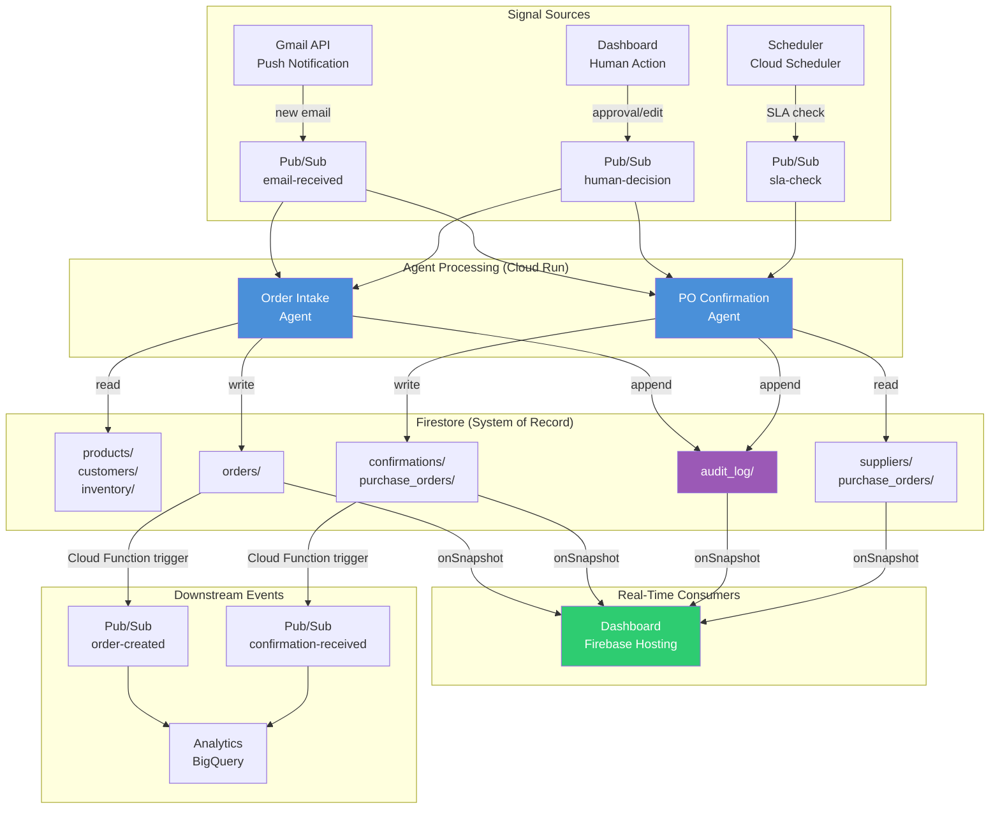

# ERP Integration and Sync Patterns

> [!info] Context — Part of [[Glacis-Agent-Reverse-Engineering-Overview]] deep dive. Depth level: 2. Parent: Both agents — [[Glacis-Agent-Reverse-Engineering-Order-Intake-Agent]] and [[Glacis-Agent-Reverse-Engineering-PO-Confirmation-Agent]]

## The Problem

Every AI agent demo eventually hits the same wall: where does the data live?

Enterprise supply chain runs on ERP systems. SAP, Oracle, Dynamics 365, BlueYonder, Manhattan Associates, Kinaxis. These systems are the gravitational center of operations — purchase orders, sales orders, inventory levels, supplier records, pricing contracts, credit limits. They represent decades of configuration, millions in consulting spend, and the collective institutional knowledge of how a company actually operates. No enterprise will rip out SAP for your AI agent. Not for a pilot. Not for a proof of concept. Not ever.

This creates a fundamental tension for anyone building AI agents that touch supply chain execution. The agent needs to read current state from the ERP (what's the contracted price for this customer? what's the inventory level for this SKU? is this supplier on a credit hold?). And the agent needs to write results back to the ERP (create a sales order, update a PO confirmation, flag an exception). But the ERP is a fortress — locked down by IT, governed by change advisory boards, protected by years of compliance audits. Getting API access takes months. Getting write access takes an act of God.

For a hackathon, you face the inverse problem. There is no ERP. You have no SAP instance, no Oracle database, no master data repository. You need something that can simulate the role of an ERP — hold master data, accept writes from agents, serve real-time reads to a dashboard, and maintain a complete audit trail — while also being buildable in days, not months. And whatever you pick needs to convincingly demonstrate the patterns that would work against a real ERP in production.

These two problems — "how do you integrate with an ERP you can't modify?" and "how do you simulate an ERP you don't have?" — converge on the same architectural pattern.

## First Principles

Glacis calls their approach the "non-invasive wrapper." The idea: the AI agent sits outside the ERP, reads from it through existing integration points (APIs, flat-file exports, database views), processes data independently, and writes results back through those same integration points. The ERP stays untouched. No custom modules installed. No schema modifications. No middleware to maintain inside the ERP's perimeter.

This is not a new pattern. It is the adapter pattern from software engineering applied to enterprise systems. The adapter translates between the agent's internal data model and the ERP's external interface without modifying either side. What makes Glacis's implementation distinctive is the scope of the claim: "ERP stays in sync, 24/7," with "every update fully auditable: the original email, what action the AI took, and who approved it." They report 2-week implementation timelines through lightweight email integration — meaning the initial integration path is email monitoring, not deep API coupling.

Strip it down to first principles. An ERP integration layer for an AI agent needs exactly four capabilities:

**Read current state.** The agent must access master data (products, prices, customers, suppliers) and transactional state (open POs, inventory levels, credit status). This can be through REST APIs, database queries, flat-file exports, or — in Glacis's case — email content that contains order and confirmation data.

**Write results.** After the agent processes an order or confirmation, the output must flow back into the system of record. In production, this means creating sales orders or updating PO statuses in SAP via BAPIs or IDocs. In a prototype, this means writing structured documents to a database that acts as the system of record.

**Maintain sync.** Changes in the ERP (a manual price update, a new product added to the catalog, a supplier put on hold) must reach the agent's working data within a bounded time window. Stale master data is the fastest way to produce wrong results — the agent matches against a price that changed yesterday and auto-approves an order with the wrong price.

**Audit everything.** Every agent action — what it read, what it decided, what it wrote, who approved it — must be logged immutably. This is not a nice-to-have for supply chain. This is a compliance requirement. When a customer disputes an order or a supplier claims they never confirmed a PO, the audit trail is the single source of truth.

These four capabilities map directly onto the technology choice. For our hackathon build on Google's ecosystem, the answer is Firestore — and it handles all four natively.

## How It Actually Works

### Firestore as the System of Record

For the hackathon demo, Firestore serves a dual role: it is both the data store for the AI agents and the simulated ERP that holds master data. There is no separate ERP to integrate with. Firestore IS the ERP. This is a legitimate architectural choice, not a shortcut — it demonstrates the same data patterns that a production system would use against SAP, just with Firestore as the persistence layer instead of SAP's database.

The collection structure maps directly to the entities that both agents need:

```
firestore/
├── orders/                    # Sales orders (Order Intake Agent output)
│   └── {order_id}/
│       ├── status: "pending" | "confirmed" | "exception" | "completed"
│       ├── customer_id, po_number, line_items[], ship_to
│       ├── validation_results: {price: "pass", inventory: "warn", ...}
│       ├── confidence_score: 0.0-1.0
│       ├── source_email_id: "gmail_msg_abc123"
│       └── created_by: "order_intake_agent"
│
├── purchase_orders/           # POs sent to suppliers (PO Confirmation Agent input)
│   └── {po_id}/
│       ├── status: "sent" | "awaiting_confirmation" | "confirmed" | "exception"
│       ├── supplier_id, line_items[], expected_delivery
│       ├── follow_up_count: 0
│       ├── last_follow_up: timestamp
│       └── confirmation_details: {confirmed_date, confirmed_qty, discrepancies[]}
│
├── products/                  # Product master (shared by both agents)
│   └── {sku}/
│       ├── description, aliases[], category
│       ├── unit_price, min_order_qty, case_pack_size
│       ├── embedding: vector(768)       # For similarity matching
│       └── lead_time_days: number
│
├── customers/                 # Customer master (Order Intake Agent)
│   └── {customer_id}/
│       ├── name, email, contract_prices: {sku: price}
│       ├── credit_limit, credit_used
│       ├── delivery_addresses: [{name, address}]
│       └── ordering_patterns: {avg_monthly_qty, typical_skus[]}
│
├── suppliers/                 # Supplier master (PO Confirmation Agent)
│   └── {supplier_id}/
│       ├── name, email, response_sla_hours: 48
│       ├── confirmation_rate: 0.94
│       └── escalation_contact: {name, email}
│
├── inventory/                 # Current stock levels
│   └── {sku}/
│       ├── available_qty, reserved_qty, incoming_qty
│       └── last_updated: timestamp
│
├── confirmations/             # Supplier confirmation records
│   └── {confirmation_id}/
│       ├── po_id, supplier_id, source_email_id
│       ├── confirmed_items: [{sku, qty, price, delivery_date}]
│       ├── discrepancies: [{field, expected, actual, severity}]
│       └── resolution: "auto_accepted" | "escalated" | "rejected"
│
└── audit_log/                 # Immutable audit trail
    └── {log_id}/
        ├── timestamp, agent_id, action_type
        ├── entity_type: "order" | "po" | "confirmation"
        ├── entity_id: reference to the affected document
        ├── input: {source_email_id, extracted_data}
        ├── output: {decision, confidence, result}
        ├── approval_status: "auto" | "human_approved" | "human_rejected"
        └── approved_by: null | user_id
```

Eight collections. Each maps to a real ERP entity. The `products/`, `customers/`, `suppliers/`, and `inventory/` collections are the master data layer — pre-seeded with synthetic data for the demo, equivalent to what you would read from SAP's material master, customer master, vendor master, and stock tables. The `orders/`, `purchase_orders/`, and `confirmations/` collections are the transactional layer — written by the agents as they process emails. The `audit_log/` collection is the compliance layer — append-only, never modified, never deleted.

### The Event Architecture

The agents do not poll Firestore for new work. Events flow through Pub/Sub, and Firestore is updated as a consequence of agent actions. The architecture looks like this:



Five Pub/Sub topics, organized by semantic event type:

| Topic | Publisher | Subscriber | Trigger |
|-------|-----------|------------|---------|
| `email-received` | Gmail API push | Order Intake Agent, PO Confirmation Agent | New email in monitored inbox |
| `human-decision` | Dashboard | Both agents (re-process after approval/edit) | Human approves, edits, or rejects |
| `sla-check` | Cloud Scheduler (every 4 hours) | PO Confirmation Agent | Time-based check for overdue confirmations |
| `order-created` | Firestore Cloud Function trigger | BigQuery sink, notification service | New order document written |
| `confirmation-received` | Firestore Cloud Function trigger | BigQuery sink, notification service | New confirmation document written |

The first three topics drive agent work. The last two are reactive — Cloud Functions on Firestore triggers detect new documents and fan out events for analytics and notifications. This separation matters: the agent's write path is Firestore only (one write, deterministic), while the fan-out to downstream systems happens asynchronously through triggers (eventual, decoupled).

### Real-Time Sync to the Dashboard

The dashboard subscribes to Firestore using `onSnapshot` listeners — not through Pub/Sub, not through polling. When the Order Intake Agent writes a new order document, every connected dashboard instance receives the update within milliseconds. No WebSocket server to build. No message broker to configure. Firestore's real-time protocol handles the fan-out natively.

Four listeners cover the full dashboard state:

1. **Orders listener**: `orders/` where `status in ["pending", "exception"]` — shows orders needing attention
2. **PO status listener**: `purchase_orders/` where `status == "awaiting_confirmation"` — shows overdue POs
3. **Confirmations listener**: `confirmations/` ordered by `timestamp desc`, limit 50 — live feed of incoming confirmations
4. **Audit listener**: `audit_log/` ordered by `timestamp desc`, limit 20 — real-time activity stream

The dashboard never fetches. It subscribes once on mount and receives push updates for the lifetime of the session. When a supply chain planner opens the dashboard in the morning, they see the current state instantly. When the Order Intake Agent processes an email at 2 AM, the planner sees it the moment they glance at the screen — no refresh button, no stale data.

### The Audit Trail

The `audit_log/` collection is the most important collection in the entire system from a compliance perspective. Every agent action produces an audit entry before the action's result is written to the transactional collections. The sequence is:

1. Agent receives event from Pub/Sub
2. Agent reads master data from Firestore
3. Agent processes (extraction, validation, routing decision)
4. Agent writes audit entry to `audit_log/` with full context
5. Agent writes result to transactional collection (`orders/` or `confirmations/`)

Steps 4 and 5 execute in a Firestore batch write — both succeed or both fail. The audit entry captures: the source email ID (so you can trace back to the original message), the extracted data (what the agent saw), the decision and confidence score (what the agent decided), the result (what the agent did), and the approval status (auto-executed or routed for human review). If a human later approves or edits in the dashboard, a second audit entry is appended — the original entry is never modified.

Firestore security rules enforce immutability on the audit collection:

```javascript
match /audit_log/{logId} {
  allow create: if request.auth != null;
  allow read: if request.auth != null;
  allow update, delete: if false;  // Immutable — no exceptions
}
```

This maps directly to Glacis's claim that "every update is fully auditable: the original email, what action the AI took, and who approved it." The audit collection is the receipt. When a customer calls to dispute an order, the support team queries `audit_log/` by `entity_id` and gets the full history: which email triggered it, what the agent extracted, which validations passed or failed, whether it was auto-executed or human-approved, and who approved it.

### How This Maps to Enterprise ERP Integration

Everything above describes the hackathon build where Firestore IS the ERP. In production, against a real SAP instance, the architecture changes in one specific way: the master data collections (`products/`, `customers/`, `suppliers/`, `inventory/`) become a cache layer rather than the source of truth. A sync process — running on Cloud Scheduler every N minutes, or triggered by SAP IDocs — pulls current master data from SAP and writes it to Firestore. The agents read from Firestore (fast, real-time capable), not from SAP directly (slow, connection-limited).

The transactional flow reverses direction: instead of the agent writing an order directly to `orders/` as the final destination, the agent writes to `orders/` as a staging area, and a separate integration service pushes confirmed orders into SAP via BAPI calls. The Firestore document tracks sync status: `erp_sync: "pending" | "synced" | "failed"`.

```
Hackathon:  Email → Agent → Firestore (source of truth) → Dashboard
Production: Email → Agent → Firestore (staging) → SAP (source of truth) → Firestore (sync back) → Dashboard
```

The agent code does not change between these two modes. It reads from Firestore and writes to Firestore regardless. The difference is what happens upstream (where master data comes from) and downstream (where transactional data goes). This is Glacis's "non-invasive wrapper" made concrete: the agent layer is decoupled from the ERP layer. You can swap SAP for Oracle for Dynamics 365 by changing the sync adapters, not the agent logic.

This is also why Glacis claims 2-week implementations. The initial deployment uses email as both input and output — the agent reads customer emails, processes them, and the results are reviewed in a dashboard. The ERP write-back is a Phase 2 concern. You can demonstrate full value (80% touchless order processing) before touching the ERP's write APIs at all.

## The Tradeoffs

**Firestore vs. PostgreSQL for the hackathon.** PostgreSQL gives you relational integrity, JOINs, and mature tooling. Firestore gives you real-time listeners out of the box, zero infrastructure management, native Google ecosystem integration, and a generous free tier (50K reads/day, 20K writes/day). For a supply chain demo where the dashboard showing live updates IS the demo, Firestore's real-time capability is not a nice-to-have — it is the feature that makes the 2-minute demo convincing. PostgreSQL would require building a WebSocket layer for live updates, which is buildable but burns days you do not have. Firestore wins on time-to-demo. PostgreSQL wins on long-term data integrity. For a hackathon, time-to-demo wins.

**Cache coherence in production.** When Firestore is a cache of SAP master data, you inherit the classic cache invalidation problem. A price changes in SAP at 10:01 AM. The cache sync runs at 10:15 AM. For 14 minutes, the agent validates orders against stale pricing. The mitigation: sync frequency tuned to business criticality (pricing every 5 minutes, inventory every minute, customer master every hour), plus a "last_synced" timestamp on every cached document that the agent can check. If the cache is older than the sync interval, the agent falls back to a direct ERP read. This adds latency but guarantees correctness for critical decisions.

**Audit trail storage costs.** An append-only audit log grows without bound. At 1,000 orders/day with an average audit document size of 2 KB, that is 2 MB/day, 730 MB/year. Trivial for Firestore pricing. But if you log the full extracted data (including base64-encoded PDF content), documents bloat to 50-100 KB each, and you hit 36 GB/year. The fix: store extracted data by reference (a Cloud Storage URI to the original attachment), not by value. The audit entry points to the evidence; it does not contain the evidence.

**Denormalization vs. consistency.** Firestore is a document database. There are no JOINs. If the Order Intake Agent needs customer data, delivery addresses, product details, and inventory levels, that is four collection reads minimum. You can denormalize — embed customer contract prices directly in the order document — but then a contract price change in the customer master does not automatically propagate to existing orders. The rule of thumb for this system: denormalize for read-heavy display data (dashboard needs it fast), normalize for write-path validation data (agent should always read the latest master data). Orders embed a snapshot of the data at creation time for audit purposes; validation always reads live master data.

**Cost at scale.** Firestore Enterprise pricing uses a chunk-based model (data processed, not operation count), which favors small-document, high-read workloads — exactly the supply chain dashboard pattern. At hackathon scale (hundreds of documents), cost is effectively zero. At production scale (millions of documents, thousands of concurrent listeners), the Firestore bill climbs. The escape hatch: BigQuery for historical analytics (export via scheduled Cloud Functions), keeping Firestore lean with only active/recent data. Firestore's new Pipeline operations (shipped January 2026) add server-side aggregation that reduces the need to export for basic analytics, but BigQuery remains the right tool for trend analysis over months of data.

## What Most People Get Wrong

**"Just use a REST API to the ERP."** This sounds obvious but fails in practice. ERP REST APIs are slow (200-500ms per call), rate-limited (SAP's OData endpoint typically allows 50-100 concurrent requests), and require VPN or private networking. An AI agent processing 100 orders simultaneously cannot make 400 SAP API calls per order (products, pricing, inventory, credit check) without hitting rate limits within seconds. The cache pattern — sync master data to Firestore, let agents read from Firestore — exists precisely because direct ERP reads do not scale to agent workloads. Glacis's "non-invasive wrapper" is not just about avoiding ERP modifications. It is about avoiding ERP load.

**"The audit trail is a logging concern, handle it later."** In supply chain, the audit trail IS the product. When Glacis says "every update is fully auditable," they are describing a feature that enterprise buyers evaluate during procurement. A supply chain AI agent without an audit trail is like an accounting system without a general ledger — technically functional, fundamentally untrustworthy. The audit collection must be designed and implemented from day one, not retrofitted. Retrofitting an audit trail means backfilling historical data that does not exist, which means fabricating evidence. Build it first.

**"Firestore can't handle enterprise workloads."** This was arguably true in 2020. It is not true in 2026. Firestore Enterprise offers 99.999% SLA (five nines), multi-region replication, Pipeline operations with 100+ query features, optional indexing for write-heavy workloads, and vector search for embedding-based matching. Google runs their own internal supply chain tooling on the same infrastructure. The legitimate concern is not capability but cost at extreme scale — and at extreme scale, you are making enough revenue to afford the bill or to justify a migration to Spanner.

**"Real-time sync means real-time consistency."** Firestore's real-time listeners deliver updates within milliseconds to connected clients. But "real-time" is a property of the notification path, not the data path. If the Order Intake Agent writes an order at timestamp T, and a concurrent PO Confirmation Agent reads inventory at timestamp T+1, the inventory read may not yet reflect the order's reservation. Firestore provides strong consistency for individual document reads and writes within a single region, but cross-collection consistency requires transactions. For the two-agent system, the critical transaction boundary is: "read inventory, check availability, reserve stock, create order" — these four operations must be atomic. Firestore transactions support this, but you have to use them explicitly. Outside transactions, you get eventual consistency across collections, which is fine for the dashboard but dangerous for business logic.

## Connections

The Firestore schema defined here feeds directly into [[Glacis-Agent-Reverse-Engineering-Firestore-Schema]], which provides the complete TypeScript/Python type definitions, composite index configuration, and security rules for every collection.

The Pub/Sub event architecture connects to [[Glacis-Agent-Reverse-Engineering-Event-Architecture]], which details the message schemas, dead-letter handling, exactly-once delivery guarantees, and the Cloud Function triggers that bridge Firestore writes to downstream events.

The audit trail pattern feeds into [[Glacis-Agent-Reverse-Engineering-Security-Audit]], which covers authentication, authorization, data encryption, and compliance requirements beyond just the audit log — including GDPR considerations for customer email content.

Both agents that read from and write to this data layer are detailed in [[Glacis-Agent-Reverse-Engineering-Order-Intake-Agent]] (customer-facing, writes to `orders/`) and [[Glacis-Agent-Reverse-Engineering-PO-Confirmation-Agent]] (supplier-facing, writes to `confirmations/` and updates `purchase_orders/`).

The existing wiki page [[firestore]] covers Firestore's general capabilities and its role in the broader supply chain architecture. The [[pub-sub]] wiki page covers Pub/Sub fundamentals. The [[event-driven-architecture]] wiki page covers the patterns (CQRS, outbox, saga) that this integration layer draws from.

## Subtopics for Further Deep Dive

| # | Subtopic | Slug | Why It Matters | Depth |
|---|----------|------|----------------|-------|
| 1 | Firestore Data Model & Schemas | [[Glacis-Agent-Reverse-Engineering-Firestore-Schema]] | Complete TypeScript schemas, composite indexes, security rules, migration strategy | Deep — production schemas need precision |
| 2 | Pub/Sub Event Architecture | [[Glacis-Agent-Reverse-Engineering-Event-Architecture]] | Message schemas, DLQ, exactly-once, Cloud Function triggers, fan-out patterns | Deep — event-driven is the nervous system |
| 3 | Security & Audit Architecture | [[Glacis-Agent-Reverse-Engineering-Security-Audit]] | Auth, encryption, GDPR, immutable audit log enforcement, SOC 2 alignment | Medium — patterns are established but critical |
| 4 | Metrics & Observability Dashboard | [[Glacis-Agent-Reverse-Engineering-Metrics-Dashboard]] | What to measure, how to display it, Firestore-to-dashboard materialized views | Medium — the demo depends on it |
| 5 | SAP/Oracle Sync Adapter Design | (future note) | Production-grade cache sync from enterprise ERP to Firestore, conflict resolution | Deep — bridges hackathon to production |

## References

### Primary Sources
- **Glacis Order Intake Whitepaper** (Dec 2025) — "Non-invasive wrapper" philosophy, "ERP stays in sync 24/7," 2-week implementation claims
- **Glacis PO Confirmation Whitepaper** (March 2026) — "Every update fully auditable: the original email, what action the AI took, and who approved it"

### Web Research
- [What Firestore Google Pub/Sub Actually Does and When to Use It — Hoop.dev](https://hoop.dev/blog/what-firestore-google-pub-sub-actually-does-and-when-to-use-it/) — Firestore-to-Pub/Sub event flow, IAM security patterns, message ID deduplication
- [Top 10 Agentic AI ERP Systems & 6 Solutions in 2026 — AIMultiple](https://research.aimultiple.com/agentic-ai-erp/) — API-first integration, RAG for non-invasive reads, RPA as legacy bridge, multi-agent event streaming
- [Supply Chain Trends for 2026: From Agentic AI to Orchestration — SAP](https://www.sap.com/india/blogs/supply-chain-trends-for-2026-from-agentic-ai-to-orchestration) — "Common real-time data foundation," autonomous decision triggers within guardrails
- [Firestore Pipeline Operations — Firebase Blog](https://firebase.blog/posts/2026/01/firestore-enterprise-pipeline-operations/) — 100+ new query features, optional indexing, server-side aggregations, Enterprise vs Standard positioning
- [Event-Driven Architecture with Pub/Sub — Google Cloud](https://docs.cloud.google.com/solutions/event-driven-architecture-pubsub) — Reference architecture for push-based event processing
- [Firestore Real-Time Queries at Scale — Firebase](https://firebase.google.com/docs/firestore/real-time_queries_at_scale) — Reverse query matcher, snapshot listener architecture
