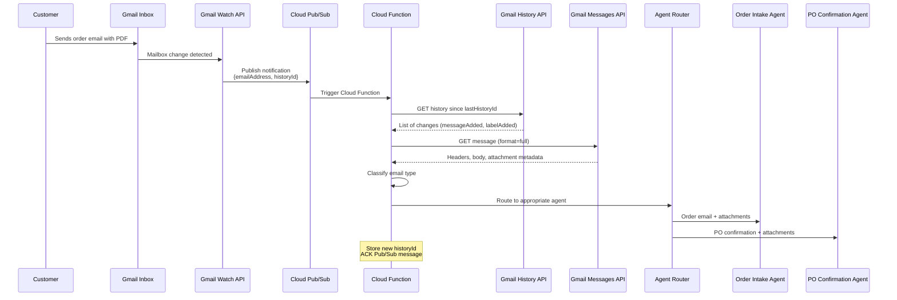

# Email Ingestion Architecture

> [!info] Context — Part of [[Glacis-Agent-Reverse-Engineering-Overview]]. Depth level: 3. Siblings: [[Glacis-Agent-Reverse-Engineering-Document-Processing]], [[Glacis-Agent-Reverse-Engineering-Event-Architecture]], [[Glacis-Agent-Reverse-Engineering-ADK-Order-Intake]]

Every architecture diagram for an AI agent shows arrows pointing from "data sources" into an "agent brain." The arrows are the easy part to draw and the hard part to build. For a supply chain agent that processes orders and PO confirmations from email, the ingestion layer is not a detail — it is the foundation. If email ingestion is unreliable, every downstream component — extraction, validation, ERP integration — inherits that unreliability. This note covers the complete architecture for getting emails from a shared Gmail inbox into an agent processing pipeline in real time.

The design target: sub-minute latency from email arrival to agent invocation, zero missed messages, and clean separation between the ingestion concern (getting the email) and the processing concern (understanding the email). Glacis's whitepapers describe agents monitoring shared group mailboxes and processing orders in under 60 seconds. That timing constraint starts here, at the inbox.

---

## The Problem

### Why Not Just Poll?

The naive approach is a cron job that calls the Gmail API every N seconds, lists unread messages, and processes them. It works for demos. It fails in production for three reasons.

**Latency vs. cost tradeoff.** Polling every 5 seconds means 17,280 API calls per day per inbox. The Gmail API quota is 250 units per second per user, but `messages.list` costs 5 units per call. For a single inbox this is manageable. For the multi-inbox reality of enterprise deployment — separate inboxes for orders, procurement, customer service, each potentially per-region — the quota math breaks fast. Reduce polling frequency to save quota and you increase latency. A 60-second polling interval means average latency of 30 seconds before you even know a message arrived, plus processing time. That eats your sub-minute budget.

**No change detection.** `messages.list` returns messages, but it does not tell you what changed since your last check. You must track state yourself — which message IDs you have already seen, handling the race condition where a message arrives between your list call and your state update. Every polling system eventually builds a janky version of what Google already provides natively.

**Wasted compute.** Most polling cycles return nothing. The inbox is idle 95% of the time, and your function runs 100% of the time. Serverless billing is per-invocation. You are paying to learn that nothing happened.

### The Push Model

Gmail's push notification system exists specifically to solve this. Instead of asking Gmail "got anything new?" thousands of times a day, you tell Gmail "notify me when something changes." The notification is delivered through Cloud Pub/Sub, which means your processing code is event-driven — it runs only when there is work to do. Zero wasted invocations, sub-second notification latency, and Google manages the delivery infrastructure.

---

## First Principles: How Gmail Push Notifications Work

### The Three-Layer Stack

The system has three layers, each with a distinct responsibility:

1. **Gmail Watch** — registers interest in mailbox changes, scoped by label
2. **Cloud Pub/Sub** — message bus that delivers change notifications
3. **History API** — retrieves the actual changes that triggered the notification

This separation is critical to understand. Gmail push notifications do not contain email content. They do not contain message IDs. They contain exactly two fields: the email address that changed and a `historyId`. That is it. The notification is a signal, not a payload. Your code must call back to the Gmail API to learn what actually happened.

This is a deliberate design choice. Pub/Sub messages have a 10MB limit, but that is not the reason — notification payloads are tiny. The reason is security and consistency. Email content never transits through Pub/Sub (which has its own IAM and could have different access controls). And by forcing your code to query the History API, Google ensures you always get the authoritative current state, not a potentially stale snapshot that was true at notification time but changed before you processed it.

### The Notification Payload

When a change occurs, Gmail publishes to your Pub/Sub topic. The Pub/Sub message contains a base64-encoded JSON payload:

```json
{
  "emailAddress": "orders@company.com",
  "historyId": "9876543210"
}
```

That `historyId` is a cursor. It points to a position in the mailbox's change log. You use it with the History API to fetch every change that occurred after the `historyId` you stored from your previous sync. This is the same principle behind database replication logs, Kafka offsets, and event sourcing — a monotonically increasing cursor that lets you ask "what happened since X?"

### Watch Registration

The `users.watch()` call registers a push notification subscription:

```
POST https://www.googleapis.com/gmail/v1/users/me/watch

{
  "topicName": "projects/myproject/topics/gmail-notifications",
  "labelIds": ["INBOX"],
  "labelFilterBehavior": "INCLUDE"
}
```

Response:

```json
{
  "historyId": "1234567890",
  "expiration": 1431990098200
}
```

The response gives you two things: the current `historyId` (your starting cursor — store it) and an expiration timestamp. Gmail watch registrations expire after 7 days. This is a hard constraint. You must re-register before expiration or you silently stop receiving notifications. No error, no warning — just silence.

The `labelIds` filter is important for our use case. A shared order inbox might have labels like "Orders/New", "Orders/Processing", "Orders/Complete". You can watch only specific labels, which means your agent only wakes up for relevant changes, not for every spam message or internal reply.

---

## How It Works: The Full Pipeline

### Architecture



### Step-by-Step Flow

**Step 1: Watch Registration (setup, not per-message).** At deployment and every 7 days thereafter, a Cloud Scheduler job calls `users.watch()` for each monitored inbox. The returned `historyId` is stored in Firestore. For multi-inbox deployments, each inbox has its own watch registration but can share the same Pub/Sub topic — the `emailAddress` field in the notification tells you which inbox changed.

**Step 2: Notification Delivery.** When a customer sends an order to `orders@company.com`, Gmail detects the mailbox change and publishes to the Pub/Sub topic. Pub/Sub delivers to a push subscription pointing at a Cloud Function (or Cloud Run service). Delivery latency is typically under 1 second.

**Step 3: History Fetch.** The Cloud Function decodes the base64 payload, extracts `emailAddress` and `historyId`, retrieves the last-stored `historyId` for that inbox from Firestore, and calls the History API:

```python
history = gmail.users().history().list(
    userId=email_address,
    startHistoryId=stored_history_id,
    historyTypes=["messageAdded"],
    labelId="INBOX"
).execute()
```

This returns a list of history records, each containing message IDs for messages that were added since the stored cursor. A single notification can cover multiple changes — if three emails arrived in rapid succession, one notification might cover all three.

**Step 4: Deduplication.** A single message can appear in multiple history records if multiple actions were taken on it (received + labeled). The Cloud Function deduplicates by message ID before processing. This is not optional — without deduplication you will process the same order twice, creating duplicate sales orders in the ERP.

**Step 5: Message Retrieval.** For each unique message ID, fetch the full message:

```python
message = gmail.users().messages().get(
    userId=email_address,
    id=message_id,
    format="full"
).execute()
```

The `format="full"` parameter returns headers, body, and attachment metadata (but not attachment content — that requires a separate call). Extract from `payload.headers`: Subject, From, To, Date, Message-ID, In-Reply-To (for thread tracking), References. Extract from `payload.parts`: body text (text/plain or text/html) and attachment stubs with `attachmentId`, `filename`, and `mimeType`.

**Step 6: Attachment Retrieval.** For each attachment part:

```python
attachment = gmail.users().messages().attachments().get(
    userId=email_address,
    messageId=message_id,
    id=attachment_id
).execute()
# attachment["data"] is base64url-encoded content
```

For large attachments, store the decoded bytes in Cloud Storage immediately rather than holding them in function memory. A Cloud Function has 512MB-8GB RAM depending on configuration, but a single email with multiple large PDF attachments can consume significant memory.

**Step 7: Classification and Routing.** With the email metadata, body, and attachments extracted, the Cloud Function classifies the email and routes it. Classification can be rule-based for the common cases (subject line contains "PO" or "Purchase Order" routes to PO Confirmation agent; emails from known customer domains route to Order Intake agent) with an LLM fallback for ambiguous cases. The classified message, along with attachment references, is published to an agent-specific Pub/Sub topic for asynchronous processing.

**Step 8: Cursor Update and ACK.** Store the new `historyId` in Firestore and return HTTP 200 to acknowledge the Pub/Sub message. The ordering matters: store the cursor before ACK. If you ACK first and crash before storing, the Pub/Sub redelivery will use the same notification, but your stored cursor will be stale, causing you to re-fetch changes you already processed (which is safe because of deduplication, but wasteful). If you store first and crash before ACK, Pub/Sub redelivers, you fetch from the new cursor, get no new changes, and ACK — clean.

---

## Multi-Inbox Architecture

Glacis describes agents that monitor "the procurement group mailbox" and integrate "via forwarding rules." In practice this means multiple inboxes:

| Inbox | Purpose | Watch Label | Routes To |
|-------|---------|-------------|-----------|
| `orders@company.com` | Customer order emails | INBOX | Order Intake Agent |
| `procurement@company.com` | Supplier PO confirmations | INBOX | PO Confirmation Agent |
| `cs@company.com` | Customer service (mixed) | INBOX | Classifier → either agent |
| CC-forwarding rule | Low-friction deployment | Specific label | Depends on source |

The CC-based integration Glacis describes is clever. Instead of asking the enterprise to grant API access to their primary mailbox (a security review nightmare), you create a dedicated Gmail workspace account and set up a CC rule or auto-forward from their existing inbox. The enterprise's email system stays untouched. The AI agent's inbox is a clean, dedicated processing queue with no legacy emails to filter through.

For the hackathon build, start with a single inbox. Multi-inbox is a deployment pattern, not an architecture change — the same Cloud Function handles all inboxes, distinguished by the `emailAddress` field in the notification payload.

---

## Thread Tracking

Supply chain orders involve conversation threads. A customer sends an order, the agent sends a confirmation, the customer replies with a correction ("actually make it 300 units, not 200"), and the agent must understand this is a modification to the original order, not a new order.

Gmail's `threadId` groups related messages automatically based on `In-Reply-To` and `References` headers. Your Cloud Function gets thread context for free:

```python
thread = gmail.users().threads().get(
    userId=email_address,
    id=thread_id,
    format="metadata",
    metadataHeaders=["Subject", "From", "Date"]
).execute()
# thread["messages"] contains all messages in the conversation
```

Pass the full thread context to the agent, not just the latest message. The agent needs conversation history to understand corrections, clarifications, and follow-ups. This maps directly to how [[Glacis-Agent-Reverse-Engineering-Exception-Handling]] describes clarification loops — the agent asks a question, the customer replies in the same thread, and the agent picks up the reply because it is watching the thread.

---

## Tradeoffs

### Push vs. Pull Pub/Sub Subscriptions

**Push subscriptions** (Pub/Sub POSTs to your Cloud Function URL) are simpler — no subscriber code, automatic triggering, native Cloud Functions integration. But they require a publicly accessible HTTPS endpoint, and if your function is slow or down, Pub/Sub retries with exponential backoff, potentially causing message reordering.

**Pull subscriptions** (your code polls Pub/Sub) give you flow control — you decide when to pull and how many messages to process at once. Better for high-volume scenarios where you want batch processing. But you need always-on compute (Cloud Run, GKE) rather than serverless functions.

For the hackathon build: push subscriptions. For enterprise scale: pull subscriptions with a Cloud Run service that can batch-process and manage backpressure.

### Watch Renewal Strategy

The 7-day watch expiration is a operational landmine. Options:

- **Cloud Scheduler cron** (recommended): Run `users.watch()` daily for each inbox. Daily is overkill but cheap and eliminates the "forgot to renew" failure mode. Cost: negligible (one API call per inbox per day).
- **Pre-expiration renewal**: Track expiration timestamps and renew with a buffer. More complex, same result, more failure modes.
- **Renewal on notification**: Re-register watch every time a notification arrives. Works for active inboxes, fails for quiet ones — if no email arrives for 7 days, the watch expires silently.

### History ID Gap Handling

What happens if your Cloud Function is down for an extended period and notifications pile up? When it comes back, the stored `historyId` might be too old — Gmail only retains history for a limited window (undocumented, but practically a few days to a week). If the `historyId` is invalid, the History API returns a 404. Your recovery path: call `messages.list` with a date filter to catch up, then re-register watch to get a fresh `historyId`. This is the polling fallback you hoped to avoid, but it only fires in disaster recovery scenarios.

---

## Misconceptions

### "Pub/Sub notifications contain the email"

They do not. The notification payload is `{emailAddress, historyId}` — two fields. You must call back to Gmail to get message content. Every tutorial that skips this detail sets you up for confusion when you try to read email content from the Pub/Sub message and find a 40-byte JSON blob.

### "One notification per email"

Gmail batches. If 5 emails arrive within a short window, you might get 1-2 notifications covering all of them via the History API. Your code must handle any number of new messages per notification, including zero (a notification can fire for label changes, not just new messages).

### "Watch is permanent"

It expires in 7 days. No warning. No error. Your agent silently stops receiving emails. This failure mode is invisible because there is no "notification not received" signal — absence of evidence is not evidence of absence. You will only notice when a customer calls asking why their order was not processed.

### "Gmail API is just for personal Gmail"

Google Workspace accounts (corporate Gmail) support the same API with the same push notification mechanism. The Workspace admin must enable API access and the OAuth consent screen must be configured for the organization's domain. For the CC-forwarding deployment model, the agent's dedicated inbox can be a standard Workspace account.

### "Attachments come with the message"

The `format="full"` response includes attachment metadata (filename, MIME type, size) but not the binary content. Attachment data requires a separate `messages.attachments.get()` call per attachment. For messages with 5 PDF attachments, that is 6 API calls total (1 message + 5 attachments). Budget your quota accordingly.

---

## Connections

- **[[Glacis-Agent-Reverse-Engineering-Overview]]** — this note implements the "Signal Ingestion" layer from the overview's architecture diagram
- **[[Glacis-Agent-Reverse-Engineering-Document-Processing]]** — downstream consumer; once this note extracts attachments, Document Processing handles the multi-format extraction (PDF, Excel, CSV, free text)
- **[[Glacis-Agent-Reverse-Engineering-Event-Architecture]]** — the Pub/Sub patterns here are a subset of the broader event-driven architecture; that note covers the full topic topology including agent-to-agent communication
- **[[Glacis-Agent-Reverse-Engineering-ADK-Order-Intake]]** — the Order Intake agent that receives classified and routed emails from this pipeline
- **[[Glacis-Agent-Reverse-Engineering-PO-Confirmation-Agent]]** — the PO Confirmation agent; same ingestion pipeline, different routing destination
- **[[Glacis-Agent-Reverse-Engineering-Exception-Handling]]** — thread tracking enables the clarification loops described in exception handling
- **[[Glacis-Agent-Reverse-Engineering-Anti-Portal-Design]]** — email-first design is a direct consequence of the anti-portal principle: meet users where they already work

---

## Subtopics for Further Deep Dive

- **OAuth 2.0 and Service Account Configuration** — how to authenticate for server-to-server Gmail API access in a Workspace domain, including domain-wide delegation vs. per-user consent flows
- **Pub/Sub Dead Letter Queues** — handling failed message processing without losing emails; DLQ configuration, retry budgets, and alerting
- **Multi-tenant Inbox Isolation** — when the agent serves multiple organizations, how to ensure inbox data does not cross tenant boundaries (separate topics vs. message attributes)
- **Email Parsing Edge Cases** — MIME multipart boundaries, inline images vs. attachments, winmail.dat (TNEF) from Outlook, character encoding mismatches in international supply chains
- **Rate Limiting and Quota Management** — Gmail API quota architecture (per-user vs. per-project), exponential backoff implementation, and quota reservation for batch catch-up operations

---

## References

- [Gmail API Push Notifications Guide](https://developers.google.com/workspace/gmail/api/guides/push) — official documentation for watch registration, Pub/Sub setup, and notification format
- [Gmail API History Guide](https://developers.google.com/workspace/gmail/api/guides/sync) — partial sync and history API documentation
- [Gmail API users.watch Reference](https://developers.google.com/gmail/api/reference/rest/v1/users/watch) — API reference for the watch method
- [Cloud Pub/Sub Push Subscriptions](https://docs.cloud.google.com/pubsub/docs/push) — push delivery configuration and retry behavior
- [Understanding Gmail's Push Notifications via Google Cloud Pub/Sub](https://medium.com/@eagnir/understanding-gmails-push-notifications-via-google-cloud-pub-sub-3a002f9350ef) — detailed walkthrough of the notification-to-history-to-message pipeline with deduplication patterns
- [Empower Your Gmail Inbox with Google Cloud Functions](https://codelabs.developers.google.com/codelabs/intelligent-gmail-processing) — Google codelab demonstrating Gmail push + Cloud Functions + Vision API for attachment processing
- [Realtime Gmail Listener (GitHub)](https://github.com/sangnandar/Realtime-Gmail-Listener) — reference implementation of Gmail push notifications with Cloud Run webhook proxy
- [Gmail Cloud Functions Demo (GitHub/GoogleCloudPlatform)](https://github.com/GoogleCloudPlatform/cloud-functions-gmail-nodejs) — official Google demo app for processing Gmail messages with Cloud Functions
- Glacis, "How AI Automates Order Intake in Supply Chain" (December 2025) — the primary whitepaper describing email-based order ingestion at enterprise scale
- Glacis, "AI For PO Confirmation" (March 2026) — companion whitepaper describing supplier response monitoring and email-first integration
