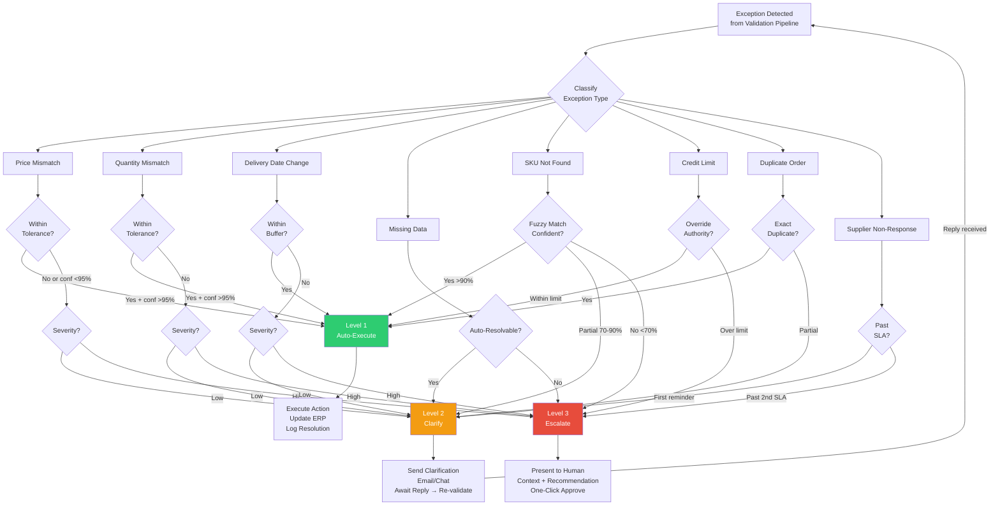

# Exception Handling and Escalation

> [!info] Context
> Depth level: 2. Parent: Both agents. Sibling notes: [[Glacis-Agent-Reverse-Engineering-Validation-Pipeline]], [[Glacis-Agent-Reverse-Engineering-SOP-Playbook]], [[Glacis-Agent-Reverse-Engineering-Order-Intake-Agent]], [[Glacis-Agent-Reverse-Engineering-PO-Confirmation-Agent]]

## The Problem

Every supply chain order carries exceptions. Not some orders — every order, eventually. A customer writes "Dark Roast 5lb" but your catalog lists "DR-5LB-001." A supplier confirms a PO but changes the delivery date by three days. A price on the confirmation is 4% higher than contracted. A FedEx account number is missing from the ship-to address.

The naive approach is binary: automate the happy path, dump everything else on a human. This is what most enterprise systems do. The result is predictable. At Pfizer before automation, every single non-EDI order required human intervention — 8 to 15 minutes of manual work per order, 40-60% of a CSR's day lost to data entry, and a 1-4% error rate that cascaded into downstream OTIF failures. On the procurement side, 60-70% of a buyer's workload went to PO confirmation activities: managing incoming confirmations (30%), updating ERP (20%), resolving exceptions (20%). A $1.5B CPG manufacturer needed 30 FTEs at $1.9M annual cost to process 35,000 POs per year.

The problem is not that exceptions exist. The problem is that most exceptions do not require human judgment — they require structured resolution. A missing ship-to address needs a clarification email, not a buyer's attention. A 2% price variance within tolerance needs auto-acceptance and a log entry, not an escalation ticket. The actual decision points — "should we accept a 15% price increase from our sole-source supplier?" — are rare. Glacis's data shows that with proper exception handling, 80-92% of orders become touchless. That means the exception handling system is not an edge case handler. It is the core product.

## First Principles

Exception handling is a routing problem. Strip away the supply chain context and what remains is a universal pattern: an input arrives, it fails some validation, and you need to decide what to do about it. The decision has exactly four dimensions:

**Classification**: What kind of exception is this? Price mismatch, quantity discrepancy, missing data, delivery date change, unknown SKU, credit limit exceeded, duplicate order, supplier non-response. Each type has fundamentally different resolution paths. A missing FedEx account number resolves with a clarification email. A price mismatch above tolerance resolves with human negotiation. Routing them through the same path wastes time and attention.

**Severity assessment**: How bad is this? A $0.03 price variance on a $500 order is noise. A $50 price variance on the same order is a negotiation trigger. A delivery date slip of 1 day within buffer is acceptable. A 3-week slip on a production-critical part is a crisis. Severity is never absolute — it depends on the business context: tolerance thresholds, item criticality, customer tier, order value.

**Confidence scoring**: How sure is the agent about its understanding of the exception? Did it clearly extract a price of $12.50 from a structured PDF, or did it infer "$12.50?" from a blurry handwritten fax? Confidence in extraction accuracy is different from confidence in the appropriate resolution. The agent might be 99% sure about what the data says but only 60% sure about what to do about it.

**Autonomy matching**: Given the type, severity, and confidence, what level of autonomy is appropriate? This is the routing decision. The answer maps to exactly three levels: auto-execute, clarify, or escalate.

```
Exception → Classify → Assess Severity → Score Confidence → Route to Autonomy Level
```

This is the same pattern used in hospital triage, incident management, and customer support routing. The supply chain version just has domain-specific classification categories and severity functions.

## How It Actually Works

Glacis implements a 3-level autonomy system. This is not a spectrum — it is three discrete operating modes with hard boundaries between them.

### The Decision Tree



### Level 1: Auto-Execute

**Trigger**: Data is complete, validates against all business rules, confidence exceeds 95%. The agent creates the order in ERP, updates the confirmation status, or accepts the variance automatically.

**Concrete examples**:
- Order Intake: Customer sends a PDF with 10 line items. All SKUs match the catalog exactly. All prices match the contracted rate. Quantities are within normal order patterns. Ship-to address is on file. Credit check passes. The agent creates the sales order and sends an acknowledgment email. Zero human involvement.
- PO Confirmation: Supplier confirms all 5 line items at exact PO prices and quantities. Delivery dates are within the requested window. The agent updates the ERP purchase order status to "confirmed" and logs the confirmation.
- Price Mismatch: Supplier quotes $10.23 vs contracted $10.20. The SOP playbook says price variances under 1% are auto-accepted. 0.29% is under 1%. Auto-accept, log the variance, update ERP.

**The 95% threshold is not arbitrary**. Production data from Galileo AI's research shows that 80-90% confidence thresholds are standard across industries, with the specific number adjusted by domain risk. Financial services uses 90-95%. Customer service uses 80-85%. Supply chain order processing — where mistakes cascade into inventory errors, production delays, and customer dissatisfaction — sits at the higher end. The 95% threshold also naturally creates the right escalation rate: Glacis reports 80-92% touchless processing, which implies an 8-20% escalation rate. Industry research from Galileo targets 10-15% escalation rate for sustainable human review operations.

### Level 2: Clarify

**Trigger**: Data has gaps or ambiguities that the agent can resolve by asking a specific question. The agent does not guess. It sends a targeted clarification request to the customer or supplier, asking only for what is missing. When the reply arrives, the agent re-runs the full validation pipeline from the top.

**Concrete examples**:
- Missing Data: Customer order has no FedEx account number for a ship-to address that requires third-party shipping. Agent emails: "Your order #PO-4521 specifies delivery to [address]. We need your FedEx account number to ship to this location. Could you provide it?" Customer replies with the number. Agent re-validates from scratch. Now it passes all checks. Promotes to Level 1 auto-execute.
- SKU Ambiguity: Customer writes "Widget A — large" but the catalog has "Widget A — Large (12-pack)" and "Widget A — Large (24-pack)." Agent emails with both options: "Your order references 'Widget A — large.' We have two matching products: [12-pack, $X] and [24-pack, $Y]. Which one did you intend?" This is not a multiple-choice quiz for the human buyer — it is a targeted disambiguation sent to the external party who created the ambiguity.
- Supplier Partial Confirmation: Supplier confirms 4 of 5 line items but says nothing about line 5. Agent sends a follow-up: "Your confirmation for PO-7890 covers lines 1-4. Could you confirm status for line 5 (Part #ABC-123, qty 200)?"

**The clarification loop is the critical differentiator**. Most agent systems treat any ambiguity as an escalation to a human operator. Glacis's insight is that many ambiguities can be resolved by going back to the source — the customer or supplier who sent the original message. The agent becomes a mediator, not a gatekeeper. This is what makes the "manage by exception" promise real: the buyer never sees the missing FedEx account number. The agent handles it.

The loop also has a termination condition. If the clarification email gets no response within the SLA window (configurable per exception type in the [[Glacis-Agent-Reverse-Engineering-SOP-Playbook|SOP Playbook]]), or if the response introduces new ambiguities that cannot be auto-resolved, the exception promotes to Level 3.

### Level 3: Escalate

**Trigger**: The exception requires human judgment. Not human data entry — human judgment. The agent has already done all the work it can. It presents the exception with full context, its own recommendation, and proposed next steps. The human approves with one click or works with the agent to explore alternatives.

**Concrete examples**:
- Price Mismatch Above Tolerance: Supplier confirms PO-7890 but at $15.00/unit instead of contracted $12.00 (25% increase). Agent presents: "Price discrepancy on PO-7890, line 3. Contracted: $12.00. Supplier quoted: $15.00. Impact: $6,000 over 2,000 units. This supplier is sole-source for Part #XYZ. Recommendation: Negotiate to $13.50 based on historical pricing trends. Alternative: Source from [Backup Supplier] at $13.00 with 2-week lead time impact." Buyer clicks "Approve recommendation" or "Explore alternatives."
- Credit Limit Exceeded: Customer order totals $450K against a $400K credit limit. Agent presents: "Order #SO-1234 from [Customer] exceeds credit limit by $50K. Customer payment history: 98% on-time over 24 months. Last 3 orders averaged $380K. Recommendation: Approve with temporary limit increase. Alternative: Split into two orders with staggered delivery."
- Supplier Non-Response After Escalation: Supplier has not responded to PO-7890 after 2 automated reminders over 7 days. Agent presents: "Supplier [Name] has not confirmed PO-7890 (critical production parts, needed by April 20). Automated follow-ups sent on April 1 and April 4. Recommendation: Escalate to supplier account manager [Name] via phone. Alternative: Re-source to [Backup Supplier] with expedited shipping (+$2,300)."

**The key to Level 3 is context packaging**. The human is not starting from scratch. The agent assembles everything relevant: the original order/PO, what the discrepancy is, the financial impact, the supplier relationship history, what the agent has already tried, and a ranked list of options. This is what Glacis means by "buyers only manage by exception" — when they do manage, they have everything they need to decide in 30 seconds, not 30 minutes.

### The Quality Gate: Pre-Execution Validation

Before any Level 1 action actually executes — before the ERP gets updated, before the email gets sent — there is a quality gate. This is the Generator-Judge pattern applied to exception handling (detailed in [[Glacis-Agent-Reverse-Engineering-Generator-Judge]]).

The generating agent proposes an action: "Auto-accept this order." A secondary validation check — which can be a separate LLM call, a rules engine, or both — verifies the proposed action against the SOP playbook. Arthur AI's research on agent guardrails calls this a "self-correction loop": the guardrail validates the agent's proposed action, and if it fails, sends it back for revision before execution. This prevents the most dangerous failure mode: a confidently wrong agent taking irreversible action.

In practice, this means Level 1 auto-execution is not truly autonomous. It is "autonomous with a safety net." The agent proposes, the quality gate validates, and only then does execution proceed. The quality gate adds 0.5-2 seconds of latency per decision — negligible for order processing that previously took 8-15 minutes.

## The Tradeoffs

**Threshold sensitivity**. Set the auto-execute threshold too high (99%) and you escalate everything — defeating the purpose. Set it too low (80%) and you auto-execute actions the agent is not sure about, creating downstream errors that cost more to fix than manual processing would have. The 95% threshold is a starting point, not a final answer. After 30 days of production data, you recalibrate based on observed error rates and adjust thresholds per exception type. Price mismatches might tolerate 90% confidence (the worst case is a small variance that gets caught in reconciliation). SKU matching might need 98% (wrong product shipped = return + reshipping + customer trust erosion).

**Per-type vs global thresholds**. A single confidence threshold for all exception types is simpler to implement and reason about. Per-type thresholds (price: 90%, SKU: 98%, quantity: 92%) are more accurate but create configuration complexity. Glacis appears to use per-type thresholds embedded in the SOP playbook. For a hackathon build, start with a global threshold and graduate to per-type as you collect production data.

**Clarification loop depth**. How many rounds of clarification before escalating? One round is often enough — the customer provides the missing FedEx number, done. But sometimes clarification generates more ambiguity. The supplier "confirms" the delivery date but in a way that introduces a new discrepancy. Cap the loop at 2 rounds. After 2 clarification attempts, escalate unconditionally. Infinite loops are worse than over-escalation.

**Synchronous vs asynchronous escalation**. Level 3 can block the order (synchronous: nothing happens until the human decides) or proceed with a safe default while flagging for review (asynchronous: accept the order provisionally, flag the price discrepancy for post-hoc review). Synchronous is safer but slower. Asynchronous is faster but risks the human never reviewing the flag. Glacis uses synchronous for high-severity exceptions (price above threshold, credit limit) and asynchronous for low-severity ones (minor date changes within buffer).

**The autonomy ratchet**. The SCMR research on agentic supply chain operations identifies three stages: shadow mode (recommendations only), low-risk auto-execute, and expanded scope. The temptation is to start at full autonomy. The correct approach is to start every exception type in shadow mode, let the agent recommend for 2-4 weeks while humans execute, measure accuracy, then ratchet up autonomy type by type. Glacis's 80-92% touchless rate was not achieved on day one. It was the result of iterative threshold tuning after production data accumulated.

## What Most People Get Wrong

**Treating all exceptions as escalations**. The single most common failure mode. A system where every validation failure creates a ticket for a human is not an agent — it is a notification system with extra steps. The entire value proposition is that the agent resolves 80% of exceptions without human involvement. If your escalation rate is above 30%, your classification and clarification logic is broken, not your threshold.

**Confusing confidence in extraction with confidence in resolution**. The agent might be 99% confident it correctly read "$15.00" from the supplier's PDF. That does not mean it is 99% confident about what to do about the $15.00 price when the contracted rate is $12.00. These are two separate confidence scores. Extraction confidence determines whether the data is trustworthy. Resolution confidence determines the autonomy level. Conflating them leads to auto-executing on data the agent is sure about but in situations it should not be deciding.

**Building a portal for Level 3**. The irony of the "Anti-Portal" design (see [[Glacis-Agent-Reverse-Engineering-Anti-Portal-Design]]) is that teams sometimes rebuild a portal for internal exception management. The buyer dashboard should be minimal: here is the exception, here is the context, here is the recommendation, here are the buttons. One click to approve. One click to reject. One click to explore alternatives. Not a form to fill out. Not a workflow to navigate. Not a dropdown to select from. Glacis specifically designs for "one-click approval" because the agent has already done the analysis.

**Ignoring the feedback loop**. Every Level 3 escalation that a human resolves is training data. If a buyer consistently approves a certain type of exception that the agent escalated, the threshold for that exception type should decrease — it should auto-execute next time. If a buyer consistently overrides the agent's recommendation, something is wrong with the resolution logic. The override rate is the single most important metric for exception handling system health. Industry benchmarks target 10-15% override rate on escalated decisions. Above 20% means the agent is making bad recommendations. Below 5% means you are over-escalating and wasting human time.

**Static thresholds**. Thresholds should drift based on production performance. After 30 days of data, recalibrate. The initial 95% threshold is a hypothesis. The production data is the experiment. Treat threshold tuning as a continuous process, not a one-time configuration. Galileo's research recommends recalibration based on observed Expected Calibration Error (ECE) to keep confidence scores aligned with actual accuracy.

## Connections

- **SOP Playbook** ([[Glacis-Agent-Reverse-Engineering-SOP-Playbook]]): Every exception type maps to an SOP entry that defines the tolerance thresholds, resolution steps, and autonomy level. The playbook is the configuration layer; this exception handling system is the execution engine.
- **Validation Pipeline** ([[Glacis-Agent-Reverse-Engineering-Validation-Pipeline]]): Exceptions are generated by the validation pipeline. The pipeline detects the discrepancy; the exception handler routes it. They are producer-consumer.
- **Generator-Judge Pattern** ([[Glacis-Agent-Reverse-Engineering-Generator-Judge]]): The quality gate before Level 1 execution is a specific application of Generator-Judge. The generating agent proposes; the judge validates against SOPs and business rules.
- **Supplier Communication Engine** ([[Glacis-Agent-Reverse-Engineering-Supplier-Communication]]): Level 2 clarification and supplier follow-up automation both depend on the communication engine. The exception handler decides what to say; the communication engine decides how to say it and through which channel.
- **Learning Loop** ([[Glacis-Agent-Reverse-Engineering-Learning-Loop]]): Human decisions on Level 3 escalations feed back into threshold calibration and SOP refinement. The learning loop is what makes the system improve over time rather than stay frozen at initial thresholds.
- **Metrics Dashboard** ([[Glacis-Agent-Reverse-Engineering-Metrics-Dashboard]]): Escalation rate, override rate, resolution latency, and touchless rate by exception type are the core operational metrics. The dashboard is the feedback mechanism for threshold tuning.
- **Smart Exception Triage** ([[Supply-Chain-Exception-Triage-Overview]]): The broader disruption-to-action pattern from the companion research set. This note covers order-level exceptions; Smart Exception Triage covers supply-chain-wide disruption handling.

## Subtopics for Further Deep Dive

- **Confidence scoring implementation**: How to generate calibrated confidence scores from Gemini extraction output. Temperature scaling, ensemble disagreement, conformal prediction as calibration techniques.
- **Per-type threshold optimization**: Algorithm for tuning thresholds per exception type based on production data. Bayesian optimization vs grid search vs manual tuning with ECE metrics.
- **Clarification email generation**: How the agent generates natural, professional clarification emails that ask exactly for what is missing. Prompt engineering for constrained communication.
- **Exception state machine**: The full lifecycle of an exception from detection through resolution, including timeout handling, re-entry after clarification, and archival.
- **Multi-exception orders**: How to handle an order with 3 line items where 2 pass validation and 1 fails. Partial processing vs hold-all-until-resolved.

## References

### Primary Sources
- Glacis, "How AI Automates Order Intake in Supply Chain" (Dec 2025) — Exception types, touchless rates, cost of manual processing
- Glacis, "AI For PO Confirmation V8" (March 2026) — 3-level autonomy, "manage by exception" philosophy, one-click approval UX

### Web Research
- [Human-in-the-Loop Agent Oversight](https://galileo.ai/blog/human-in-the-loop-agent-oversight) — Galileo AI. Confidence thresholds by domain, 10-15% escalation rate target, calibration techniques, multi-tier oversight patterns
- [Execution, Not Chat: How Agentic AI Changes Supply Chain Operations](https://www.scmr.com/article/how-agentic-ai-changes-supply-chain-operations) — SCMR. Four-pillar execution model, graduated autonomy (shadow/low-risk/expanded), ontology as foundation, operational metrics
- [AI Agent Guardrails: Pre-LLM & Post-LLM Best Practices](https://www.arthur.ai/blog/best-practices-for-building-agents-guardrails) — Arthur AI. Self-correction loop pattern, pre/post-LLM validation layers, guardrails as first-class execution logic
- [AI Agent Routing: Tutorial & Best Practices](https://www.patronus.ai/ai-agent-development/ai-agent-routing) — Patronus AI. Confidence-based routing patterns
- [Understanding Confidence Threshold in AI Systems](https://www.llamaindex.ai/glossary/what-is-confidence-threshold) — LlamaIndex. 0.85 for irreversible actions, 0.70 for reversible actions as starting points
