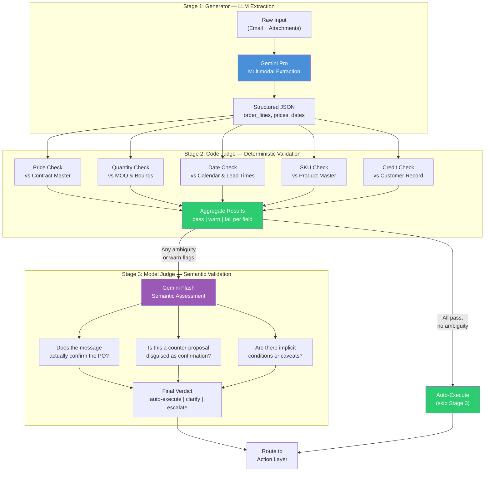

# Generator-Judge Pattern for Supply Chain

> [!info] Context
> This is a Level 3 Implementation Detail note in the [[Glacis-Agent-Reverse-Engineering-Overview|Glacis Reverse-Engineering]] research set. It defines the dual-model validation architecture that sits at the heart of both the Order Intake and PO Confirmation agents — the mechanism by which raw LLM extraction becomes trustworthy business data. Parent: [[Glacis-Agent-Reverse-Engineering-Validation-Pipeline]]. Siblings: [[Glacis-Agent-Reverse-Engineering-Prompt-Templates]], [[Glacis-Agent-Reverse-Engineering-ADK-Order-Intake]].

## The Problem

A single LLM call is not reliable enough to create a sales order or update a purchase order in an ERP system. Not because the model is bad — Gemini Pro can extract structured data from a messy PDF with impressive accuracy. The problem is that "impressive accuracy" means 95-98%, and on 35,000 POs per year, 2% error means 700 wrong records flowing into production systems. A single misread quantity — 500 units instead of 50 — cascades into a wrong pick, a wrong shipment, an angry supplier, and a blown OTIF metric.

The standard engineering response is to add validation rules. Check the price against the contract. Check the quantity against plausible bounds. Check the date against the calendar. These deterministic checks catch the obvious errors — but they miss semantic ones. Did the supplier actually confirm the PO, or did they send a counter-proposal? Is "we can do 450 by the 15th" a confirmation, a partial confirmation, or a rejection? A rule engine cannot answer these questions. An LLM can — but then you are back to trusting a single LLM call.

This is the core tension: **deterministic validation catches structural errors but misses semantic ones. LLM validation catches semantic errors but introduces its own reliability problems.** The Generator-Judge pattern resolves this tension by separating the two concerns into distinct stages, each optimized for what it does well.

## First Principles

The Generator-Judge pattern is a specialization of a much older idea: **separation of generation from evaluation**. Compilers do it (parser generates AST, type checker evaluates it). Code review does it (developer writes code, reviewer evaluates it). Scientific publishing does it (author writes paper, peer reviewer evaluates it). The insight in every case is the same — the skills required to produce output are different from the skills required to judge output, and combining both into a single pass produces worse results than separating them.

Pallet's engineering team articulated this for logistics specifically. Their "Deep Reasoning" architecture uses a Generator Model as an autonomous operations specialist — it analyzes data, determines tools and resources, plans execution steps. A separate Judge Model acts as supervisory quality control — it evaluates the Generator's output against performance standards. If the Judge approves, the output executes. If the Judge rejects, it provides corrective feedback and the Generator revises. If the Judge rejects after multiple iterations, the task escalates to a human.

The key insight from Pallet is why single-pass fails for complex operations. They describe an 18-step SOP — read an incoming email, run a credit check, find origin/destination appointment hours, determine accessorials, and so on. A single LLM call attempting all 18 steps produces a non-auditable output. You cannot tell where it went wrong. The iterative Generator-Judge approach traces exactly where mistakes occur because each step is evaluated independently.

But Pallet's pattern is fully LLM-based: both Generator and Judge are language models. For supply chain validation, this is incomplete. When a customer says the price is $12.50 and the contract says $12.75, you do not need an LLM to detect that mismatch — you need a database lookup and a comparison operator. Using an LLM for arithmetic validation is like using a chainsaw to cut butter: it works, but it is the wrong tool, it is slower, and it introduces unnecessary failure modes.

The right architecture for supply chain is a **three-stage hybrid**: LLM extraction (Generator), deterministic validation (Code Judge), and LLM semantic validation (Model Judge). Each stage does what it is uniquely good at.

## How It Actually Works

### The Three-Stage Architecture



### Stage 1: The Generator (Gemini Pro)

The Generator's job is extraction — take unstructured input and produce structured output. This is the most expensive LLM call in the pipeline because it requires multimodal processing (reading PDFs, images, spreadsheets) and the largest context window (a 15-page order document can run 10,000+ tokens).

The Generator receives the email body and all attachments as a multimodal prompt. It outputs structured JSON conforming to a predefined schema: line items with customer descriptions, quantities, units, prices, dates, and metadata like PO numbers and shipping instructions.

Critical design decision: **the Generator does not validate.** It does not check if the price is correct or the quantity is plausible. It extracts what the document says, faithfully. Asking the Generator to simultaneously extract and validate conflates two concerns and degrades both — the model starts "correcting" extracted values based on what it thinks they should be rather than what the document actually says. Keep extraction pure.

For Order Intake, the Generator extracts from customer order emails. For PO Confirmation, it extracts from supplier response emails. The schema differs but the pattern is identical.

The Generator writes its output to session state via ADK's `output_key` mechanism: `state['extracted_data']`.

### Stage 2: The Code Judge (Deterministic Validation)

This is not an LLM. This is Python code executing deterministic checks against master data in Firestore. It is the fastest, cheapest, and most reliable stage in the pipeline — and it catches the majority of errors.

**Price validation**: Pull the customer's contract price (or the PO's agreed price for confirmations) from Firestore. Compare against the extracted price. If within tolerance (configurable, typically 2%), pass. If outside tolerance, fail with the exact delta. No LLM needed — this is arithmetic.

**Quantity validation**: Check against minimum order quantity, case pack multiples, and historical bounds. An order for 50,000 units from a customer who averages 500 per month is almost certainly a typo. Flag it. Again, arithmetic and a database lookup.

**Date validation**: Is the requested date a business day? Is it within the standard lead time window? Is it in the past? Calendar math, not language understanding.

**SKU resolution**: Does the extracted product description match a known SKU? This uses the embedding-based matching described in [[Glacis-Agent-Reverse-Engineering-Item-Matching]] — vector similarity search against the product master. High-confidence matches (>0.92 similarity) pass. Medium-confidence matches (0.80-0.92) get flagged for human confirmation. Low-confidence matches (<0.80) fail.

**Credit check**: Is the customer within their credit limit? Any outstanding payment holds? A Firestore query against the customer record.

Each check returns a structured result: `{field: "price", status: "pass|warn|fail", expected: 12.75, actual: 12.50, delta: -0.25, message: "Price 2% below contract"}`. The aggregate of all checks determines the routing decision.

The Code Judge writes its results to `state['validation_results']`.

**Why deterministic first**: Three reasons. Speed — a Firestore lookup takes 10-50ms versus 1-3 seconds for an LLM call. Cost — zero inference cost. Reliability — `12.50 != 12.75` is always correct; an LLM might hallucinate that the prices match. Running deterministic checks first means 70-80% of orders that are clean never touch the Model Judge at all, saving both time and money.

### Stage 3: The Model Judge (Gemini Flash)

The Model Judge handles what code cannot: **semantic validation**. It receives the original message, the extracted data from Stage 1, and the validation results from Stage 2, then answers questions that require language understanding.

For PO Confirmation, the critical semantic questions are:

- **"Does this message actually confirm the PO?"** A supplier might reply "Thanks for the PO, we'll review and get back to you." That is an acknowledgment, not a confirmation. A rule engine sees a reply to the PO email thread and might wrongly mark it as confirmed. The Model Judge reads the actual language and distinguishes confirmation from acknowledgment from counter-proposal from rejection.

- **"Is this a counter-proposal disguised as a confirmation?"** "We can fulfill your order — 450 units at $13.00, delivery by the 20th." The supplier said "fulfill" and "your order," which sounds affirmative. But the quantity is different, the price is different, and the date is different. This is a counter-proposal. The Code Judge already flagged the numeric mismatches, but the Model Judge determines the intent — is the supplier agreeing to a modified order, or are they opening a negotiation?

- **"Are there implicit conditions or caveats?"** "Confirmed, subject to raw material availability." That word "subject" changes everything. The Code Judge sees matching numbers and passes. The Model Judge catches the conditional language and flags it as a qualified confirmation that needs buyer attention.

For Order Intake, the semantic questions shift:

- **"Is this actually an order, or an inquiry?"** "Can you check if you have 50 cases of Dark Roast available?" is not an order. "Send me 50 cases of Dark Roast" is. The classification model in Stage 0 catches most of these, but edge cases slip through.

- **"Are there contradictions within the order?"** The email body says "rush delivery" but the attachment specifies standard shipping. The header says 50 cases but the line item total sums to 45. Cross-referencing different parts of the same message for consistency is a semantic task.

The Model Judge uses Gemini Flash, not Pro. Flash is 10-20x cheaper and 3-5x faster than Pro, and semantic classification does not require the reasoning depth of multi-document extraction. The prompt is short and focused: here is the message, here is what we extracted, here are the validation flags — what is your assessment? The output is a structured verdict: `{status: "confirmed|counter-proposal|inquiry|ambiguous", confidence: 0.92, reasoning: "Supplier explicitly states 'we confirm' for all line items with matching quantities and dates. No conditions or caveats detected."}`.

The Model Judge writes to `state['semantic_verdict']`.

**When Stage 3 is skipped**: If every deterministic check in Stage 2 passes and the message type is unambiguous (e.g., a structured EDI confirmation or a clearly formatted PDF with matching numbers), the Model Judge adds no value. The pipeline short-circuits directly to auto-execute. This is not an optimization — it is a design principle. Do not burn inference tokens on validation that code already handled. In practice, 60-70% of messages skip Stage 3 entirely.

### The Iteration Loop

When the Model Judge identifies an issue — ambiguous language, a counter-proposal, contradictions — the pipeline does not immediately escalate. It first attempts self-correction through a feedback loop.

The Judge writes specific feedback: "The supplier's message appears to be a counter-proposal. Line 3 quantity (450) differs from PO quantity (500), and the supplier used the phrase 'we can do' rather than 'we confirm.' Re-extract with attention to whether this is a confirmation or a counter-proposal."

The Generator re-processes the original message with this feedback injected into the prompt. On the second pass, it produces a more nuanced extraction — perhaps tagging the line item as `{status: "counter-proposed", original_qty: 500, proposed_qty: 450}` rather than simply extracting 450 as the confirmed quantity.

In ADK, this maps to a `LoopAgent` wrapping the Generator and Judge:

```python
from google.adk.agents import LlmAgent, SequentialAgent, LoopAgent

generator = LlmAgent(
    name="Extractor",
    model="gemini-2.0-pro",
    instruction="""Extract structured order/confirmation data from the
    input message. If feedback is provided in {{review_feedback}},
    incorporate it and re-extract with greater precision.""",
    output_key="extracted_data"
)

code_judge = CodeExecutionAgent(  # custom agent wrapping Python validation
    name="DeterministicValidator",
    output_key="validation_results"
)

model_judge = LlmAgent(
    name="SemanticJudge",
    model="gemini-2.0-flash",
    instruction="""Evaluate the extraction and validation results.
    If the message clearly confirms/orders with no ambiguity, output
    exactly: VALIDATED
    Otherwise, output specific feedback for re-extraction.""",
    output_key="review_feedback"
)

validation_loop = LoopAgent(
    name="GeneratorJudgeLoop",
    sub_agents=[generator, code_judge, model_judge],
    max_iterations=3
)

pipeline = SequentialAgent(
    name="OrderValidationPipeline",
    sub_agents=[classification_agent, validation_loop, routing_agent]
)
```

The `max_iterations=3` is a deliberate choice. Pallet's engineering blog reports that Generator-Judge loops converge within 2-3 iterations for well-defined tasks. Beyond 3, the model is stuck — either the input is genuinely ambiguous or there is a systematic extraction failure. At that point, escalate to a human rather than burning tokens on a loop that will not converge.

The exit mechanism: when the Model Judge outputs exactly `VALIDATED`, the `LoopAgent` terminates (triggered by the Judge agent setting `context.actions.escalate = True` upon detecting the completion phrase). The pipeline proceeds to routing.

## The Tradeoffs

**Latency**: Three stages take longer than one. The Generator (Gemini Pro, multimodal) runs 2-5 seconds. The Code Judge runs 50-200ms. The Model Judge (Gemini Flash) runs 0.5-1.5 seconds. Total: 3-7 seconds for a clean pass, up to 15-20 seconds if the loop iterates twice. Compare to a single Gemini Pro call at 2-5 seconds. The extra time buys reliability — and for supply chain operations processing orders over minutes, not milliseconds, the tradeoff is worth it.

**Cost**: Gemini Pro for extraction (~$0.01-0.05 per document depending on size). Gemini Flash for semantic validation (~$0.001-0.005 per call). Firestore lookups are negligible. Per-order cost: $0.01-0.06. Compare to $10-15 for manual processing. Even with the loop iterating, total cost stays under $0.20 per order — a 98% reduction from manual.

**Complexity**: Three stages means three things that can fail independently. The Generator can hallucinate fields that do not exist in the document. The Code Judge can have stale master data. The Model Judge can misjudge intent. Each failure mode requires its own monitoring and remediation. This is more complex than a single LLM call — but each failure mode is isolated and debuggable, unlike a monolithic call where you cannot tell which part went wrong.

**The short-circuit tradeoff**: Skipping Stage 3 for clean orders is a significant optimization — but it means the Model Judge never sees the easy cases. If there is a systematic extraction error that happens to produce valid-looking numbers (e.g., consistently reading "50" as "500" from a specific PDF format), the Code Judge passes it because 500 is a plausible quantity, and the Model Judge never gets a chance to notice the pattern. Mitigation: run Stage 3 on a random 5-10% sample of auto-executed orders as a quality audit, even when all deterministic checks pass.

**Generator purity vs pragmatism**: The principle of keeping extraction pure — the Generator should not validate — is theoretically clean but sometimes impractical. If the Generator sees an obvious impossibility (a delivery date in 1924, a price of $0.00), should it faithfully extract the wrong value or flag it? The purist answer is extract faithfully and let the Judge catch it. The pragmatic answer is that some errors are so obvious that extracting them wastes a validation round-trip. The recommendation: keep the Generator pure for the initial build. If specific error patterns emerge that the Code Judge consistently catches, consider adding lightweight guardrails to the Generator prompt — but document them explicitly so you know when extraction is interpreting rather than transcribing.

## What Most People Get Wrong

**"Just use a better model and you don't need a Judge."** Model capability does not eliminate the need for validation. GPT-5 or Gemini Ultra could extract with 99.5% accuracy. On 35,000 POs/year, that is still 175 errors. More importantly, semantic validation is not about extraction accuracy — it is about understanding intent. A perfect extraction of a counter-proposal is still a counter-proposal, and no amount of model capability changes the fact that you need a separate evaluation step to classify the intent.

**"The Judge should be a bigger model than the Generator."** This is the conventional wisdom from LLM-as-a-Judge literature — weak judges underrate strong generators. But in the hybrid pattern, the Code Judge is not a model at all — it is deterministic code, and it is a perfect judge for the checks it covers. The Model Judge (Flash) only handles semantic questions where the "size" of the model matters less than the specificity of the prompt. A well-prompted Flash model outperforms a generic Pro model on binary classification tasks like "is this a confirmation or a counter-proposal?"

**"Run all three stages on every message."** This wastes money and time. The whole point of the three-stage architecture is that each stage acts as a filter. Stage 1 runs on everything. Stage 2 runs on everything that Stage 1 produces. But Stage 3 should only run when Stage 2 produces ambiguous results. If every deterministic check passes with high confidence, the semantic check adds marginal value at non-trivial cost. The short-circuit path is not a shortcut — it is the design working correctly.

**"The iteration loop will converge on any input."** It will not. Some inputs are genuinely ambiguous. A supplier email that says "noted" in response to a PO — is that confirmation? Acknowledgment? The Generator-Judge loop can cycle three times and still not resolve the ambiguity, because the ambiguity is in the source, not in the extraction. The `max_iterations` limit exists precisely for this case. When the loop exhausts its iterations without convergence, the correct action is human escalation, not more iterations.

**"Deterministic validation is the boring part."** It is the most valuable part. The Code Judge catches 80-90% of actionable errors at near-zero cost and latency. It is fully auditable — every check logs exactly what it compared, what it expected, and what it found. It never hallucinates. It never drifts. It is the foundation that makes the rest of the pipeline trustworthy. The LLM stages are impressive, but the Code Judge is the load-bearing wall.

## Connections

### Parent
- [[Glacis-Agent-Reverse-Engineering-Validation-Pipeline]] — The full validation and enrichment pipeline that this pattern sits within. The Generator-Judge is the engine; the pipeline is the vehicle.

### Siblings (Level 3)
- [[Glacis-Agent-Reverse-Engineering-Prompt-Templates]] — The actual prompts used for Generator extraction and Model Judge evaluation. The prompt design determines whether Stage 1 and Stage 3 perform well.
- [[Glacis-Agent-Reverse-Engineering-Item-Matching]] — The embedding-based SKU matching that the Code Judge uses for product resolution. A dependency of Stage 2.

### Children (Level 4)
- [[Glacis-Agent-Reverse-Engineering-ADK-Order-Intake]] — The complete ADK agent definition for Order Intake, which implements this three-stage pipeline as a `SequentialAgent` wrapping a `LoopAgent`.

### Foundation Context
- [[Glacis-Agent-Reverse-Engineering-Order-Intake-Agent]] — The Order Intake workflow that this pattern validates. Stage 1-3 map directly to Steps 2-4 in that workflow.
- [[Glacis-Agent-Reverse-Engineering-PO-Confirmation-Agent]] — The PO Confirmation workflow. Same pattern, different extraction schema and semantic questions.
- [[Glacis-Agent-Reverse-Engineering-Overview]] — Full research map.

### Wiki Pages
- [[google-adk]] — The framework implementing the `SequentialAgent` and `LoopAgent` primitives used here.
- [[error-recovery-patterns]] — Circuit breaker and retry patterns relevant to the iteration loop's failure modes.

## References

### Primary Sources
- **Pallet Engineering Blog**: [Introducing Deep Reasoning](https://www.pallet.com/blog/introducing-deep-reasoning) — Generator-Judge architecture for logistics, 18-step SOP example, auditability argument, multi-iteration feedback cycle.
- **Glacis Whitepapers** (Dec 2025, March 2026) — Enterprise case studies validating that extraction + validation + routing is the correct decomposition for supply chain document processing.

### ADK Documentation
- [Google ADK: Loop Agents](https://google.github.io/adk-docs/agents/workflow-agents/loop-agents/) — `LoopAgent` with `max_iterations`, exit via escalation, `output_key` for session state communication between sub-agents.
- [Google Developers Blog: Multi-Agent Patterns in ADK](https://developers.googleblog.com/developers-guide-to-multi-agent-patterns-in-adk/) — Generator-Critic pattern with `SequentialAgent` wrapping `LoopAgent`, state-based agent communication.

### LLM-as-a-Judge Research
- [LLM-as-a-Judge: Enterprise Control Layer — Appinventiv](https://appinventiv.com/blog/llm-as-a-judge/) — Hybrid deterministic + LLM evaluation, risk-tiered assessment, production deployment patterns.
- [LLM as a Judge 2026 Guide — Label Your Data](https://labelyourdata.com/articles/llm-as-a-judge) — 500x-5000x cost savings over human review, 80% agreement with human preferences, bias patterns in automated evaluation.
- [Evidently AI: LLM-as-a-Judge Complete Guide](https://www.evidentlyai.com/llm-guide/llm-as-a-judge) — Structured generation for judge evaluations, rubric design, calibration methodology.
