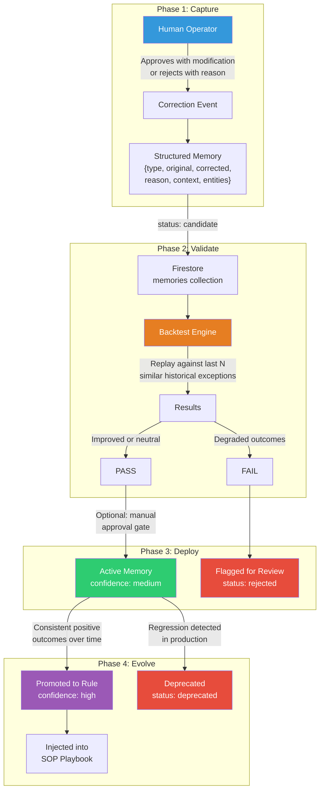

# Learning Loop & Continuous Intelligence

> [!info] Context — Part of [[Glacis-Agent-Reverse-Engineering-Overview]] deep dive. Depth level: 3. Parent: [[Glacis-Agent-Reverse-Engineering-SOP-Playbook]]

## The Problem

An AI agent that ships with a fixed set of rules is a brittle system pretending to be intelligent. On day one, it handles the patterns its developers anticipated. On day thirty, it encounters a supplier who confirms POs by replying with a single-line "OK" and a handwritten delivery date scrawled on a napkin photo. On day sixty, a major customer starts embedding line items in a nested Excel table format nobody on the team has ever seen. On day ninety, the agent is drowning in exceptions that a human operator resolves in seconds — the same exceptions, over and over — while the agent keeps escalating because it never learned from the first correction.

This is the core problem with static rule systems in supply chain operations. The domain is adversarial in a mundane way: not malicious actors, but thousands of humans doing things their own way, changing formats without notice, inventing new abbreviations, switching suppliers, consolidating warehouses. Every week introduces novel edge cases. A system that cannot learn from its own operational experience degrades over time as the gap between its fixed rules and the evolving reality widens.

Glacis does not disclose their learning loop architecture in their whitepapers. But Pallet does. Across five engineering blog posts, Pallet describes a production system that ingests "thousands of new memories per day across customers." Their Continuous Intelligence pipeline is the most detailed public description of how a supply chain AI agent learns in production. The architecture described in this note synthesizes Pallet's disclosed patterns with production backtesting principles from SRE and ML Ops, mapped onto our Google Cloud stack.

## First Principles

Strip away the "AI" branding and continuous intelligence is a version control problem for decision-making rules. Think about it in terms any backend engineer understands.

You have a service that makes decisions — route this order, flag this exception, match this item. Those decisions are governed by rules: explicit (if price delta > 5%, escalate) and implicit (the patterns embedded in LLM prompts and few-shot examples). When a human operator overrides a decision, they are implicitly saying "your rule was wrong for this case." The question is: do you capture that signal and use it, or do you throw it away?

Most systems throw it away. The human clicks "approve with modification," the modification gets applied to the current order, and the next identical order hits the same wrong rule and gets escalated again. The operator corrects it again. Indefinitely. This is the manual labor treadmill that Glacis's metrics expose: buyers spending 60-70% of their time on confirmation activities, CSRs spending 40-60% of their day on data entry. A meaningful fraction of that work is re-correcting the same errors.

A learning loop turns every correction into a candidate rule. But here is the critical insight that separates production systems from naive implementations: **you cannot deploy a learned rule without testing it first.** Pallet states this explicitly: memories are "tested against historical scenarios BEFORE activation to prevent unintended accuracy regression." This is backtesting — the same concept from quantitative finance applied to operational decision-making.

Why is backtesting non-negotiable? Because human corrections are local. An operator corrects a specific case based on what they see in front of them. They might not realize that the correction they are making, if applied broadly, would break fifty other cases they are not looking at. A buyer who says "accept 3-day late delivery from Supplier X because they always deliver early anyway" is encoding a supplier-specific exception. Without backtesting, the system might generalize that to all suppliers, and now late deliveries from unreliable suppliers get auto-accepted.

The learning loop has four phases, each doing one thing:

1. **Capture**: Record what the human changed and why
2. **Structure**: Convert the correction into a testable rule
3. **Validate**: Replay the rule against historical data to check for regressions
4. **Deploy**: Promote validated rules to active use with confidence tracking

This is functionally identical to a CI/CD pipeline for business rules. The correction is the code change. Backtesting is the test suite. Promotion is the deployment. Confidence tracking is the monitoring. The only difference is that the "code" is a natural-language memory unit rather than source code.

## How It Actually Works

### The Learning Pipeline



### Phase 1: Capture — Structured Correction Events

Every time a human operator touches an agent's decision, the system captures a structured correction event. This is not a log entry — it is a first-class data object designed to be machine-readable and replayable.

The correction event schema:

```json
{
  "correction_id": "corr_2026-04-08_001",
  "correction_type": "item_match_override | price_acceptance | date_tolerance | quantity_adjustment | format_recognition | routing_override",
  "original_action": {
    "action": "escalate",
    "reason": "No item match found for 'DR5-Bulk 25kg'",
    "confidence": 0.32
  },
  "corrected_action": {
    "action": "match",
    "target_sku": "SKU-7042-DR5-BULK",
    "reason": "Customer uses 'DR5-Bulk' as shorthand for Dark Roast 5kg Bulk"
  },
  "context": {
    "customer_id": "CUST-4521",
    "supplier_id": null,
    "order_id": "ORD-2026-04-08-0847",
    "agent": "order_intake",
    "stage": "item_matching"
  },
  "operator": {
    "user_id": "ops_jane",
    "role": "csr_lead",
    "timestamp": "2026-04-08T14:23:00Z"
  },
  "entities": ["CUST-4521", "SKU-7042-DR5-BULK", "Dark Roast"],
  "reason_text": "This customer always abbreviates. DR5-Bulk = Dark Roast 5kg Bulk package."
}
```

Three correction capture patterns matter:

**Approve with modification**: The agent suggested something, the operator changed it. The delta between `original_action` and `corrected_action` is the learning signal. This is the most valuable type because it shows both what the agent thought and what the right answer was.

**Reject with reason**: The agent suggested an action that was flat wrong. The operator rejects and provides the correct action plus reasoning. The `reason_text` field is critical — it is what distinguishes a correction that can generalize ("this customer always abbreviates") from one that cannot ("one-time exception for this order only").

**Auto-approve observation**: The agent acted autonomously and the outcome was correct. No correction needed. These are equally important because they form the positive training set — the cases where the rules worked. Without tracking successes, you have no baseline for backtesting.

Pallet converts these corrections into what they call "discrete plain English memory units" — short, self-contained statements that can be injected into an LLM's context window. The format is intentionally natural language, not code, because the consumer is an LLM, not a rule engine. Example memory unit derived from the correction above:

> Customer CUST-4521 uses the abbreviation "DR5-Bulk" to mean SKU-7042-DR5-BULK (Dark Roast 5kg Bulk). Always match this abbreviation for this customer.

This is classified by topic (`item_matching`), customer (`CUST-4521`), and location (if relevant). The classification enables scoped retrieval — when processing a future order from CUST-4521, the system pulls only memories relevant to that customer and that processing stage, not the entire memory bank.

### Phase 2: Validate — Backtesting Against Historical Data

This is where the architecture diverges from naive "just learn from feedback" approaches. A candidate memory does not go live until it proves it would not have caused regressions.

The backtest engine works as follows:

**Step 1: Find similar historical cases.** Query Firestore for the last N exceptions (N = 50-200, configurable) that match the candidate memory's scope — same customer, same correction type, same agent stage. Use the entity embeddings from [[Glacis-Agent-Reverse-Engineering-Item-Matching]] to also find semantically similar cases (e.g., other customer abbreviation corrections). The goal is a representative sample of cases the new memory would have influenced.

**Step 2: Replay with the candidate memory injected.** For each historical case, reconstruct the input the agent received at the time and re-run the decision logic with the candidate memory included in the context. This does not require re-running the full pipeline — only the decision step that the memory applies to. Record what the agent would have decided.

**Step 3: Compare outcomes.** For each replayed case, compare the agent's hypothetical decision (with the new memory) against the actual outcome (what eventually happened after human intervention). Score each case:

- **Improved**: The memory would have led to the correct decision without human intervention (saves labor)
- **Neutral**: The memory did not change the decision (no effect)
- **Degraded**: The memory would have caused a wrong decision that previously was correct (regression)

**Step 4: Apply promotion threshold.** The default gate: zero degraded cases and at least one improved case. This is intentionally conservative. In Pallet's words, the point is to "prevent unintended accuracy regression." A single regression in the backtest set blocks promotion. The operator who created the correction can review the regression cases and either refine the memory (make it more specific) or force-promote with acknowledgment.

The backtest engine itself is a Cloud Run job triggered by a Firestore `onCreate` listener on the memories collection. It is asynchronous — the operator does not wait for backtesting to complete. The memory sits in `candidate` status until the backtest job finishes and transitions it to either `backtested` (passed) or `rejected` (failed).

```python
# Simplified backtest logic
async def backtest_memory(memory: Memory) -> BacktestResult:
    # Find similar historical exceptions
    historical = await find_similar_exceptions(
        customer_id=memory.context.customer_id,
        correction_type=memory.correction_type,
        agent_stage=memory.context.stage,
        limit=100,
        embedding=memory.embedding
    )

    improved, neutral, degraded = 0, 0, 0

    for case in historical:
        # Replay decision with candidate memory injected
        hypothetical = await replay_decision(
            case.original_input,
            active_memories + [memory]  # inject candidate
        )
        actual_outcome = case.resolved_action

        if hypothetical == actual_outcome:
            neutral += 1
        elif hypothetical == case.corrected_action:
            improved += 1  # would have gotten it right
        else:
            degraded += 1  # would have gotten it wrong

    return BacktestResult(
        memory_id=memory.id,
        total=len(historical),
        improved=improved,
        neutral=neutral,
        degraded=degraded,
        passed=(degraded == 0 and improved > 0)
    )
```

### Phase 3: Deploy — Memory Activation With Confidence Tracking

A memory that passes backtesting transitions to `active` status with `confidence: medium`. It is now included in the agent's context window when processing cases that match its scope (customer, stage, correction type).

The confidence ladder:

| Level | Meaning | Behavior |
|-------|---------|----------|
| `low` | Candidate, not yet backtested | Not used in agent decisions |
| `medium` | Passed backtest, recently activated | Used in decisions, outcomes tracked closely |
| `high` | Consistent positive outcomes over 30+ applications | Used in decisions, considered reliable |
| `rule` | Promoted to structured rule | Injected into [[Glacis-Agent-Reverse-Engineering-SOP-Playbook]] as a permanent SOP entry |

Confidence promotion is automatic based on outcome tracking. Every time a memory influences a decision (the agent's reasoning trace references it), the system records whether the decision was:
- Auto-approved (positive signal)
- Approved with modification (weak negative — the memory helped but was not sufficient)
- Rejected (strong negative — the memory led to a wrong decision)

After 30 applications with >90% auto-approval rate, the memory promotes to `confidence: high`. After 100 applications with >95% auto-approval rate and coverage across multiple customers or contexts, it becomes a candidate for rule promotion — which means it gets extracted from the memory bank and encoded as a permanent SOP entry in the playbook system. At that point, it no longer needs to be dynamically retrieved; it is baked into the agent's base instructions.

### Phase 4: Evolve — Deprecation and Rule Promotion

Memories are not permanent. The supply chain changes. A customer changes their abbreviation conventions. A supplier changes their confirmation format. A product gets discontinued. A memory that was accurate six months ago might cause regressions today.

**Continuous monitoring** runs on every active memory. If an active memory's auto-approval rate drops below 70% over a rolling 30-day window, it transitions to `deprecated` status and is excluded from the agent's context. The operator gets a notification: "Memory X (Customer Y always abbreviates DR5-Bulk) is no longer performing. 4 of the last 10 influenced decisions were overridden by operators. Review and retire or update?"

**Rule promotion** goes the other direction. When a memory has been active for 90+ days, has been applied 100+ times, maintains >95% accuracy, and generalizes across multiple entities (not just one customer), it graduates. The system generates a proposed SOP rule — natural language, formatted for the [[Glacis-Agent-Reverse-Engineering-SOP-Playbook]] — and presents it to a senior operator for approval. Once approved, the memory becomes a rule: permanent, high-confidence, injected into the base prompt rather than retrieved dynamically.

This creates a knowledge flywheel. Day one: the agent has only the initial SOPs and generic item matching. Month one: dozens of active memories supplement its decisions. Month six: the highest-performing memories have been promoted to rules, the agent's base accuracy has improved, and the remaining active memories handle increasingly niche edge cases. The exception rate drops over time because the system is absorbing the patterns that used to cause exceptions.

## Firestore Memory Schema

The memory lifecycle maps to a single Firestore collection with status-driven queries. Full schema details in [[Glacis-Agent-Reverse-Engineering-Firestore-Schema]]; the memory-specific structure:

```
memories/
  {memory_id}/
    correction_type: string
    original_action: map
    corrected_action: map
    reason_text: string
    context: map {customer_id, supplier_id, agent, stage}
    entities: array<string>
    embedding: vector(768)
    status: "candidate" | "backtested" | "active" | "promoted" | "deprecated" | "rejected"
    confidence: "low" | "medium" | "high" | "rule"
    backtest_result: map {total, improved, neutral, degraded, passed, run_at}
    application_stats: map {total_applied, auto_approved, modified, rejected, last_applied}
    created_at: timestamp
    created_by: string
    promoted_at: timestamp | null
    deprecated_at: timestamp | null
    deprecated_reason: string | null
```

Key queries the system needs:

- **Agent context retrieval**: `WHERE status == "active" AND context.customer_id == X AND context.stage == Y ORDER BY confidence DESC LIMIT 20` — pulls relevant memories for a specific processing step
- **Backtest candidates**: `WHERE status == "candidate" ORDER BY created_at ASC` — queue of memories awaiting validation
- **Degradation monitoring**: `WHERE status == "active" AND application_stats.last_applied > 30_days_ago` — finds stale memories that might need deprecation review
- **Rule promotion candidates**: `WHERE status == "active" AND confidence == "high" AND application_stats.total_applied > 100` — finds memories ready for SOP graduation

## Multi-Model Redundancy

Pallet discloses one additional architectural detail worth replicating: multi-model redundancy for memory application. When a memory is being used to influence a critical decision (e.g., auto-approving a high-value order), the system runs the decision through multiple LLMs and compares answers. If the models agree, proceed. If they disagree, escalate to a human.

For our Google Cloud build, this translates to running the same decision through Gemini Pro and Gemini Flash. If both agree on the action, the confidence is higher. If they disagree, the decision gets flagged. This adds latency and cost, so it should only apply to decisions above a configurable value threshold — say, orders above $10,000 or PO confirmations with delivery date deviations beyond the tolerance window.

This pattern connects directly to the [[Glacis-Agent-Reverse-Engineering-Item-Matching|Generator-Judge architecture]]: the Generator proposes an action informed by active memories, and the Judge evaluates whether the action is sound. The learning loop adds a third dimension — the memories themselves evolve based on whether the Generator-Judge pair's decisions get approved or corrected by humans.

## What Makes This Different From Fine-Tuning

A reasonable question: why not just fine-tune the model on correction data instead of maintaining a dynamic memory layer?

Three reasons:

**Latency.** Fine-tuning takes hours to days. A memory can be backtested and deployed in minutes. When a new customer sends their first order with a novel abbreviation scheme, the operator's correction becomes an active memory the same day. Fine-tuning would require batching corrections, running a training job, evaluating the new model, and deploying it — a cycle measured in weeks.

**Specificity.** Memories are scoped. A memory about Customer X's abbreviations only applies to Customer X's orders. Fine-tuning bakes knowledge into the model's weights globally, with no guarantee that a customer-specific pattern does not leak into general behavior. The scoped retrieval of memories provides surgical precision that weight updates cannot.

**Reversibility.** A bad memory can be deprecated instantly. A bad fine-tune requires retraining from the previous checkpoint. The memory layer's explicit lifecycle (candidate → backtested → active → deprecated) gives operators a kill switch at every stage. Fine-tuning is a one-way door with a slow rollback path.

The memory layer is not a replacement for fine-tuning — it operates at a different timescale. Memories handle fast-changing, entity-specific knowledge. Fine-tuning (if ever needed) would handle slow-changing, general patterns once you have thousands of validated memories providing a clean training dataset. The memory layer is the real-time system; fine-tuning is the periodic consolidation.

## Connection to the Broader Architecture

The learning loop is not a standalone system — it is the feedback channel that closes the loop for every other subsystem in the agent architecture:

- **[[Glacis-Agent-Reverse-Engineering-Item-Matching]]**: When an operator corrects an item match, the correction becomes a memory. Over time, the most common corrections get promoted to permanent entries in the item synonym table. The embedding-based matching improves because the training set for customer-specific embeddings grows with every correction.

- **[[Glacis-Agent-Reverse-Engineering-SOP-Playbook]]**: The SOP playbook is the initial rule set. The learning loop is how the playbook grows. Promoted memories become new SOP entries. The playbook is not static documentation — it is the accumulated output of the learning loop.

- **[[Glacis-Agent-Reverse-Engineering-Firestore-Schema]]**: The `memories` collection is a core part of the data model. It needs vector search capability for embedding-based retrieval, composite indexes for scoped queries, and TTL policies for deprecated memories.

- **[[Glacis-Agent-Reverse-Engineering-Overview]]**: The overview's architecture diagram shows the Learning Loop as the feedback arrow from human corrections back into the agent. This note is the implementation detail behind that arrow.

## Implementation Priority for the Hackathon

For a 2-4 week build, the full learning loop is too much. Here is the minimum viable version:

**Week 1-2 (must have):** Capture correction events in Firestore. Every human override gets recorded with the full structured schema. No backtesting, no automation — just capture. This gives you the data foundation.

**Week 3 (should have):** Memory retrieval. When processing an order from a customer who has previous corrections, pull those corrections into the agent's context window. This alone will reduce repeat escalations.

**Post-hackathon (nice to have):** Backtesting engine, automated promotion, degradation monitoring. These are the production-grade features that make the system self-improving rather than just correction-aware.

The critical insight for the demo: even without the full loop, showing the correction capture interface and explaining the backtesting architecture demonstrates that this is not a static demo — it is the foundation of a system designed to improve with every interaction. Judges care about trajectory, not just current state.

## Sources

- [Continuous Intelligence: How AI Agents Learn and Improve](https://www.pallet.com/blog/continuous-intelligence-how-ai-agents-learn-and-improve-in-real-time-logistics-operations) — Pallet Engineering Blog. Primary source for the learning pipeline architecture, backtesting requirement, and "thousands of memories per day" scale metric.
- [Memory and Reasoning in Agentic AI](https://www.pallet.com/blog/memory-and-reasoning-in-agentic-ai-why-logistics-demands-more-than-llms) — Pallet Engineering Blog. SOP-to-memory conversion, classification by topic/customer/location, multi-model redundancy.
- [Self-Learning AI Agents](https://beam.ai/agentic-insights/self-learning-ai-agents-transforming-automation-with-continuous-improvement) — Beam AI. Golden sample datasets, version-controlled flow evolution, automated regression testing before deployment.
- [Backtesting AI Agents: How SRE Teams Prove Reliability Before Production](https://drdroid.io/blog/backtesting-ai-agents-how-sre-teams-prove-reliability-before-production) — DrDroid. Pass^k reliability framework, five reliability dimensions, regression-as-permanent-test-case pattern.
- [Incorporating Human-in-the-Loop Feedback for Continuous Improvement](https://www.getmaxim.ai/articles/incorporating-human-in-the-loop-feedback-for-continuous-improvement-of-ai-agents/) — Maxim AI. Multi-dimensional evaluation schemas, uncertainty-based triage, progressive automation patterns.
