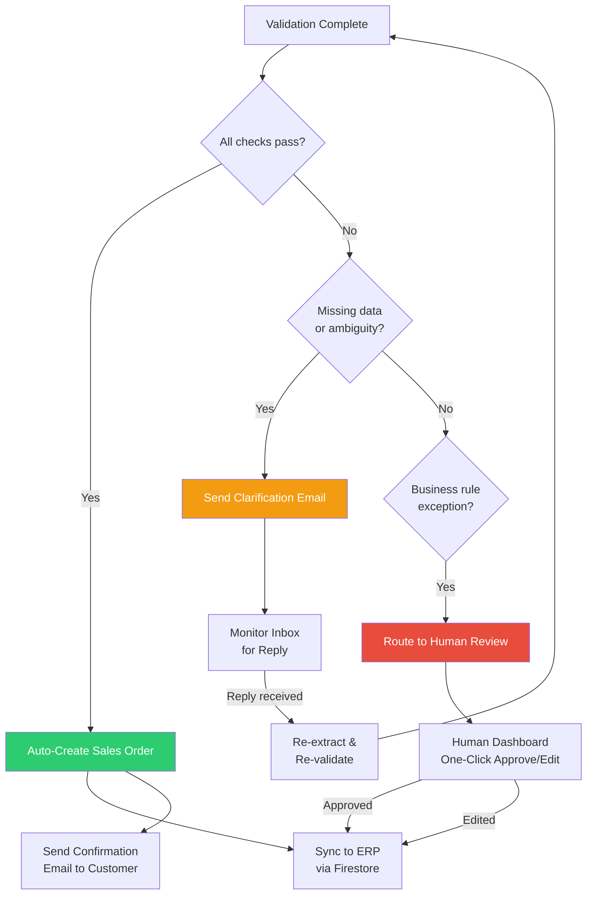

# Order Intake Agent: How Glacis Does It

> [!info] Context — Part of [[Glacis-Agent-Reverse-Engineering-Overview]] deep dive. Depth level: 1

## The Problem

Every manufacturer with non-EDI customers has the same inbox problem. Orders arrive as free-text emails ("Hey, need 50 cases of Dark Roast 5lb bags shipped to our Dallas warehouse by the 15th"), PDF attachments with embedded tables, Excel spreadsheets with custom column layouts, scanned faxes of handwritten forms, and occasionally through a customer portal that maybe 15% of customers actually use. A $10B manufacturer Glacis profiled receives orders through 6-8 distinct channels. Each channel has its own format. Each customer within a channel has their own quirks.

A customer service rep pulls an order from the shared inbox, reads it, opens the ERP, manually keys in every line item — product code, quantity, unit, price, ship-to address, requested delivery date — then cross-references pricing against the contract, checks inventory availability, and flags anything that looks off. This takes 8-15 minutes per order, costs $10-15 in labor, and produces a 1-4% error rate. That error rate compounds: a wrong quantity cascades into a wrong pick, a wrong shipment, a return, and a blown OTIF metric. Multiply by thousands of orders per month and you have 40-60% of a CSR's day consumed by data entry rather than actual customer relationship management.

The portal approach — "just make customers enter orders in our system" — has been tried and abandoned by nearly every enterprise that attempted it. Customers don't want to learn your system. They have their own procurement processes and they already have a way to place orders: email. Asking them to change is asking them to add friction to their own workflow for your benefit. The predictable result: single-digit adoption rates and a CSR team still processing 85%+ of orders manually.

## First Principles

Strip away the industry jargon and "AI" branding, and order intake automation is three problems stacked on top of each other.

**Problem 1: Parsing.** Take unstructured data in an arbitrary format and extract structured fields. An email body that says "need 50 cases of Dark Roast 5lb bags" needs to become `{product: "Dark Roast 5lb", quantity: 50, unit: "cases"}`. A PDF table with columns labeled "Item," "Qty," and "Delivery" needs the same treatment. A scanned fax with handwritten numbers needs OCR first, then parsing. This is fundamentally a multimodal extraction problem — the input can be text, a document image, a spreadsheet, or a mix of all three within a single email.

**Problem 2: Validation.** Extracted fields are meaningless until verified against ground truth. "Dark Roast 5lb bag" is not a valid SKU — it needs to map to `SKU-7042-DR5`. The customer's requested price of $12.50 might not match their contracted price of $12.75. The requested delivery date might be a weekend when the warehouse is closed. The ship-to address might not match any known delivery point for that customer. Validation requires a product master, a price master, customer master data, and business rules — all living in the ERP or adjacent systems.

**Problem 3: Routing.** Once you have structured, validated data, three things can happen. If everything checks out, create the sales order automatically — no human needed. If data is missing or ambiguous (no FedEx account number, unclear which "warehouse" they mean), ask the customer for clarification — but only for what's actually missing, not a generic "please resubmit." If something is genuinely wrong (price mismatch, credit hold, discontinued product), escalate to a human with full context so they can make a judgment call. The routing decision is a confidence threshold: high confidence = auto-execute, medium = clarify, low = escalate.

These three problems map cleanly onto the technology stack. Parsing is what multimodal LLMs like Gemini excel at — they can read PDFs, images, and text in a single call and output structured JSON. Validation is a database lookup problem — Firestore or your ERP's API. Routing is a rule engine with LLM-assisted judgment — configurable thresholds plus an LLM that can assess whether a discrepancy is a typo or a genuine dispute. The entire agent is a pipeline: Parse → Validate → Route → Act.

## How It Actually Works

Here is the Glacis Order Intake Agent workflow reconstructed from their $10B manufacturer case study, mapped step-by-step onto a Google Cloud implementation.

### Step 1: Signal Ingestion

The agent monitors a shared inbox — the same `orders@company.com` that the CSR team already uses. No new email addresses, no new portals, no customer behavior change required. Implementation: Gmail API with Pub/Sub push notifications. When a new message arrives, Gmail pushes a notification to a Pub/Sub topic. A Cloud Run service subscribes to that topic and triggers the agent.

The first thing the agent does is triage. Not every email to the orders inbox is an order — there are shipping inquiries, complaints, internal forwards, spam. A lightweight classifier (Gemini Flash with a short system prompt) categorizes the email: `order`, `inquiry`, `follow-up`, `not-relevant`. Only `order` messages proceed to extraction. Everything else gets tagged and left for the CSR team. This classification step keeps the agent focused and prevents it from trying to "process" a complaint as an order.

### Step 2: Multi-Format Extraction

This is where the LLM does the heavy lifting. The agent takes the email body and all attachments, sends them to Gemini Pro as a multimodal prompt, and requests structured output. The prompt includes the expected schema:

```
Extract all order line items from this email and its attachments.
For each line item, extract:
- customer_description: exact text the customer used
- quantity: numeric value
- unit: unit of measure (cases, pallets, each, kg, etc.)
- requested_price: if mentioned
- requested_delivery_date: if mentioned
- ship_to: delivery address or location name if mentioned

Also extract:
- customer_name or customer_account_number
- po_number: customer's PO reference if provided
- special_instructions: any notes about shipping, handling, etc.

Return as JSON. If a field is not present, return null.
```

Gemini handles the format diversity natively. A PDF attachment gets rendered and read. An Excel file gets parsed. A scanned fax gets OCR'd. Free-text email bodies get interpreted. The output is a single JSON object regardless of input format. This is the key advantage of multimodal LLMs over traditional OCR + template matching: you don't need a separate template for every customer's PDF layout.

For the Google Cloud implementation, this maps to: Gemini 1.5 Pro (or later) with `response_mime_type: "application/json"` and a `response_schema` that enforces the output structure. Attachments are downloaded from Gmail, stored temporarily in Cloud Storage, and passed as file URIs in the Gemini request.

### Step 3: Item Matching and Enrichment

Raw extraction gives you "Dark Roast 5lb bag" — but the ERP needs `SKU-7042-DR5`. This is a fuzzy matching problem. Glacis maps customer descriptions to internal item codes using what they describe as checking against "company records."

Implementation: maintain a product master in Firestore with fields like `sku`, `description`, `aliases`, `category`, and a text embedding for each item. When the agent extracts `customer_description: "Dark Roast 5lb bag"`, it does two things:

1. **Exact/alias match**: Check if the description matches any known alias in the product master. Customers are creatures of habit — "Dark Roast 5lb" is probably how they've always referred to this SKU, and previous orders have established that mapping. Store these learned aliases.

2. **Embedding similarity**: If no alias match, compute the embedding of the customer description and run a vector similarity search against the product master embeddings. Firestore supports vector search natively. The top-K results are candidate matches. If the top result has similarity > 0.92 (tunable threshold), auto-match. If between 0.80-0.92, flag for human confirmation. Below 0.80, escalate — the customer may be ordering something that doesn't exist in the catalog.

This step also enriches each line item with master data: the canonical SKU, current price from the price master, available inventory, standard lead time, and the customer's contract terms (negotiated pricing, minimum order quantities, payment terms).

### Step 4: Validation

With structured, enriched data, the agent runs a validation pass. This is a rules engine, not an LLM call — deterministic checks that either pass or fail:

- **Price validation**: Does the customer's requested price match their contracted price? Glacis notes that up to 1/3 of orders contain price exceptions. If the price is off by more than a configurable tolerance (say, 2%), flag it.
- **Quantity validation**: Is the quantity above the minimum order quantity? Is it a valid multiple of the case pack size? Is it within plausible bounds (ordering 50,000 units when their monthly average is 500)?
- **Delivery date validation**: Is the requested date feasible given current lead times and warehouse schedule? Is it a business day?
- **Credit check**: Is the customer within their credit limit? Any outstanding payment issues?
- **Inventory check**: Is stock available, or will this trigger a backorder?
- **Address validation**: Does the ship-to address match a known delivery point for this customer?

Each check returns `pass`, `warn`, or `fail` with a reason. The aggregate determines routing.

### Step 5: Routing Decision



Three paths:

**Auto-execute** (target: >80% of orders): All validations pass, all items matched with high confidence. The agent creates the sales order in the ERP (via Firestore as the intermediary data layer, synced to the ERP through an integration API), and sends a clean confirmation email to the customer. The confirmation includes the PO number, all line items with quantities and prices, expected delivery dates, and a "reply to this email if anything looks wrong" footer. Total time: under 60 seconds from email receipt.

**Clarify** (~10-15% of orders): Data is incomplete but the order is fundamentally valid. The customer forgot to include their FedEx account number, or they mentioned "the usual warehouse" without specifying which one, or they referenced a product that could match two similar SKUs. The agent sends a targeted clarification email asking only for the missing information — not "please resubmit your order" but "We received your order for 50 cases of Dark Roast. Could you confirm which delivery address: Dallas Main or Dallas South?" When the customer replies, the agent re-extracts, re-validates, and routes again.

**Escalate** (~5-10% of orders): Something requires human judgment. A price mismatch that's outside tolerance. A product that's been discontinued. A customer on credit hold. The agent routes to a human dashboard with full context: the original email, the extracted data, exactly which validations failed and why, and a one-click approve/edit interface. The human doesn't have to re-read the email or re-key any data — they just resolve the exception.

### Step 6: The SOP Playbook

Glacis's configurable SOP playbook is the mechanism that makes this agent adaptable without code changes. The playbook defines:

- Which validations to run and their thresholds (e.g., price tolerance of 2% vs 5%)
- What constitutes a "clarify" vs "escalate" condition
- Email templates for confirmations and clarifications
- Customer-specific rules (Customer X always orders in pallets, Customer Y's "rush" means 2-day shipping)
- Escalation routing (price issues go to Sales, credit issues go to Finance)

This is stored as structured configuration in Firestore — not hardcoded logic. Supply chain teams edit it through a dashboard, not through IT tickets. This is what lets the agent handle the reality that every customer relationship has its own negotiated quirks, and those quirks change over time.

### Step 7: The Learning Loop

Every human correction teaches the agent. When a human edits an item match in the escalation dashboard, the new mapping gets stored as an alias. When a human overrides a price flag (because the 3% discount was verbally agreed but not yet in the system), the playbook rule gets updated. When the agent successfully processes an order that used to require clarification, the pattern is reinforced.

This is not model fine-tuning. It is structured feedback captured as data: new aliases in the product master, updated rules in the SOP playbook, expanded training examples for the classifier. The model itself stays static — the context it operates on gets richer.

Glacis reports that their agents achieve >80% touchless processing rates, and the customers who hit 90%+ got there through this learning loop, not through a better base model.

## The Tradeoffs

**Latency vs accuracy**: Running every order through Gemini Pro with full validation takes 15-30 seconds. Running through Gemini Flash with lighter validation takes 3-5 seconds but misses edge cases. The right answer for most enterprises: Flash for classification and initial extraction, Pro for validation and edge cases. This two-tier approach keeps the median latency under 10 seconds while catching the hard cases.

**Autonomy vs control**: 80% touchless sounds great, but some enterprises want 100% human review initially. The SOP playbook needs to support a "confidence ramp" — start with everything routed to human review, gradually increase auto-execution thresholds as trust builds. The Glacis approach of configurable rules per customer enables this. The danger is setting thresholds too aggressively and auto-creating a wrong order. A single wrong order to a key customer can destroy months of trust.

**Integration depth vs deployment speed**: A shallow integration (agent writes to a staging table, humans import to ERP) deploys in days. A deep integration (agent writes directly to SAP via BAPI/RFC) deploys in months but eliminates the manual import step. Glacis claims 2-week deployment, which almost certainly means the shallow approach initially, deepening over time. For a hackathon build, Firestore as the "ERP" is the right call — it's the staging table and the database in one.

**Cost per order**: Glacis reports $1.77-5 per order after automation vs $10-15 manual. The AI cost is mostly LLM inference: a Gemini Pro call with a multipage PDF runs ~$0.01-0.05 in tokens. The real cost is in the validation lookups, the integration infrastructure, and the exception handling labor that remains. The 85% cost reduction comes from eliminating the 80%+ of orders that need zero human involvement, not from making the remaining 20% cheaper.

## What Most People Get Wrong

**"This is just OCR with extra steps."** No. OCR extracts text from images. That is step zero. The hard part is not reading "50 cases Dark Roast 5lb" off a scanned PDF — any decent OCR engine handles that. The hard part is knowing that "Dark Roast 5lb" maps to SKU-7042-DR5, that this customer's contract price is $12.75 not the catalog price of $14.00, that their "Dallas warehouse" means the one on Commerce St not the one on Industrial Blvd, and that 50 cases is unusually high for this customer and should probably be verified. OCR gives you text. The agent gives you a validated, enriched sales order. The gap between those two things is where all the business value lives.

**"You need to train a custom model per customer."** You don't. Multimodal LLMs handle format diversity out of the box — that's their core capability. What you need per customer is structured data: their product aliases, their contract prices, their delivery addresses, their ordering patterns. This is configuration, not training. It lives in Firestore, not in model weights. The Glacis approach of a configurable SOP playbook per customer is the right abstraction — it separates "understanding documents" (the model's job) from "knowing customer-specific business rules" (the data layer's job).

**"The 80% touchless rate means 20% failure."** The 20% is not failure — it is appropriate escalation. A price mismatch that requires sales approval is not a system failure; it is the system working correctly by routing a business decision to a human. The metric that matters is not touchless rate alone, but touchless rate combined with accuracy on auto-executed orders. Glacis reports ~99% reduction in manual data entry errors on auto-executed orders. The 20% that gets escalated would have required human judgment regardless — the agent just surfaces the right information faster.

## Connections

This note is the inbound half of the order lifecycle. The outbound half — what happens after the manufacturer places purchase orders with their own suppliers — is covered in [[Glacis-Agent-Reverse-Engineering-PO-Confirmation-Agent]]. The two agents share architectural DNA: both monitor email inboxes, both extract structured data from unstructured messages, both validate against master data, and both use the same clarify-or-escalate routing pattern. The difference is directionality: Order Intake faces customers, PO Confirmation faces suppliers.

The [[Glacis-Agent-Reverse-Engineering-Anti-Portal-Design]] note explores the design philosophy that makes this work — the agent adapts to humans, not the other way around. This is not a nice-to-have principle; it is the constraint that drives every architectural decision, from "monitor the existing inbox" to "send clarification emails instead of requiring portal logins."

For competitive context, [[Glacis-Agent-Reverse-Engineering-Competitor-Landscape]] covers how Pallet, Tradeshift, Coupa, Basware, and Esker approach the same problem — and where Glacis's email-native approach differs from portal-centric competitors.

The Google Cloud implementation details — ADK agent definitions, Firestore schemas, Pub/Sub event design, Gemini prompt templates — are covered in the Level 3-4 notes listed in the [[Glacis-Agent-Reverse-Engineering-Overview]].

## Subtopics for Further Deep Dive

| # | Subtopic | Slug | Why It Matters | Depth | Key Questions |
|---|----------|------|----------------|-------|---------------|
| 1 | Multi-Format Document Processing | [[Glacis-Agent-Reverse-Engineering-Document-Processing]] | PDFs, Excel, scanned faxes, free-text emails each need different extraction strategies even within a single LLM call. Token budgets, image resolution, table detection. | Deep — each format has production gotchas | How do you handle a 15-page Excel attachment? What's the token cost of a scanned fax vs a text PDF? How do you detect tables in images reliably? |
| 2 | Validation & Enrichment Pipeline | [[Glacis-Agent-Reverse-Engineering-Validation-Pipeline]] | The rules engine that turns raw extraction into business-ready data. Price matching, inventory checks, credit holds, address validation. | Deep — every enterprise has different rules | How do you handle 1/3 of orders having price exceptions? Where do validation rules live? How do you version rules as contracts change? |
| 3 | Exception Handling & Escalation | [[Glacis-Agent-Reverse-Engineering-Exception-Handling]] | The 10-20% of orders that need human involvement. Clarification email design, escalation routing, one-click resolution UI. | Medium — patterns are well-established | What makes a good clarification email? How do you prevent "email ping-pong"? How do you measure time-to-resolution? |
| 4 | Embedding-Based Item Matching | [[Glacis-Agent-Reverse-Engineering-Item-Matching]] | Mapping "Dark Roast 5lb bag" to SKU-7042-DR5. Vector similarity, learned aliases, fuzzy matching fallbacks. | Deep — this is where accuracy lives | What embedding model? What similarity threshold? How do you handle new products not in the catalog? |
| 5 | SOP Playbook System Design | [[Glacis-Agent-Reverse-Engineering-SOP-Playbook]] | Configurable business rules that non-technical supply chain teams can edit. Per-customer overrides, threshold tuning, template management. | Medium — UI/UX is the hard part | What's the schema? Who edits it? How do you prevent conflicting rules? |
| 6 | Email Ingestion Architecture | [[Glacis-Agent-Reverse-Engineering-Email-Ingestion]] | Gmail API + Pub/Sub push notifications, attachment handling, deduplication, threading. The plumbing that makes the agent event-driven. | Medium — well-documented Google APIs | How do you handle email threads vs new messages? How do you deduplicate forwards? Rate limits? |
| 7 | Learning Loop & Continuous Intelligence | [[Glacis-Agent-Reverse-Engineering-Learning-Loop]] | Every human correction feeds back as structured data. Alias learning, rule updates, pattern reinforcement. How you go from 60% to 90% touchless. | Deep — this is the compounding advantage | How do you capture corrections? How do you prevent bad feedback from degrading quality? When do you retrain vs update config? |

## References

### Primary Source
- **Glacis Order Intake Whitepaper** (Dec 2025) — Philipp Gutheim, CEO. "$10B manufacturer" case study, Pfizer/Carlsberg/Schneider Electric metrics, step-by-step workflow. Source of all Glacis-specific claims in this note.

### Enterprise Case Studies (from Glacis whitepaper)
- **Pfizer**: 80% touchless, <5 min order entry, 10 markets in 6 months
- **Carlsberg**: 92% touchless, 140+ hours/month saved, 150 markets
- **Schneider Electric**: 70% zero-touch non-EDI, 4 hours → 2 minutes
- **Heineken Spain**: 900% faster, 50% fully touchless
- **ABB**: $200M/year saved, 99.3% accuracy
- **Tetra Pak**: 85% reduction in information collection time

### Web Research
- [Glacis — Supply Chain AI Agents for Execution](https://www.glacis.com/) — Product positioning, deployment model (2-week launch, ROI by week 6), non-invasive ERP wrapper approach
- [Order Intake Automation: The Complete Guide 2026 — Dokumentas](https://www.dokumentas.ai/en/blog/auftragseingang-automatisieren/) — Five-stage processing pipeline, fuzzy logic matching, continuous learning from corrections, 2-4 week pilot timeline
- [The Future of Order Automation — Cloudflight](https://www.cloudflight.io/en/blog/the-future-of-order-automation-is-here-and-its-ai-ordering-systems/) — Three automation levels (live assist → partial → full), confidence scoring for exception handling, AI hallucination risks
- [AI Document Parsing: How LLMs Read Documents — LlamaIndex](https://www.llamaindex.ai/blog/ai-document-parsing-llms-are-redefining-how-machines-read-and-understand-documents) — Agentic parsing (loop-based rather than single-pass), zero-shot semantic understanding across text and images
- [End-to-End Structured Extraction with LLM — Databricks](https://community.databricks.com/t5/technical-blog/end-to-end-structured-extraction-with-llm-part-1-batch-entity/ba-p/98396) — Batch entity extraction patterns, structured output enforcement
