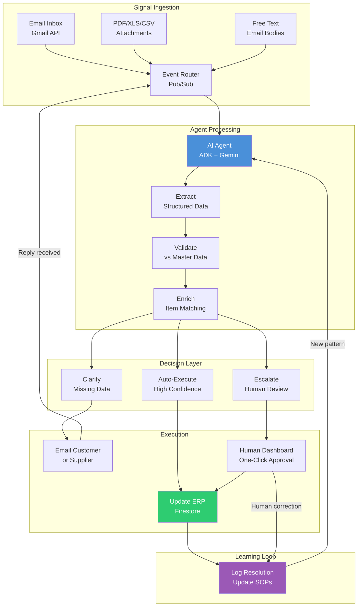

# Glacis AI Agent Reverse-Engineering: Order Intake + PO Confirmation

> [!abstract] Research Map
> Implementation-grade reverse-engineering of **Glacis's two proven AI agents** — Order Intake and PO Confirmation — synthesized with Pallet's engineering patterns and competitor analysis, mapped onto Google's ecosystem (ADK, Gemini, Cloud Run, Firestore) for the Google Solution Challenge 2026.
> 27 subtopics across 5 depth levels | ~45 sources | 2026-04-08

## Why This Exists

There is a companion research set — [[Supply-Chain-Solution-Challenge-Overview]] — with 33 notes covering the strategic architecture of an AI agent platform for supply chain execution. That research answers "what should we build and why." This research answers a different question: "how exactly does it work, and how do we code it?"

The trigger was two Glacis whitepapers — "How AI Automates Order Intake in Supply Chain" (December 2025) and "AI For PO Confirmation" (March 2026) — authored by Philipp Gutheim, Glacis's Founder & CEO. These are not marketing fluff. They contain step-by-step workflow descriptions, enterprise case studies with named companies and quantified results, and enough process detail to reverse-engineer the actual agent architecture. Pfizer achieved 80% touchless order processing. Knorr-Bremse hit >99% accuracy on PO confirmation extraction. WITTENSTEIN saves 11 hours of processing time per day. A $10B manufacturer went from 8-15 minutes per order to under 60 seconds with 93% reduction in processing time.

These numbers matter because they prove the architecture works at enterprise scale. The question for our hackathon build is not "will this approach work?" but "how do we implement it with Google's tools in 2-4 weeks?" This research exists to answer that question — implementation-level detail, proven patterns, buildable blueprints.

## The Big Picture

### Two Agents, One Architecture

Glacis has built two complementary AI agents that together cover the full order lifecycle:

**Order Intake Agent** (customer → manufacturer): A customer sends an order by email — could be free text, a PDF attachment, a spreadsheet, or an XML file. The agent pulls it from a shared inbox, extracts every line item (quantities, SKUs, dates, prices, ship-to addresses), maps customer descriptions ("Dark Roast 5lb bag") to internal item codes, validates against the product/price master, checks inventory and credit, and either creates the sales order in ERP automatically or flags exceptions for human review. The whole process takes under 60 seconds. Before the agent, it took 8-15 minutes of manual work per order with a 1-4% error rate.

**PO Confirmation Agent** (manufacturer → supplier): After a purchase order is sent from MRP/ERP to a supplier, the agent monitors for responses. If the supplier doesn't reply within the SLA, the agent follows up automatically in a natural, professional tone. When the supplier responds — again, via email in any format — the agent extracts the confirmation details, cross-references them against the original PO (checking price, quantity, delivery dates), flags any discrepancies, and either auto-updates the ERP or escalates to a buyer. The key insight: suppliers won't use portals (one manufacturer had 5% portal adoption), but they all use email.

Both agents share the same architectural DNA:

### The Anti-Portal Principle

The single most important design insight from both Glacis PDFs is what they call the "Anti-Portal" approach. Portals failed because they asked external parties (customers, suppliers) to change their behavior — log into a new system, learn a new interface, manually enter data in a specific format. The adoption numbers tell the story: one manufacturer had only 5% of suppliers actively using their portal. Another implemented SAP Ariba for direct materials confirmations, but teams moved back to email the moment exceptions arose. They eventually scrapped the implementation.

The AI agent flips this entirely. Suppliers and customers keep doing exactly what they already do — sending emails. The agent is the one that adapts, parsing whatever format arrives. No training required. No adoption barrier. No change management. This is not just a feature — it is the foundational architectural constraint. Every design decision in our build must respect it: the system adapts to humans, never the other way around.

### What Glacis Proves (Enterprise Metrics)

| Company | Industry | What They Automated | Result |
|---------|----------|-------------------|--------|
| Pfizer | Pharma | Unstructured order capture from email/PDF | 80% touchless; order entry <5 min; scaled to 10 markets in 6 months |
| Thermo Fisher | Scientific Equipment | Digitizing orders from 17 systems (phone/fax/email) | $200-300M cash flow improvement; 27% faster call handling |
| Carlsberg | Food & Beverage | Emailed distributor orders across 150 markets | 92% touchless; 140+ hours/month saved |
| Siemens | Industrial Manufacturing | AI extracts PO data, suppliers confirm in cloud portal | 55,000 work hours/year saved |
| BMW | Automotive | Agent analyzes supplier offers; shop-floor robots linked to order data | Rapid "stress testing" of supplier networks |
| Schneider Electric | Energy Management | Maps PDFs to EDI; AI handles non-EDI PPE orders | 70% zero-touch for non-EDI orders; 4 hours → 2 min processing |
| Heineken Spain | Food & Beverage | Splits single PDF orders into multiple ERP sales orders | 900% faster; 50% fully touchless |
| ABB | Robotics & Automation | Optimizes distributor ordering patterns; Vision AI picks items | $200M/year saved via inventory optimization |
| Tetra Pak | Packaging | Real-time "digital thread" of orders/production steps | 85% reduction in information collection time |
| Knorr-Bremse | Rail & Commercial Vehicles | PO confirmations from any format (PDF, Excel, SAP screenshots, handwritten) | >99% accuracy; eliminated manual cross-checking |
| WITTENSTEIN SE | Drive Technology | PO confirmations from email/PDF matched against SAP POs | ~11 hours processing time saved per day |
| IDEX Corporation | Diversified Industrial | Auto-reminders for unconfirmed POs; escalation notifications | 92% supplier orders confirmed within 48 hours |
| BraunAbility | Automotive & Mobility | Automated PO confirmation across ~15,000 SKUs and 100+ suppliers | 94% PO acknowledgment rate; 30% boost in supplier OTIF to 90% |

### The Cost of NOT Automating

The Glacis PDFs quantify the manual cost with precision:

**Order Intake**: 8-15 minutes per non-EDI order. 40-60% of a customer service rep's day lost to data entry. $10-15 incurred per manual order. 1-4% inherent error rate that cascades into downstream OTIF failures.

**PO Confirmation**: 60-70% of a buyer's workload consumed by confirmation activities — managing incoming confirmations (30%), updating ERP (20%), resolving exceptions (20%). At a $1.5B CPG manufacturer: 30 FTEs at $1.9M annual cost processing 35,000 POs/year. Best-in-class orgs do it with 6 FTEs (100 vs 400 POs per buyer per month). The gap: $900K in people costs, $2.2M in expedites and safety stock, $3.1M total annual savings.

## How It All Fits Together

This research is organized as a progressive descent from "what does Glacis build?" down to "how do I deploy this on Cloud Run?" The 27 deep dives are structured across 5 depth levels:

**Level 1 — Foundation**: Reverse-engineers both Glacis agents step by step, scans the competitor landscape (Pallet, Tradeshift, Coupa, Basware, Esker), and establishes the Anti-Portal design philosophy as the architectural constraint.

**Level 2 — Core Systems**: Designs the six core subsystems needed for both agents — multi-format document processing, validation & enrichment pipeline, exception handling & escalation, SOP playbook system, supplier communication engine, and ERP integration patterns.

**Level 3 — Implementation Detail**: Goes one level deeper into each subsystem — email ingestion architecture (Gmail API + Pub/Sub), embedding-based item matching, the Generator-Judge pattern adapted for supply chain, the learning loop, metrics/observability, security/audit, and token optimization strategy.

**Level 4 — Build-Level Detail**: Produces the artifacts needed to write code — complete ADK agent definitions for both Order Intake and PO Confirmation, Firestore data model with collection schemas, Pub/Sub event architecture, Gemini prompt templates, and dashboard UI design.

**Level 5 — Demo & Deployment**: Designs the hackathon demo scenario (2-minute wow moment with 3+ supplier types), synthetic data generation strategy, a 2-4 week build plan for a 3-person team, and Cloud Run + Firebase Hosting deployment.

## Deep Dives

### Level 1 — Foundation

| # | Subtopic | Note | Why It Matters |
|---|----------|------|----------------|
| 1 | Order Intake Agent: How Glacis Does It | [[Glacis-Agent-Reverse-Engineering-Order-Intake-Agent]] | Step-by-step reverse-engineering of the Order Intake workflow from Glacis's $10B manufacturer case study |
| 2 | PO Confirmation Agent: How Glacis Does It | [[Glacis-Agent-Reverse-Engineering-PO-Confirmation-Agent]] | Step-by-step reverse-engineering of the PO Confirmation workflow, "Anti-Portal" approach, supplier follow-up automation |
| 3 | Competitor Landscape | [[Glacis-Agent-Reverse-Engineering-Competitor-Landscape]] | Glacis vs Pallet vs Tradeshift vs Coupa vs Basware vs Esker — steal the best patterns from each |
| 4 | Anti-Portal Design Philosophy | [[Glacis-Agent-Reverse-Engineering-Anti-Portal-Design]] | Zero adoption barrier as architectural constraint — why portals fail, why email wins, design implications |

### Level 2 — Core Systems

| # | Subtopic | Note | Parent |
|---|----------|------|--------|
| 5 | Multi-Format Document Processing | [[Glacis-Agent-Reverse-Engineering-Document-Processing]] | Order Intake Agent |
| 6 | Validation & Enrichment Pipeline | [[Glacis-Agent-Reverse-Engineering-Validation-Pipeline]] | Order Intake Agent |
| 7 | Exception Handling & Escalation | [[Glacis-Agent-Reverse-Engineering-Exception-Handling]] | Both agents |
| 8 | SOP Playbook System Design | [[Glacis-Agent-Reverse-Engineering-SOP-Playbook]] | Both agents |
| 9 | Supplier Communication Engine | [[Glacis-Agent-Reverse-Engineering-Supplier-Communication]] | PO Confirmation Agent |
| 10 | ERP Integration & Sync Patterns | [[Glacis-Agent-Reverse-Engineering-ERP-Integration]] | Both agents |

### Level 3 — Implementation Detail

| # | Subtopic | Note | Parent |
|---|----------|------|--------|
| 11 | Email Ingestion Architecture | [[Glacis-Agent-Reverse-Engineering-Email-Ingestion]] | Document Processing |
| 12 | Embedding-Based Item Matching | [[Glacis-Agent-Reverse-Engineering-Item-Matching]] | Validation Pipeline |
| 13 | Generator-Judge Pattern for Supply Chain | [[Glacis-Agent-Reverse-Engineering-Generator-Judge]] | Validation Pipeline |
| 14 | Learning Loop & Continuous Intelligence | [[Glacis-Agent-Reverse-Engineering-Learning-Loop]] | SOP Playbook |
| 15 | Metrics & Observability Dashboard | [[Glacis-Agent-Reverse-Engineering-Metrics-Dashboard]] | Both agents |
| 16 | Security & Audit Architecture | [[Glacis-Agent-Reverse-Engineering-Security-Audit]] | ERP Integration |
| 17 | Token Optimization Strategy | [[Glacis-Agent-Reverse-Engineering-Token-Optimization]] | Document Processing |

### Level 4 — Build-Level Detail

| # | Subtopic | Note | Parent |
|---|----------|------|--------|
| 18 | ADK Agent: Order Intake Implementation | [[Glacis-Agent-Reverse-Engineering-ADK-Order-Intake]] | Email Ingestion + Validation |
| 19 | ADK Agent: PO Confirmation Implementation | [[Glacis-Agent-Reverse-Engineering-ADK-PO-Confirmation]] | Supplier Communication |
| 20 | Firestore Data Model & Schemas | [[Glacis-Agent-Reverse-Engineering-Firestore-Schema]] | ERP Integration |
| 21 | Pub/Sub Event Architecture | [[Glacis-Agent-Reverse-Engineering-Event-Architecture]] | Email Ingestion |
| 22 | Gemini Prompt Templates | [[Glacis-Agent-Reverse-Engineering-Prompt-Templates]] | Generator-Judge |
| 23 | Real-Time Dashboard UI Design | [[Glacis-Agent-Reverse-Engineering-Dashboard-UI]] | Metrics Dashboard |

### Level 5 — Demo & Deployment

| # | Subtopic | Note | Parent |
|---|----------|------|--------|
| 24 | Demo Scenario Design | [[Glacis-Agent-Reverse-Engineering-Demo-Scenario]] | Overview |
| 25 | Synthetic Data & Test Fixtures | [[Glacis-Agent-Reverse-Engineering-Synthetic-Data]] | Demo Scenario |
| 26 | 2-4 Week Build Plan (3-Person Team) | [[Glacis-Agent-Reverse-Engineering-Build-Plan]] | Demo Scenario |
| 27 | Cloud Run + Firebase Deployment | [[Glacis-Agent-Reverse-Engineering-Deployment]] | Build Plan |

## Sources

### Glacis Whitepapers (Primary)
- [How AI Automates Order Intake in Supply Chain](https://glacis.com) — Glacis, Dec 2025. 9-page whitepaper with Pfizer/Siemens/Carlsberg case studies and $10B manufacturer implementation
- [AI For PO Confirmation V8](https://glacis.com) — Glacis, March 2026. 11-page whitepaper with Knorr-Bremse/WITTENSTEIN/IDEX case studies and "Anti-Portal" concept

### Pallet Engineering Blog (Enrichment)
- [Deep Reasoning in AI Agents](https://www.pallet.com/blog/deep-reasoning-in-ai-agents-moving-beyond-simple-llm-outputs-in-logistics) — Generator-Judge pattern
- [Memory and Reasoning in Agentic AI](https://www.pallet.com/blog/memory-and-reasoning-in-agentic-ai-why-logistics-demands-more-than-llms) — Enterprise Memory Layer
- [AI-Powered OCR in Logistics](https://www.pallet.com/blog/ai-powered-ocr-in-logistics-beyond-scanning-to-understanding) — Document processing with LLMs
- [Parallel AI Agents in Logistics](https://www.pallet.com/blog/parallel-ai-agents-in-logistics-processing-1000-workflows-simultaneously) — Concurrent execution
- [Continuous Intelligence](https://www.pallet.com/blog/continuous-intelligence-how-ai-agents-learn-and-improve-in-real-time-logistics-operations) — Learning loop

### Competitor Analysis
- Sources compiled during research — see [[Glacis-Agent-Reverse-Engineering-Competitor-Landscape]] for full list

### Google Ecosystem
- [ADK Documentation](https://google.github.io/adk-docs/) — Agent Development Kit for multi-agent orchestration
- [Gemini API](https://ai.google.dev/docs) — Multimodal document processing, structured output
- [Cloud Run](https://cloud.google.com/run/docs) — Serverless deployment
- [Firestore](https://firebase.google.com/docs/firestore) — Real-time database and vector search
- [Pub/Sub](https://cloud.google.com/pubsub/docs) — Event-driven messaging

### Industry Data
- APQC Open Standards Benchmarking — PO confirmation activities account for 60-70% of buyer workload
- FourKites Control Tower Survey — 34 updates, 25 emails, 8 roles per disruption
- Kinaxis/IDC 2024 — 83% of supply chains can't respond to disruptions within 24 hours

## Related Notes

### Companion Research (Strategic/Architectural)
- [[Supply-Chain-Solution-Challenge-Overview]] — The 33-note strategic research set (start here for "what and why")
- [[Supply-Chain-Glacis-Analysis]] — High-level Glacis competitive analysis
- [[Supply-Chain-Pallet-Analysis]] — Pallet's approach and $27M validation
- [[Supply-Chain-Pallet-Engineering-Patterns]] — 8 blog articles synthesized into patterns
- [[Supply-Chain-Order-Intake-Workflow]] — Existing order intake workflow (architectural level)
- [[Supply-Chain-Agent-Workflows]] — Four agent types with workflow definitions
- [[Supply-Chain-Platform-Architecture]] — Five-layer platform architecture

### Other Deep Dives
- [[Supply-Chain-Problem-Discovery]] — The 24 quantified problems defining the problem space
- [[Supply-Chain-Exception-Triage-Overview]] — AI-powered disruption-to-action bridge
