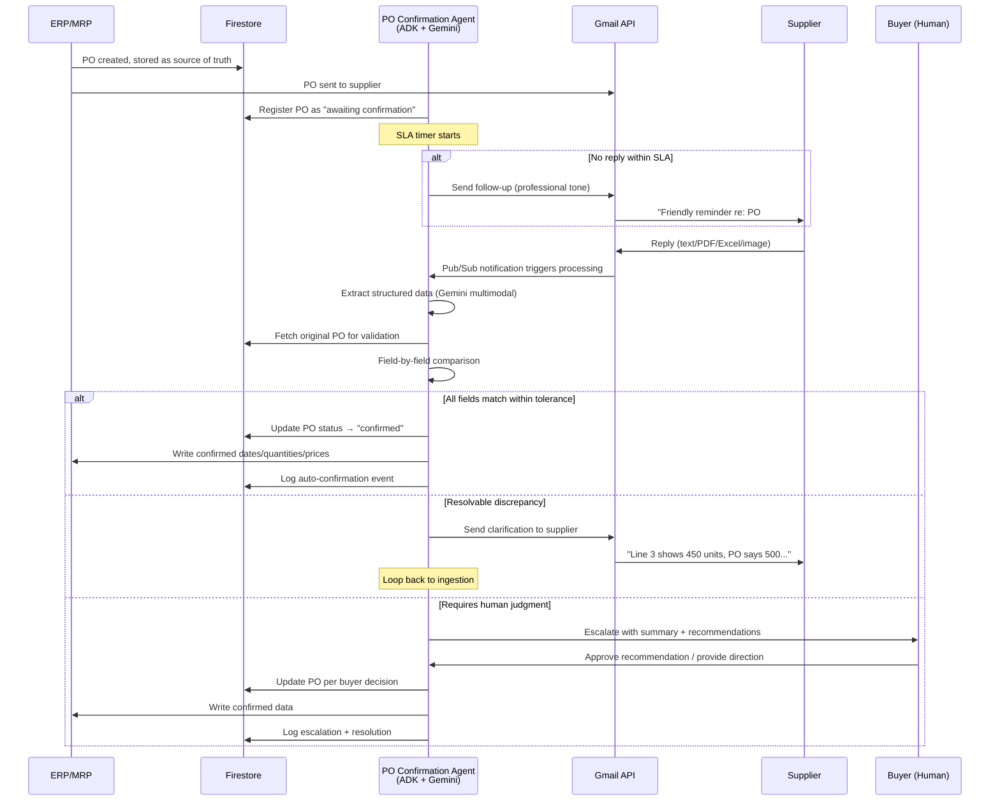

# PO Confirmation Agent: How Glacis Does It

> [!info] Context
> This is a Level 1 Foundation note in the [[Glacis-Agent-Reverse-Engineering-Overview|Glacis Reverse-Engineering]] research set. It reverse-engineers the PO Confirmation Agent from Glacis's March 2026 whitepaper ("AI For PO Confirmation V8" by Philipp Gutheim), grounded in enterprise case studies from Knorr-Bremse, WITTENSTEIN SE, IDEX Corporation, and BraunAbility. Sibling note: [[Glacis-Agent-Reverse-Engineering-Order-Intake-Agent]] covers the inbound order side. After reading this, you should understand exactly what the agent does, why portals failed so badly that email became the only viable channel, and how to build a PO Confirmation agent yourself using Google's stack.

## The Problem

A manufacturer sends a purchase order to a supplier. What happens next?

In theory, the supplier confirms — acknowledging the items, quantities, prices, and delivery dates. The buyer updates the ERP. Material planners work from current data. Production schedules hold. OTIF stays high.

In practice, almost none of that happens cleanly.

### Portal Failure Is Not a Technology Problem

Every major ERP vendor has tried to solve this with supplier portals. SAP Ariba, Coupa, Oracle Supplier Cloud — the pitch is always the same: give suppliers a web interface, they enter confirmations, data flows into ERP. Clean. Structured. Auditable.

The adoption numbers are brutal. Over 60% of supplier portal implementations fail to meet adoption goals. Only 30-40% of suppliers consistently use portals even after sustained rollout efforts. One manufacturer in the Glacis case study had **5% portal adoption**. Another integrated SAP Ariba for direct materials PO confirmations — teams moved back to email the moment exceptions arose. They eventually scrapped the entire implementation.

Why? Suppliers must log into an average of **8.4 different systems** to serve their major customers (38% log into 10+ systems). Each portal has different UX, different credentials, different workflows. Suppliers don't have bandwidth for this. They have their own business to run. Portal fatigue is not a training problem or a UX problem — it is a structural impossibility. You are asking external organizations to subsidize your data quality with their labor.

Email works for every customer. Handles routine confirmations and exceptions. Zero training required. 77% of B2B customers prefer email over any other communication channel. The industry data is unambiguous: email is the de facto protocol for supplier communication, and no amount of portal investment changes that.

### The Real Cost of Manual Confirmation Processing

The Glacis whitepaper quantifies this with precision at a **$1.5B CPG manufacturer**:

- **35,000 POs/year** requiring confirmation
- **30 FTEs** dedicated to confirmation processing at **$1.9M annual cost**
- Best-in-class organizations do the same work with **6 FTEs** (400 POs per buyer per month vs. 100)
- **60-70% of a buyer's workload** consumed by confirmation activities: managing incoming confirmations (30%), updating ERP (20%), resolving exceptions (20%)
- **2-5 day delay** between supplier communication and ERP update
- Inventory carrying costs at **~20% annually** inflated by stale data
- Expedite costs at **1-2% of procurement spend** — reactive firefighting caused by outdated plans

The downstream damage is where it gets expensive. When confirmations sit unprocessed, MRP shows outdated promised dates. Material planners make decisions on stale data. Production schedules are built on fiction. The result: emergency expedites ($2.2M at this manufacturer), inflated safety stock, "golden screw" scenarios where a single missing component halts an entire assembly line, and OTIF erosion. In CPG, that means empty shelf space and retailer penalties. In build-to-order manufacturing, it means a late component stops the production line.

## First Principles

Strip away the supply chain jargon and what Glacis built is a **monitoring + validation + communication loop**. This is the same pattern you see in observability systems, CI/CD pipelines, and fraud detection. The core abstraction:

1. **Watch** a signal source for events (email inbox)
2. **Extract** structured data from unstructured input (parse supplier replies)
3. **Validate** extracted data against a source of truth (cross-reference with original PO from ERP)
4. **Decide** what to do based on the validation result (auto-update, clarify, or escalate)
5. **Act** on the decision (write to ERP, send email, notify human)
6. **Learn** from outcomes (log resolutions, update SOPs)

This is not a chatbot. This is not RAG over documents. This is a **stateful, long-running agent** that maintains context across a multi-turn conversation with a supplier that could span days or weeks. The agent tracks which POs are outstanding, which have been confirmed, which have discrepancies — and it takes autonomous action within guardrails.

The key architectural insight: the agent sits between two systems that will never natively integrate (supplier email behavior and buyer ERP data), acting as a real-time translation layer. It does not ask either side to change. It adapts to both.

## How It Actually Works

Glacis describes a six-step workflow. Here is each step reverse-engineered into buildable components, with the Google tech stack mapped alongside.

### Step 1: PO Dispatch and Inbox Monitoring

The ERP/MRP system generates a purchase order and sends it to the supplier. The AI agent receives a copy — either from a procurement group mailbox (shared inbox) or via forwarding rules.

**What is actually happening**: The agent needs a persistent connection to an email inbox, polling or push-notified when new messages arrive. It also needs the original PO data from the ERP so it has a source of truth to validate against later.

**Google stack mapping**: Gmail API with Pub/Sub push notifications. When a new email arrives in the monitored inbox, Google pushes a notification to a Pub/Sub topic. A Cloud Run service subscribes to that topic and triggers the agent. The original PO data lives in Firestore, written there when the PO was created in the ERP.

### Step 2: Autonomous Follow-Up

If no supplier reply arrives within the SLA window (configurable per supplier or commodity), the agent sends a follow-up email. The follow-up is written in natural, professional language that mirrors the buyer team's writing style.

**What is actually happening**: A scheduled check (cron or Cloud Scheduler) scans open POs past their SLA threshold. For each, the agent composes a follow-up using the original PO context and sends it from the group mailbox. The tone and style are calibrated to match existing team communications — this is not a robotic "Please confirm PO #12345." It reads like a human buyer wrote it.

**Implementation detail**: This is where prompt engineering matters. The agent needs few-shot examples of actual buyer emails to calibrate tone. At IDEX Corporation, this autonomous follow-up drove **92% of supplier orders confirmed within 48 hours**. At BraunAbility, the acknowledgment rate hit **94%** across ~15,000 SKUs and 100+ suppliers.

### Step 3: Supplier Response Ingestion

The supplier replies by email — could be plain text in the body, a PDF attachment, an Excel spreadsheet, or even a screenshot of their system. No format requirements. No constraints on the supplier.

**What is actually happening**: The agent must handle multi-format document processing. Email body text is the simplest case. Attachments require extraction and parsing — PDF with tabular data, Excel with varying column layouts, sometimes even images. Knorr-Bremse's case study explicitly mentions handling "PDF, Excel, SAP screenshots, and handwritten notes" with >99% accuracy.

**Google stack mapping**: Gemini's multimodal capabilities handle this natively. PDF and image attachments go through Gemini's vision model. Excel and CSV get parsed programmatically first, then Gemini extracts structured fields. The output is always the same: a structured confirmation object with line items, quantities, prices, dates, and any supplier notes.

### Step 4: Validation Against Master Data

The agent takes the extracted confirmation data and cross-references it against the original PO from the ERP. It checks: Are the quantities correct? Do the prices match? Are the delivery dates acceptable? Do the item codes/SKUs align?

**What is actually happening**: This is a deterministic validation layer — not an LLM judgment call. The agent pulls the original PO from Firestore (or ERP API), performs field-by-field comparison, and flags mismatches. This is where Glacis's first design principle matters: "Every confirmation validated against master data + original PO before action."

**Validation logic** (reverse-engineered from Glacis + competitor patterns):
- **Quantity check**: Confirmed qty vs. ordered qty. Partial confirmations are valid but flagged.
- **Price check**: Confirmed unit price vs. PO unit price. Tolerance ranges apply (Turian.ai mentions 2% as a common threshold). Currency and unit-of-measure conversions handled.
- **Date check**: Confirmed delivery date vs. requested date. Delay tolerance configurable.
- **Item matching**: Supplier item codes mapped to internal SKUs. This may require embedding-based fuzzy matching (see [[Glacis-Agent-Reverse-Engineering-Item-Matching]]).
- **Terms check**: Payment terms and Incoterms validation against master agreements.

### Step 5: Decision and Action

Based on validation results, the agent takes one of three paths:

**(a) No issues → Auto-update ERP.** The confirmation matches the PO within tolerances. The agent writes the confirmed quantities, prices, and dates directly to the ERP record. No human involvement. At WITTENSTEIN SE, this path saves ~11 hours of processing time per day.

**(b) Inconsistencies → Clarify with supplier.** A price is 3% higher than the PO. A delivery date is pushed out by two weeks. The quantity is short. The agent composes a clarification email to the supplier — specific, professional, referencing the exact discrepancy: "We received your confirmation for PO #78234. Line 3 shows 450 units at $12.80/unit, but our PO specifies 500 units at $12.50/unit. Could you confirm the correct quantity and pricing?" This loops back to Step 3 when the supplier replies.

**(c) Exceptions requiring human judgment → Escalate to buyer.** The supplier confirms a 6-week delay on a critical component. Or the price increase exceeds tolerance and requires commercial negotiation. The agent doesn't negotiate or make commitments. Instead, it escalates to the buyer with a summary of the situation, the discrepancy details, and recommended next steps. The buyer makes a one-click approval or provides alternative direction.

**Escalation design** (from Glacis whitepaper): When a discrepancy can't be resolved with the supplier directly, the AI recommends solutions and next steps to the buyer. The buyer approves the recommendation or works with the AI to explore alternatives. Once confirmed, the AI executes based on SOPs. This is critical — the agent is a decision-support tool with execution capability, not an autonomous negotiator.

### Step 6: Continuous ERP Sync and Audit Trail

The ERP stays in sync 24/7. Planners work with actual supplier commitments, not outdated promised dates. Every action is logged — every email sent, every validation performed, every decision made, every escalation and its resolution.

**What is actually happening**: The agent maintains a complete audit trail. Every state transition (PO sent → awaiting confirmation → confirmed → discrepancy detected → clarification sent → resolved → ERP updated) is logged with timestamps, the data at each stage, and the rationale for each decision.

**Google stack mapping**: Firestore for state management (each PO is a document with a subcollection of events). Cloud Logging for operational audit. The real-time sync means material planners see confirmed dates the moment the agent processes them — not 2-5 days later when a buyer gets around to updating the ERP manually.

### The Complete Flow

## The Tradeoffs

### What You Gain

**Speed**: The 2-5 day delay between supplier communication and ERP update drops to near-zero. At the $1.5B CPG manufacturer, this translated to OTIF improvement from 84% to 91%.

**Cost**: 30 FTEs to 9 FTEs ($900K saved). Expedites and safety stock from $3.4M to $1.2M ($2.2M saved). Total: **$3.1M/year**.

**Coverage**: Email-first means 100% of suppliers are reachable from day one. No onboarding. No adoption campaigns. No portal fatigue. Compare this to portals where you spend 6-12 months achieving 30-40% adoption.

**Data freshness**: Planners work with actual supplier commitments instead of assumptions. MRP runs produce actionable schedules instead of fiction.

### What You Pay

**LLM accuracy risk**: The agent parses unstructured supplier emails. Even at >99% accuracy (Knorr-Bremse's reported number), on 35,000 POs/year that is potentially 350 errors. The validation layer catches most — but not all. You need the human escalation path as a safety net, not just for complex cases but for LLM parsing errors.

**Prompt brittleness**: The follow-up and clarification emails must sound human. If they drift into robotic language, suppliers may disengage or become confused. This requires ongoing prompt maintenance as supplier communication patterns evolve. Few-shot examples from real buyer emails are essential calibration material.

**Integration complexity**: The "lightweight integration" Glacis describes (4-week pilot: connect to email + ERP) is lightweight compared to a portal rollout, but ERP integration is never simple. Reading PO data is straightforward. Writing confirmed dates and prices back to the ERP requires careful handling of locking, validation rules, and approval workflows that vary wildly across SAP, Oracle, NetSuite, and Dynamics installations.

**Supplier trust**: Some suppliers may object to receiving AI-generated communications (especially follow-ups and clarification requests). The design principle of mirroring the buyer team's writing style mitigates this — the supplier should not know or care that an agent sent the email. But if the agent is ever unmasked as automated, trust repair is expensive.

**Scope boundary**: The agent does not negotiate. It does not approve price increases. It does not commit to accepting late deliveries. These boundaries are features, not limitations — but they mean a human buyer is still required for commercial decisions. The agent handles the 70-80% of routine confirmations that match, freeing the buyer to focus on the 20-30% that actually need judgment.

## What Most People Get Wrong

**"This is just OCR with a chatbot on top."** No. OCR extracts text from images. This agent maintains state across a multi-turn, multi-day conversation, validates against business rules, takes autonomous action within guardrails, and loops back for clarification. The extraction step is maybe 15% of the system. The validation, decision, and communication layers are the hard part.

**"We need to clean our data first."** Glacis explicitly designs for a 4-week pilot with no upfront data cleaning. The agent starts with one buyer team and the highest-volume supplier segment. It learns from the data it encounters. Waiting for perfect master data is the classic enterprise stall tactic that kills projects before they start.

**"Suppliers won't respond to AI emails."** They already do — they just don't know it. The Glacis design principle is that the agent communicates in clear, professional language mirroring the buyer team's writing style. BraunAbility achieved a 94% PO acknowledgment rate. IDEX hit 92% confirmation within 48 hours. Suppliers respond to well-written, specific emails regardless of who (or what) sent them.

**"We should build a portal with AI as a fallback."** This inverts the correct architecture. Email-first with a dashboard for buyer oversight is the right design. The dashboard is for the buyer, not the supplier. The supplier never sees your system. The 2026 industry data confirms this: email-first AI achieves near-100% supplier participation vs. 30-40% for portals even after sustained rollout.

**"The hard part is the LLM."** The hard part is the state machine. Tracking which POs are outstanding, which are partially confirmed, which have discrepancies in resolution, which follow-ups have been sent and when, which escalations are pending buyer action — this is a distributed systems problem. The LLM is a powerful parser and composer, but the orchestration layer (state management, SLA timers, escalation rules, audit logging) is where the real engineering lives.

## Connections

### Sibling Notes (Level 1 — Foundation)
- [[Glacis-Agent-Reverse-Engineering-Order-Intake-Agent]] — The inbound side: customer sends order, agent processes into ERP. Same architectural DNA, different direction.
- [[Glacis-Agent-Reverse-Engineering-Competitor-Landscape]] — How Pallet, Tradeshift, Coupa, Basware, and Esker approach the same problem space. Steal the best patterns.
- [[Glacis-Agent-Reverse-Engineering-Anti-Portal-Design]] — Deep dive into the "Anti-Portal" philosophy as an architectural constraint. The foundational principle that governs every design decision.

### Parent
- [[Glacis-Agent-Reverse-Engineering-Overview]] — Full research map with 27 subtopics across 5 depth levels.

### Companion Research
- [[Supply-Chain-Solution-Challenge-Overview]] — Strategic architecture of the AI agent platform (the "what and why" to this note's "how")
- [[Supply-Chain-Glacis-Analysis]] — High-level Glacis competitive analysis
- [[Supply-Chain-Agent-Workflows]] — Four agent types including PO Confirmation workflow at architectural level

### Wiki Pages
- [[a2a-protocol]] — Agent-to-agent communication standard relevant to multi-agent PO processing
- [[google-adk]] — The framework we'd use to build the agent's orchestration layer
- [[event-driven-architecture]] — The Pub/Sub + state machine pattern that underpins this agent
- [[error-recovery-patterns]] — Circuit breaker and retry patterns for ERP integration reliability

## Subtopics for Further Deep Dive

1. **[[Glacis-Agent-Reverse-Engineering-Supplier-Communication]]** — The supplier communication engine in detail: tone calibration, follow-up escalation ladders, multi-language support, thread management across weeks-long conversations.
2. **[[Glacis-Agent-Reverse-Engineering-Validation-Pipeline]]** — Field-by-field validation logic: tolerance thresholds, partial confirmation handling, unit-of-measure conversion, price break verification.
3. **[[Glacis-Agent-Reverse-Engineering-Exception-Handling]]** — The escalation decision tree: what gets auto-resolved, what gets clarified, what gets escalated, and how the buyer interface works for one-click approvals.
4. **[[Glacis-Agent-Reverse-Engineering-ERP-Integration]]** — Reading PO data and writing confirmations back: locking, idempotency, retry logic, handling ERP-specific validation rules across SAP/Oracle/NetSuite.
5. **[[Glacis-Agent-Reverse-Engineering-SOP-Playbook]]** — How the agent's behavior is configured via standard operating procedures rather than code: business rules, tolerance thresholds, escalation policies as data, not logic.
6. **[[Glacis-Agent-Reverse-Engineering-Learning-Loop]]** — How buyer corrections and resolution patterns feed back into the agent's behavior: prompt refinement, threshold tuning, new exception categories.
7. **[[Glacis-Agent-Reverse-Engineering-ADK-PO-Confirmation]]** — Build-level detail: complete ADK agent definition, tool schemas, session state management, Gemini prompt templates for extraction and composition.

## References

### Primary Source
- Glacis, "AI For PO Confirmation V8" (March 2026) — Philipp Gutheim, Founder & CEO. 11-page whitepaper with enterprise case studies and step-by-step workflow. [glacis.com](https://www.glacis.com/)

### Enterprise Case Studies (from Glacis whitepaper)
- **Knorr-Bremse** (Rail & Commercial Vehicles): >99% accuracy on PO confirmation extraction across PDF, Excel, SAP screenshots, handwritten notes
- **WITTENSTEIN SE** (Drive Technology): ~11 hours processing time saved per day on PO confirmations from email/PDF matched against SAP POs
- **IDEX Corporation** (Diversified Industrial): 92% supplier orders confirmed within 48 hours via auto-reminders and escalation
- **BraunAbility** (Automotive & Mobility): 94% PO acknowledgment rate across ~15,000 SKUs and 100+ suppliers; 30% boost in supplier OTIF to 90%
- **$1.5B CPG manufacturer** (unnamed): 30→9 FTEs, $3.1M/year savings, OTIF 84%→91%

### Industry Data
- [Sotro: Supplier Portals Are Dead](https://sotro.io/blog/supplier-portals-are-dead) — 60% portal implementation failure rate, 8.4 average systems per supplier, email-first adoption data
- [CodaBears: The Anti-Supplier Portal Revolution](https://codabears.com/en/product/blog/the-anti-supplier-portal-revolution--antisupplier_portal_revolution) — 30-40% portal adoption rates, 93% supplier response rates with email-first AI
- [Turian.ai: AI Agent for PO Confirmation](https://www.turian.ai/use-cases/ai-agent-for-purchase-order-confirmation) — Workflow details, tolerance ranges, approval rules, 80% time savings
- [Nordoon: Automating PO Maintenance with AI Agents](https://www.nordoon.ai/customer-stories/automating-purchase-order-maintenance-ai-agents) — 90%+ reduction in manual PO time, 500+ supplier scalability
- [NPA: Why 2026 Is the Year of AI Agents for Autonomous Procurement](https://www.newpageassociates.com/2026/04/07/why-2026-is-the-year-of-ai-agents-for-autonomous-procurement/) — 94% weekly GenAI usage in procurement, 60% full AI integration forecast by 2026
- APQC Open Standards Benchmarking — PO confirmation activities account for 60-70% of buyer workload
