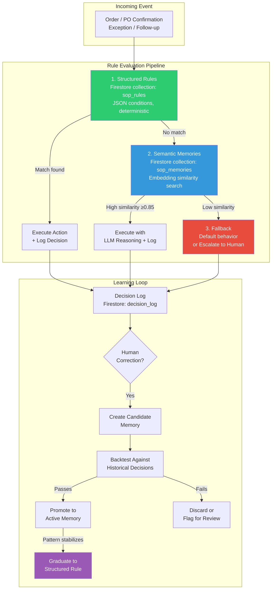

# SOP Playbook System Design

> [!info] Context — Depth level: 2. Parent: Both agents. THIS IS A DESIGN NOTE — the research question was how to design the SOP playbook system for our Google Solution Challenge build, synthesizing proven patterns from Glacis's configurable playbook and Pallet's Enterprise Memory Layer.

## The Problem

A $10B manufacturer does not have one way of doing business. It has thousands of ways, accumulated over decades, distributed across the heads of people who are retiring, changing roles, or simply not around when the 3 AM exception fires.

Glacis's whitepapers describe an "SOP playbook" that is "configurable by the supply chain teams, not IT" and controls what the agent can and cannot do, when to auto-execute versus escalate, communication style, validation rules, and follow-up cadence. Pallet's product page describes an "Enterprise Memory Layer" built from "written SOPs, event logs, and history of manual interventions" that applies "thousands of customer-specific rules and tribal knowledge." Both companies raised significant funding validating this exact capability: Glacis with enterprise deployments at Pfizer and Knorr-Bremse, Pallet with $27M and 200+ logistics customers.

The numbers define the engineering challenge. Pallet reports an average of 20 custom rules per customer across 200+ customers, yielding 4,000+ active business rules. These are not abstract policy documents sitting in a SharePoint folder. They are operational instructions that determine whether the agent auto-creates a sales order or escalates to a human. "Customer ABC always requests FedEx Ground for orders under 50 lbs." "Price deviations above 5% on pharmaceutical products require buyer approval." "Procter & Gamble is coded as P&G." "Consolidate multiple LTL loads for ACME." Every one of these rules must fire reliably, at the right moment, for the right customer, without a developer deploying new code.

The deeper problem is that these rules exist on a spectrum. Some are crisp and deterministic: if price deviation exceeds 5%, escalate. A JSON condition evaluates that in microseconds. Others are fuzzy and contextual: "this customer tends to round up quantities, so 48 units probably means 50." No JSON rule captures that. It requires understanding a pattern learned from six months of order history. Building a system that handles only the crisp rules misses the tribal knowledge. Building one that handles only the fuzzy knowledge sacrifices the auditability that enterprises require. You need both.

## First Principles

Strip away the product marketing and SOPs are instructions for making decisions under uncertainty. Every SOP answers the same three questions: (1) When does this rule apply? (2) What should happen? (3) Who is responsible if it goes wrong?

These questions map onto a spectrum of rule types:

**Deterministic rules** sit at one end. They have explicit trigger conditions, binary logic, and predictable outcomes. "If the customer's credit balance exceeds their credit limit, hold the order." There is no ambiguity. The trigger is a numeric comparison. The action is a state change. The responsible party is the credit team. These rules are fast to evaluate, trivial to audit, and easy to explain to a regulator. They are also brittle: every edge case requires a new rule, and the rule count grows linearly with business complexity.

**Heuristic guidelines** sit at the other end. They encode judgment accumulated through experience. "When a longtime customer disputes a price, check whether their sales rep negotiated a verbal discount before escalating." No trigger condition captures "longtime customer" precisely. No binary logic handles "check whether a verbal discount exists." These guidelines are flexible, contextual, and capable of handling novel situations. They are also slow to evaluate (they require LLM reasoning over retrieved context), difficult to audit (the reasoning path varies each time), and impossible to guarantee deterministic behavior.

The first-principles insight: you do not choose between these two types. You build a system that stores both, evaluates deterministic rules first (fast, cheap, auditable), falls through to heuristic guidelines when no deterministic rule matches (slower, richer, contextual), and provides a learning loop that gradually promotes validated heuristics into deterministic rules as patterns stabilize.

This is the hybrid architecture. Glacis implements the deterministic side (configurable SOP playbook with explicit thresholds and routing rules). Pallet implements the heuristic side (Enterprise Memory Layer with plain-English memories retrieved by semantic similarity). Our design combines both.

## How It Actually Works

### The Hybrid Architecture



The pipeline evaluates rules in order of speed and certainty. Structured rules fire in milliseconds with zero ambiguity. Semantic memories fire in hundreds of milliseconds with LLM-mediated reasoning. The fallback path catches everything else. This ordering matters for two reasons: latency (80%+ of decisions should resolve at the structured rule layer) and auditability (the faster the path, the easier the audit trail).

### Layer 1: Structured Rules

A structured rule is a JSON document in Firestore with five fields that answer the three SOP questions plus two fields for lifecycle management:

```json
{
  "rule_id": "rule_price_deviation_pharma",
  "trigger": {
    "event_type": "order_validation",
    "conditions": [
      { "field": "product.category", "op": "==", "value": "pharmaceutical" },
      { "field": "line_item.price_deviation_pct", "op": ">", "value": 5.0 }
    ]
  },
  "action": {
    "type": "escalate",
    "target": "buyer_queue",
    "priority": "high",
    "message_template": "Price deviation of {deviation}% on {product} exceeds 5% pharma threshold"
  },
  "autonomy_level": "human_required",
  "escalation_path": ["buyer", "procurement_manager", "vp_supply_chain"],
  "metadata": {
    "created_by": "ops_team",
    "created_at": "2026-03-15",
    "source": "corporate_pricing_policy_v3",
    "confidence": "high",
    "hit_count": 847,
    "last_triggered": "2026-04-07"
  }
}
```

**Trigger conditions** are evaluated as a conjunction (all must match). The `field` references use dot notation into the event payload. The `op` field supports standard comparisons: `==`, `!=`, `>`, `<`, `>=`, `<=`, `in`, `not_in`, `contains`, `regex`. This is deliberately limited. Complex boolean logic (OR, nested AND/OR) gets expressed as multiple rules, not as a mini-programming-language inside a single rule. The reason: non-technical supply chain teams need to read and edit these. A flat list of conditions is readable. A nested boolean expression tree is not.

**Action types** map to agent capabilities:

| Action Type | What Happens | Example |
|------------|-------------|---------|
| `auto_execute` | Agent proceeds without human input | Create sales order, send confirmation |
| `escalate` | Route to human queue with context | Price mismatch above threshold |
| `clarify` | Send targeted question to customer/supplier | Missing ship-to address |
| `modify` | Transform the data before proceeding | Round quantity to nearest case pack |
| `delay` | Wait for a condition before proceeding | Hold order until credit review clears |
| `notify` | Send alert but continue processing | Large order from new customer |

**Autonomy levels** form a four-tier spectrum that maps to Glacis's configurable escalation:

1. `auto_execute` — agent acts, logs the decision, no human sees it unless they audit
2. `auto_execute_notify` — agent acts and sends a notification; human can override within a window
3. `human_approve` — agent prepares the action, human clicks approve/reject
4. `human_required` — agent surfaces the data, human makes the decision from scratch

This four-tier model supports the "confidence ramp" that Glacis describes for new deployments: start everything at `human_required`, then graduate rules to higher autonomy levels as trust builds. The ramp is per-rule and per-customer, not global.

**Firestore collection design** for structured rules:

```
sop_rules/
  {rule_id}/
    trigger: map
    action: map
    autonomy_level: string
    escalation_path: array
    scope: map  # { customer_id: "all" | "cust_123", region: "all" | "APAC" }
    metadata: map
    active: boolean
    version: number
```

Rules are scoped by customer and region. A rule with `scope.customer_id: "cust_123"` applies only to that customer. A rule with `scope.customer_id: "all"` applies globally. When multiple rules match an event, the most specific scope wins (customer-specific beats regional beats global). Ties are broken by priority field. This scoping model handles the reality that "Customer X always orders in pallets" without requiring a separate rule engine per customer.

**Evaluation at runtime**: When an event arrives, the agent queries Firestore for all active rules where `trigger.event_type` matches. This is a single indexed query. The returned rules (typically 10-50 for a given event type) are evaluated in-memory by checking each condition against the event payload. This is a simple loop, not an LLM call. Total latency: 20-80ms depending on rule count and Firestore read latency.

### Layer 2: Semantic Memories

When no structured rule matches — or when the matched rule's action is ambiguous and needs contextual enrichment — the agent falls through to the semantic memory layer.

A semantic memory is a plain-English statement with a precomputed vector embedding, stored alongside classification metadata:

```json
{
  "memory_id": "mem_acme_fedex_preference",
  "text": "ACME Corp always requests FedEx Ground for orders under 50 lbs. They switched from UPS in January 2026 after a series of delivery failures.",
  "embedding": [0.0234, -0.1567, ...],
  "classification": {
    "topic": "shipping_preference",
    "customer_id": "acme_corp",
    "region": "US_EAST",
    "agent_type": ["order_intake", "po_confirmation"]
  },
  "lifecycle": {
    "status": "active",
    "confidence": 0.92,
    "source": "manual_sop_ingestion",
    "created_at": "2026-02-10",
    "last_validated": "2026-04-01",
    "hit_count": 34,
    "backtested": true,
    "backtest_accuracy": 0.97
  }
}
```

**How memories are retrieved**: The agent constructs a natural-language query from the event context ("ACME Corp order, 30 lbs, shipping method needed") and runs a Firestore vector similarity search against the `embedding` field, pre-filtered by `classification.customer_id` and `classification.agent_type`. Firestore's native vector search supports this hybrid query pattern: standard field filters narrow the candidate set, then cosine similarity ranks the results. This is the critical capability that makes Firestore viable as both the rule store and the memory store without a separate vector database.

**How memories are used**: Unlike structured rules that execute deterministically, retrieved memories are injected into the LLM's context as grounding information. The agent prompt becomes: "Given this order event and these relevant business memories, determine the appropriate action." The LLM reasons over the memories and produces a decision with an explanation. This is slower (500-2000ms for a Gemini call) but handles the fuzzy guidelines that structured rules cannot.

**Firestore collection design** for semantic memories:

```
sop_memories/
  {memory_id}/
    text: string
    embedding: vector(768)
    classification: map
    lifecycle: map
    active: boolean
```

The embedding dimension (768) matches Gemini's text embedding model. The `lifecycle.confidence` score decays over time if a memory is never retrieved and validated by a human correction — this prevents stale tribal knowledge from persisting indefinitely.

### Layer 3: The Learning Loop

This is where the system compounds. Every human correction is a signal that the current rule set is incomplete.

**Step 1 — Capture the correction.** When a human overrides an agent decision in the escalation dashboard (edits an item match, approves a flagged price, changes a shipping method), the system logs the original decision, the correction, and the context. This is the `decision_log` collection.

**Step 2 — Generate a candidate memory.** The system examines the correction and generates a plain-English memory that would have produced the correct decision: "When ACME Corp orders include items under 50 lbs, default to FedEx Ground instead of standard shipping." This generation can be automated (the LLM drafts the memory from the correction context) or manual (the operations team writes it).

**Step 3 — Backtest the candidate.** This is Pallet's critical contribution. Before any learned rule goes live, it is tested against historical decisions. The system replays the last N events that would have triggered this memory and checks: would the memory have produced the correct outcome? If the backtest accuracy exceeds a threshold (e.g., 90%), the memory is promoted to `active` status. If it fails, it is discarded or flagged for human review. This prevents a single anomalous correction from creating a rule that breaks ten other cases.

**Step 4 — Graduate to structured rule.** When a semantic memory has been active for a sustained period, has high confidence, high hit count, and high backtest accuracy, it is a candidate for graduation to a structured rule. The operations team reviews it and, if appropriate, creates a deterministic JSON rule that replaces the memory. This graduation is the mechanism by which the fuzzy heuristic layer gradually crystallizes into the deterministic layer. Over time, the system gets faster, more auditable, and more predictable — without losing its ability to handle novelty through the remaining semantic memories.

### Ingestion: How Rules Enter the System

Rules arrive through three channels:

1. **Manual creation by operations teams.** A supply chain manager opens the playbook dashboard and creates a structured rule: "For customer X, if quantity exceeds 1000 units, require sales approval." This is the Glacis model — configurable by business users, not IT.

2. **Automated SOP ingestion.** Written SOP documents (PDFs, Word docs, wiki pages) are processed by Gemini to extract discrete, actionable rules. A 20-page SOP document might yield 40-60 individual memories. The LLM extracts each instruction as a standalone statement, classifies it by topic and scope, and generates an embedding. Human review validates the extraction before memories go active. This is how you bootstrap the memory layer for a new customer: ingest their existing SOPs instead of manually recreating every rule.

3. **Learned from corrections.** As described in the learning loop above. This is the channel that grows the rule set organically over time.

### Runtime Evaluation: Putting It All Together

When an order event arrives, the evaluation sequence is:

1. Extract event metadata: customer_id, event_type, product categories, quantities, prices.
2. Query `sop_rules` for all active rules matching event_type and scoped to this customer (or global).
3. Evaluate trigger conditions against event payload. If a rule matches, execute its action. Done. Log the decision.
4. If no structured rule matches, construct a context query and run vector similarity search against `sop_memories`, filtered by customer_id and agent_type.
5. If top memory similarity exceeds 0.85, inject retrieved memories (top 3-5) into the LLM prompt along with the event context. LLM produces a decision and explanation.
6. If no memory matches with sufficient confidence, apply the default behavior (which itself is a configurable rule — the "catch-all" rule for this event type and customer).
7. Log the decision, the path taken (structured/semantic/fallback), retrieved memories, and the LLM's reasoning (if applicable).

The entire pipeline runs in under 2 seconds for the happy path (structured rule match) and under 5 seconds for the semantic path. The 80%+ of events that match structured rules complete in under 100ms of rule evaluation time (plus Firestore read latency).

## The Tradeoffs

**Structured rules are fast but brittle.** A deterministic JSON rule evaluates in microseconds. It is perfectly auditable — you can show a regulator exactly which rule fired and why. But it handles only the cases its author anticipated. Every new edge case demands a new rule. At 4,000+ rules (Pallet's scale), rule management itself becomes a burden: conflicts between rules, stale rules that nobody remembers creating, rules that interact in unexpected ways. Mitigations: version control on rules, conflict detection (flag when a new rule's trigger conditions overlap with an existing rule's), and hit-count tracking to identify dead rules.

**Semantic memories are flexible but unpredictable.** A plain-English memory can capture nuance that no JSON schema accommodates. But the same memory, retrieved in a slightly different context, might produce a different LLM decision. You cannot guarantee deterministic behavior. Mitigations: backtest every memory before activation, track confidence scores, decay unused memories, and always log the full reasoning chain for post-hoc audit.

**The hybrid adds complexity.** Two evaluation layers mean two sets of storage schemas, two query paths, two monitoring dashboards, and a graduation pipeline between them. For a hackathon build, this might be over-engineered. The pragmatic path: build the structured rule layer first (it handles the 80% case), add the semantic memory layer as a stretch goal, and implement the learning loop only if time permits. The structured rule layer alone is already more sophisticated than most hackathon competitors will attempt.

**Ingestion quality determines system quality.** Automated SOP ingestion via LLM extraction sounds elegant. In practice, a 20-page SOP document contains contradictions, outdated procedures, and ambiguous instructions. The LLM will faithfully extract all of them, including the contradictions. Human review of extracted memories is non-negotiable for the initial ingestion. Automated extraction handles the volume; human curation handles the quality.

**Multi-model redundancy raises cost.** Pallet runs workflows through multiple LLMs (OpenAI, Gemini, Anthropic) in parallel and compares results. This is a production-grade reliability pattern for high-stakes decisions (a wrong auto-execution on a $500K order matters). But it triples inference cost. For a hackathon build, single-model with structured output validation is sufficient. For production at enterprise scale, multi-model consensus on the semantic memory path is worth the cost for decisions above a dollar-value threshold.

## What Most People Get Wrong

**"Just put the SOPs in the system prompt."** This is the first instinct and the worst architecture. A 4,000-rule SOP playbook does not fit in any model's context window, and even if it did, the LLM would hallucinate rule interactions, miss edge cases, and produce inconsistent decisions across invocations. SOPs are data, not prompt text. They belong in a structured store with deterministic evaluation for the crisp rules and similarity-based retrieval for the fuzzy ones. The LLM's job is reasoning over retrieved context, not memorizing the entire rulebook.

**"Configurable means a UI."** The Glacis value proposition — "configurable by supply chain teams, not IT" — sounds like it requires a polished no-code rule builder. It does not. Configurable means the rules live in a data store that non-developers can edit through any interface, even a spreadsheet upload. The sophistication is in the evaluation engine and the learning loop, not in the configuration UI. For the hackathon: a Firestore console or a simple form that writes to Firestore is sufficient. The dashboard is a polish item, not a core architecture decision.

**"Learned rules are better than manual rules."** They are not inherently better. They are complementary. A learned rule that was extracted from three corrections might capture a genuine pattern — or it might capture an anomaly. The backtesting step exists precisely to distinguish between these cases. Companies that skip backtesting and promote every correction directly into the rule set find that their agent's accuracy degrades over time as anomalous corrections pollute the memory layer. Pallet's architecture mandates backtesting for exactly this reason. Manual rules written by domain experts with decades of experience are often more reliable than patterns extracted from a few months of data.

**"You need a separate vector database."** Firestore supports native vector search with cosine, Euclidean, and dot-product distance measures, combined with standard field filters in the same query. For a memory layer with thousands (not millions) of entries, Firestore's vector search is sufficient. You do not need Pinecone, Weaviate, or Qdrant. The advantage of keeping everything in Firestore: one database, one auth model, one billing account, real-time listeners for rule updates, and the Firestore security rules model for access control. The disadvantage: Firestore vector search has a 2048-dimension limit and is not optimized for billion-scale datasets. At 4,000 memories with 768-dimension embeddings, you are nowhere near those limits.

**"The learning loop runs itself."** It does not. The learning loop generates candidate memories and backtests them automatically. But the promotion decision — whether a validated candidate becomes an active memory — should be human-approved for the first 6-12 months of operation. Fully automated promotion is a maturity stage, not a starting configuration. Glacis's model of "configurable by supply chain teams" implies humans in the loop on rule changes, and that is the right default. Autonomy on rule execution is different from autonomy on rule creation.

## Connections

The SOP Playbook is the nervous system that connects every other subsystem in this architecture. The [[Glacis-Agent-Reverse-Engineering-Order-Intake-Agent]] references Step 6 ("The SOP Playbook") as the mechanism that makes the agent configurable — validation thresholds, routing decisions, email templates, and customer-specific rules all live here. The [[Glacis-Agent-Reverse-Engineering-PO-Confirmation-Agent]] relies on the same playbook for follow-up cadence rules ("send first reminder at 48 hours, escalate at 72 hours"), supplier-specific communication styles, and tolerance thresholds for confirmation discrepancies.

The [[Glacis-Agent-Reverse-Engineering-Exception-Handling]] system is the consumer of escalation rules defined in the playbook. When the playbook says `autonomy_level: "human_required"`, the exception handling system receives the escalated event and presents it in the human dashboard. The playbook defines when to escalate; exception handling defines how to present the escalation.

The [[Glacis-Agent-Reverse-Engineering-Learning-Loop]] is the producer that feeds the playbook. Every human correction generates a candidate memory. Every validated memory strengthens the playbook. The learning loop and the playbook form a closed feedback cycle: the playbook governs agent behavior, corrections expose gaps in the playbook, the learning loop fills those gaps, and the playbook gets richer over time.

The [[Glacis-Agent-Reverse-Engineering-ERP-Integration]] depends on the playbook for data transformation rules (which ERP fields to populate, how to map agent-extracted data to ERP schemas) and sync policies (real-time vs batch, retry behavior on ERP downtime).

For the strategic framing of why configurable automation matters, see [[Supply-Chain-Solution-Challenge-Overview]] and the Anti-Portal design philosophy in [[Glacis-Agent-Reverse-Engineering-Anti-Portal-Design]]. The Salesforce engineering team's work on Agentic Memory — with write gates, read gates, and confidence scoring — validates the hybrid approach from an independent enterprise perspective.

## Subtopics for Further Deep Dive

| # | Subtopic | Slug | Why It Matters | Depth | Key Questions |
|---|----------|------|----------------|-------|---------------|
| 1 | Learning Loop & Continuous Intelligence | [[Glacis-Agent-Reverse-Engineering-Learning-Loop]] | The mechanism that makes the playbook compound over time. Correction capture, backtesting, promotion pipeline. | Deep | How do you prevent bad corrections from degrading quality? What's the minimum backtest sample size? When do you auto-promote vs human-approve? |
| 2 | Playbook Dashboard & Rule Management UI | [[Glacis-Agent-Reverse-Engineering-Playbook-Dashboard]] | Non-technical users need to create, edit, and audit rules. Conflict detection, dead rule cleanup, version history. | Medium | What's the minimum viable UI? How do you detect conflicting rules? How do you handle rule versioning? |
| 3 | Automated SOP Ingestion Pipeline | [[Glacis-Agent-Reverse-Engineering-SOP-Ingestion]] | Bootstrapping the memory layer from existing SOP documents. LLM extraction, classification, deduplication. | Medium | How do you handle contradictions in source SOPs? What extraction prompts work? How do you validate completeness? |
| 4 | Rule Conflict Detection & Resolution | [[Glacis-Agent-Reverse-Engineering-Rule-Conflicts]] | At 4,000+ rules, conflicts are inevitable. Overlapping triggers, contradictory actions, priority resolution. | Medium | How do you detect conflicts at creation time? What happens when two rules match with contradictory actions? |
| 5 | Confidence Ramp & Autonomy Graduation | [[Glacis-Agent-Reverse-Engineering-Confidence-Ramp]] | New deployments start with full human oversight. Rules graduate to higher autonomy as trust builds. | Medium | What metrics trigger graduation? How do you handle regression (a graduated rule starts producing errors)? |

## References

### Primary Sources (Glacis)
- **Glacis Order Intake Whitepaper** (Dec 2025) — "The playbook is configurable by the supply chain teams, not IT." SOP controls: what agent can/cannot do, auto-execute vs escalate thresholds, communication style, validation rules.
- **Glacis PO Confirmation Whitepaper** (March 2026) — "The AI Agent is configured around the organization's SOPs and business rules." Follow-up cadence, tolerance thresholds, escalation paths.

### Primary Sources (Pallet)
- [Pallet Product Page](https://www.pallet.com/product) — Enterprise Memory Layer: "your enterprise system to store every operating instruction and tribal knowledge." Built from written SOPs, event logs, manual interventions. Multi-model redundancy (OpenAI, Gemini, Anthropic).
- [Pallet — AI Logistics Workforce](https://www.pallet.com/) — $27M raised, 200+ customers, "thousands of customer-specific rules."
- [Pallet Recognized for Customer-Specific End-to-End AI — FreightWaves](https://www.freightwaves.com/news/pallet-recognized-for-customer-specific-end-to-end-ai) — Industry recognition for customer-specific rule execution.

### Enterprise Memory Architecture
- [How Agentic Memory Enables Reliable AI Agents — Salesforce Engineering](https://engineering.salesforce.com/how-agentic-memory-enables-durable-reliable-ai-agents-across-millions-of-enterprise-users/) — Write gates, read gates, confidence scoring, structured memory as platform capability, hybrid semantic validation.
- [AI Agent Memory: Types, Architecture & Implementation — Redis](https://redis.io/blog/ai-agent-memory-stateful-systems/) — Four-stage memory pipeline (encode, store, retrieve, integrate). Hybrid architectures: vector for semantics, graph for relationships, event logs for audit.
- [Memory for AI Agents — Microsoft](https://microsoft.github.io/ai-agents-for-beginners/13-agent-memory/) — Memory types: short-term, long-term, episodic, semantic, procedural.
- [Architecture and Orchestration of Memory Systems in AI Agents — Analytics Vidhya](https://www.analyticsvidhya.com/blog/2026/04/memory-systems-in-ai-agents/) — Ontology layer improved accuracy by 20% and reduced tool calls by 39%.

### Firestore Vector Search
- [Search with Vector Embeddings — Firestore](https://firebase.google.com/docs/firestore/vector-search) — Native vector fields, KNN queries, hybrid queries combining vector search with standard field filters, cosine/Euclidean/dot-product distance measures.
- [How to Implement Vector Search in Firestore — OneUptime](https://oneuptime.com/blog/post/2026-02-17-how-to-implement-vector-search-in-firestore-for-ai-powered-similarity-matching/view) — Practical implementation guide for Firestore vector search.

### SOP Automation
- [AI Standard Operating Procedures Analysis — V7 Labs](https://www.v7labs.com/automations/standard-operating-procedures-sops) — Automated SOP extraction, compliance validation, gap identification.
- [Execution, Not Chat: How Agentic AI Changes Supply Chain Operations — SCMR](https://www.scmr.com/article/how-agentic-ai-changes-supply-chain-operations) — Accountability shifts from "who processed this" to "who approved the configuration governing this agent."
- [Top 5 AI Agents 2026: Production-Ready Solutions — Beam AI](https://beam.ai/agentic-insights/top-5-ai-agents-in-2026-the-ones-that-actually-work-in-production) — SOP-grounded workflows with neuro-symbolic reasoning. Agents follow defined business rules while navigating decision points flexibly.
- [Why 2026 Is the Year of AI Agents for Autonomous Procurement — NPA](https://www.newpageassociates.com/2026/04/07/why-2026-is-the-year-of-ai-agents-for-autonomous-procurement/) — Agents to manage 60-70% of end-to-end transactional procurement.
