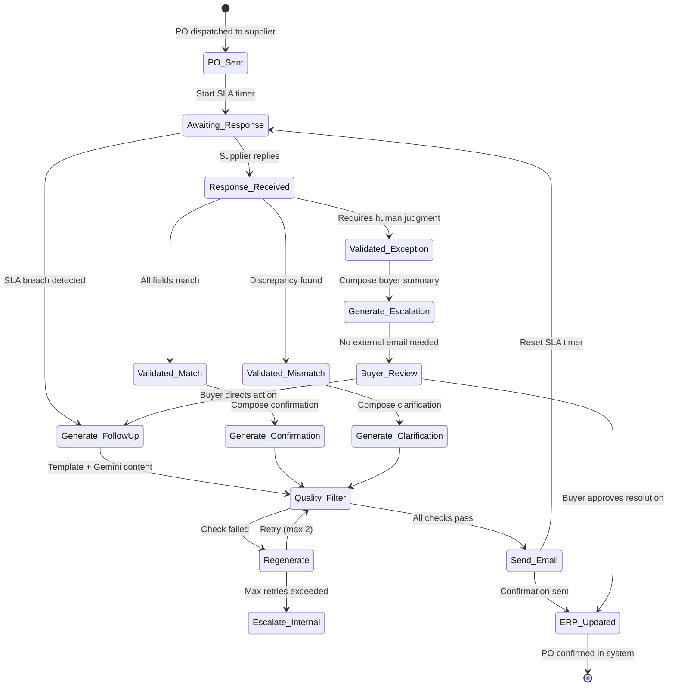

# Supplier Communication Engine

> [!info] Context --- Depth level: 2. Parent: [[Glacis-Agent-Reverse-Engineering-PO-Confirmation-Agent]]

## The Problem

Your PO Confirmation Agent can extract data, validate against master records, and update the ERP. But none of that matters if it cannot talk to suppliers.

The communication layer is where most procurement automation projects die --- not because the parsing failed, but because the outbound messages sounded like a robot wrote them. A supplier who receives "AUTOMATED REMINDER: PO #78234 UNCONFIRMED. RESPOND WITHIN 24 HOURS." treats it like spam. A supplier who receives "Hi Maria, just checking in on PO #78234 for the 500 hydraulic actuators. Our production team is building the schedule for next month and we want to make sure the April 22 delivery still works. Could you confirm when you get a chance?" treats it like a real email from a real buyer --- and responds.

The gap between those two messages is the gap between a 40% response rate and a 94% response rate. BraunAbility achieved the latter across 100+ suppliers and ~15,000 SKUs. IDEX Corporation hit 92% of supplier orders confirmed within 48 hours. These numbers did not come from better reminders. They came from a communication engine that produces messages indistinguishable from what a competent buyer would write.

This is not a cosmetic problem. In PO confirmation, every day of delay between sending the PO and receiving confirmation means MRP is running on assumptions instead of commitments. At the $1.5B CPG manufacturer profiled in the Glacis whitepaper, that delay averaged 2-5 days and directly caused $2.2M/year in expedites and safety stock inflation. The communication engine is the mechanism that collapses that delay --- but only if suppliers actually read and respond to its messages.

Three hard requirements emerge. First, generated emails must be indistinguishable from human-written buyer emails in tone, specificity, and professionalism. Second, no generated email may contain hallucinated information --- wrong PO numbers, fabricated delivery dates, URLs that do not exist, commitments the organization has not authorized. Third, the agent must never negotiate or make commitments. It confirms, it clarifies, it escalates. The moment it says "we can accept the 3% price increase" without buyer approval, it has overstepped its authority and created a legal liability.

## First Principles

Supplier communication is a state machine. Every purchase order progresses through a deterministic sequence of states, and every state transition either happens automatically or requires an outbound message.

```
PO Sent --> Awaiting Response --> [SLA Breach] --> Follow-Up #1
     --> [SLA Breach] --> Follow-Up #2 --> [SLA Breach] --> Escalate to Buyer
     
Response Received --> Validated (match) --> Confirmation Email --> ERP Updated
                  --> Validated (mismatch) --> Clarification Email --> Awaiting Response
                  --> Validated (exception) --> Escalation Summary --> Buyer Review
```

Each outbound message type has a distinct purpose and constraint set:

**Follow-up emails** remind the supplier to respond. They must reference the specific PO, include enough context for the supplier to locate and process it, and escalate in urgency without becoming hostile. The tone ladder matters: follow-up #1 is friendly, follow-up #2 is direct, follow-up #3 is firm with a deadline. After that, a human buyer takes over.

**Confirmation emails** acknowledge a clean match. They mirror back what the agent extracted and validated --- "We've received and confirmed your acknowledgment of PO #78234: 500 units of Part #A-2041 at $12.50/unit, delivery April 22." This serves as a receipt and a final check --- if the agent misread the supplier's response, the confirmation email gives the supplier a chance to catch it.

**Clarification emails** address specific discrepancies. They must identify exactly what does not match, quote both the PO value and the supplier's stated value, and ask a precise question. "Your confirmation shows 450 units but our PO specifies 500. Could you confirm the correct quantity?" Never: "There seems to be an issue with your confirmation, please resubmit."

**Escalation summaries** go to the buyer, not the supplier. They contain the discrepancy details, the supplier's stated values, the PO values, and the agent's recommended resolution. The buyer makes the call.

The state machine is the hard part. The LLM is a powerful text composer, but it does not track which POs are outstanding, which follow-ups have been sent, how many days remain before the SLA breaches, or whether a supplier's reply resolves the open discrepancy. That logic lives in the orchestration layer --- Firestore documents with state fields, Cloud Scheduler jobs checking SLA deadlines, Pub/Sub events triggering state transitions.

## How It Actually Works

The communication pipeline has six stages. Every outbound email passes through all six, in order, with no exceptions.

### Stage 1: Template Selection

The agent selects a template based on the current state and the required action. Templates are not free-form prompts --- they are structured documents with fixed sections and dynamic fields.

A follow-up template might look like:

```
Subject: PO #{po_number} - Confirmation Request | {buyer_company}

Hi {supplier_contact_name},

{opening_line}

{po_context_paragraph}

{action_request}

{closing_line}

{signature}
```

The fixed structure ensures every email has a subject line with the PO number (so suppliers can search for it), a greeting, context, a clear ask, and a sign-off. The dynamic fields are where Gemini generates content. This separation is critical: the template controls structure and compliance, the LLM controls tone and specificity.

Templates are stored in Firestore as configuration --- not hardcoded. The SOP playbook (see [[Glacis-Agent-Reverse-Engineering-SOP-Playbook]]) maps states to templates, and buyer teams can customize templates without code changes.

For a Google Cloud build, the template library should include at minimum:
- `follow_up_initial` --- first reminder, friendly tone
- `follow_up_urgent` --- second reminder, direct with deadline
- `follow_up_final` --- last automated attempt before human takeover
- `confirmation_clean` --- acknowledgment of successful match
- `clarification_price` --- price discrepancy identified
- `clarification_quantity` --- quantity mismatch
- `clarification_date` --- delivery date discrepancy
- `clarification_general` --- multiple or ambiguous issues
- `order_intake_confirmation` --- customer-facing order receipt (for the Order Intake Agent)
- `order_intake_clarification` --- customer-facing data request

### Stage 2: Dynamic Content Generation

Gemini generates the content for each dynamic field. The system prompt is the critical engineering artifact here. It must encode three constraints from the Glacis design principles:

1. **Validate before communicating.** The prompt receives validated data --- PO number, line items, discrepancy details --- not raw supplier text. The LLM composes from verified facts, not from its own interpretation of what the supplier said.

2. **Mirror the buyer team's writing style.** The system prompt includes 3-5 few-shot examples of actual buyer emails for the specific team. These examples calibrate tone, formality level, common phrases, and sign-off style. A buyer team that writes "Best, Sarah" gets emails that end "Best, Sarah." A team that writes "Thanks --- let me know if you have questions" gets that cadence.

3. **Never negotiate or commit.** The system prompt contains an explicit constraint: "You are composing a communication on behalf of the buyer. You may confirm facts, request clarification, and provide information. You may NOT agree to price changes, accept delivery delays, waive requirements, or make any commitment that the buyer has not explicitly authorized."

Temperature setting: 0.3-0.5. This range produces natural variation in phrasing while keeping the content grounded and professional. Temperature 0 produces repetitive, robotic text. Temperature 0.7+ introduces too much creative drift for business communication where precision matters. The Gemini call uses `response_mime_type: "application/json"` with a schema that returns each dynamic field separately, not a monolithic email body. This allows the quality filter to inspect each component independently.

```python
# Simplified Gemini call for follow-up content generation
generation_config = {
    "temperature": 0.4,
    "response_mime_type": "application/json",
    "response_schema": {
        "type": "object",
        "properties": {
            "opening_line": {"type": "string"},
            "po_context_paragraph": {"type": "string"},
            "action_request": {"type": "string"},
            "closing_line": {"type": "string"}
        },
        "required": ["opening_line", "po_context_paragraph",
                      "action_request", "closing_line"]
    }
}
```

### Stage 3: Quality Filter

This is the stage most teams skip, and it is the stage that prevents disasters.

A secondary LLM call --- Gemini Flash, cheap and fast --- reviews the assembled email before it goes anywhere near a supplier. The quality filter checks for:

- **Hallucinated URLs.** LLMs occasionally invent plausible-looking URLs. Any URL not present in the original template or PO data gets flagged. For supplier communications, the answer is simple: no URLs, period. The email contains text, PO numbers, and line item details. Nothing clickable.

- **Hallucinated data.** The filter cross-references every number in the generated email (PO number, quantities, prices, dates) against the source data passed to the generation stage. If a quantity in the email does not match the quantity in the PO record, the email is rejected and regenerated.

- **Unauthorized commitments.** The filter scans for language patterns that imply agreement, acceptance, or authorization: "we accept," "we can accommodate," "this is fine," "we agree to," "approved." Any match triggers a block.

- **Excessive length.** Supplier emails should be 3-8 sentences for follow-ups, 5-12 sentences for clarifications. If the generated email exceeds the template's length ceiling, it is trimmed or regenerated.

- **Missing required elements.** Every email must contain: the PO number in the subject, the supplier contact name in the greeting, the specific action requested, and the buyer's signature. Missing any of these = regeneration.

- **Spam trigger phrases.** Words and patterns that trip corporate email filters: ALL CAPS sections, excessive exclamation marks, "URGENT" in the subject without the `follow_up_urgent` template, promotional language.

The quality filter is not optional. It is the contractual boundary between "AI-assisted" and "AI-autonomous" communication. Without it, you are sending unfiltered LLM output to external business partners. One hallucinated price, one fabricated commitment, one email that reads like spam --- and the supplier relationship takes damage that no technology recovers.

Microsoft's Supplier Communications Agent in Dynamics 365 takes the conservative approach: it generates draft emails and presents them for human review before sending. The auto-send capability exists but requires explicit administrator opt-in and a mandatory footer disclosing AI involvement. For a hackathon build, the quality filter replaces the human review loop --- but the filter must be rigorous enough to justify that trust.



### Stage 4: Send via Gmail API

The assembled, filtered email is sent through the Gmail API from the buyer team's shared inbox address. The supplier sees `procurement@company.com` in the From field --- the same address they have always communicated with. No new sender addresses. No "noreply@" automation addresses. No disclosure that the email was AI-generated (unless organizational policy requires it, in which case a footer is appended).

Implementation with Gmail API in Python:

```python
import base64
from email.mime.text import MIMEText
from googleapiclient.discovery import build

def send_email(service, sender, to, subject, body):
    message = MIMEText(body)
    message["to"] = to
    message["from"] = sender
    message["subject"] = subject
    # Thread the reply to the original PO email
    # message["In-Reply-To"] = original_message_id
    # message["References"] = original_message_id
    
    raw = base64.urlsafe_b64encode(
        message.as_bytes()
    ).decode()
    
    return service.users().messages().send(
        userId="me",
        body={"raw": raw, "threadId": thread_id}
    ).execute()
```

The `threadId` parameter is critical. Follow-ups and clarifications must land in the same email thread as the original PO. If the agent starts a new thread, the supplier loses context, the conversation fragments, and response rates drop. Gmail API's threading is based on `In-Reply-To` and `References` headers, plus the `threadId` field. Store the original message ID and thread ID in Firestore when the PO is dispatched.

For a Cloud Run deployment, the Gmail API requires OAuth 2.0 with the `gmail.send` scope. Service account authentication with domain-wide delegation is the correct pattern for a shared inbox --- the service account impersonates the inbox owner and sends on their behalf.

### Stage 5: Track Response and Parse Reply

After sending, the agent registers the outbound message in Firestore and resets the SLA timer. Cloud Scheduler runs a periodic job (every 15-60 minutes, configurable) that scans all POs in `awaiting_response` state and checks whether their SLA has been breached.

The SLA configuration is per-supplier or per-commodity, stored in the SOP playbook:

| Follow-Up Level | Default SLA | Tone | Action on Next Breach |
|---|---|---|---|
| Initial send | 48 hours | N/A (PO sent) | Generate follow-up #1 |
| Follow-up #1 | 48 hours | Friendly | Generate follow-up #2 |
| Follow-up #2 | 24 hours | Direct with deadline | Generate follow-up #3 |
| Follow-up #3 | 24 hours | Firm, final automated | Escalate to buyer |

The escalation ladder compresses. Each subsequent follow-up has a shorter SLA and a more direct tone. After three automated attempts, the agent stops emailing the supplier and routes to the buyer for manual intervention. This prevents harassment and preserves the relationship.

Cloud Scheduler + Pub/Sub is the implementation pattern. A Cloud Scheduler job fires every 30 minutes, publishing a message to a `check-sla-deadlines` Pub/Sub topic. A Cloud Run service subscribes, queries Firestore for all POs past their current SLA threshold, and triggers the follow-up generation pipeline for each.

When the supplier replies, the Gmail API push notification triggers the ingestion pipeline (see [[Glacis-Agent-Reverse-Engineering-PO-Confirmation-Agent]], Step 3). The agent parses the reply, validates it, and the communication engine composes the next outbound message based on the validation result --- confirmation, clarification, or escalation.

### Stage 6: Thread Management Across Multi-Day Conversations

A single PO confirmation can span multiple exchanges over days or weeks. Supplier sends partial confirmation. Agent clarifies the remaining lines. Supplier responds with updated dates for two lines but not the third. Agent clarifies again. Supplier finally confirms everything. Agent sends confirmation.

Each exchange must maintain context. The agent cannot send "Could you confirm the delivery date for Line 3?" if it already asked that question two days ago and received an answer. Thread state lives in Firestore:

```
po_confirmations/{po_id}/
  status: "awaiting_clarification"
  thread_id: "gmail_thread_abc123"
  original_po: { ... full PO data ... }
  exchanges: [
    { timestamp, direction: "outbound", type: "follow_up_1", content_hash },
    { timestamp, direction: "inbound", extracted_data: { ... }, validation_result },
    { timestamp, direction: "outbound", type: "clarification_quantity", line_items: [3] },
    { timestamp, direction: "inbound", extracted_data: { ... }, validation_result }
  ]
  open_discrepancies: [
    { line: 3, field: "delivery_date", po_value: "2026-04-22", supplier_value: null }
  ]
  follow_up_count: 1
  last_outbound: "2026-04-06T14:30:00Z"
  sla_deadline: "2026-04-08T14:30:00Z"
```

The `open_discrepancies` array is what drives the clarification email content. Each clarification only asks about fields that are still unresolved. The `exchanges` array provides conversation history that gets injected into the Gemini prompt so the generated email references prior communication naturally: "Following up on our earlier message about Line 3 --- we still need the confirmed delivery date for the hydraulic actuators."

## The Tradeoffs

**Templates vs. free-form generation.** Templates constrain the LLM but guarantee structural consistency. Free-form generation sounds more natural but risks missing required elements, varying in length unpredictably, and drifting in tone over time. The right answer is templates with generous dynamic sections --- the structure is fixed, the prose is generated. This is the pattern Glacis describes and the one Microsoft's Supplier Communications Agent implements.

**Quality filter cost vs. risk.** Every outbound email makes two Gemini calls: one for generation (Pro, ~$0.01-0.03), one for quality filtering (Flash, ~$0.001-0.005). On 35,000 POs/year with an average of 2.5 outbound messages per PO, that is 87,500 emails at ~$0.02-0.035 each = $1,750-$3,000/year for the quality filter alone. Trivial compared to the cost of one hallucinated commitment. The filter is non-negotiable.

**Tone calibration maintenance.** Few-shot examples calibrate tone at deployment time, but buyer teams evolve their communication style. New hires write differently than veterans. Seasonal urgency changes (end-of-quarter vs. mid-quarter). The few-shot examples need refreshing every 3-6 months. This is operational overhead that most teams underestimate.

**Auto-send vs. human-review.** Microsoft defaults to human review. Glacis implies auto-send for routine follow-ups and confirmations, with human review only for escalations. The quality filter is what makes auto-send viable. Without it, human review is the only safe option. With it, auto-send is defensible for follow-ups and confirmations but still risky for clarifications (where the agent is surfacing a discrepancy and the supplier might interpret the message as a complaint).

**Single language vs. multi-language.** Glacis operates globally. Suppliers in Germany, Japan, and Brazil expect communication in their language. Gemini handles translation natively, but the quality filter must also operate in the target language --- hallucination detection in German requires German-language validation. For a hackathon, English-only is the correct scope. For production, multi-language support is a Phase 2 requirement that roughly triples the template library and quality filter complexity.

## What Most People Get Wrong

**"Just use a system prompt and let the LLM write the email."** This produces emails that sound generically professional but lack the specific cadence, vocabulary, and sign-off patterns of the actual buyer team. Worse, without templates, the LLM occasionally forgets to include the PO number in the subject, omits the specific ask, or buries the action request in paragraph four. Templates with dynamic fields solve both problems --- the structure is guaranteed, the voice is calibrated.

**"Temperature 0 for maximum accuracy."** Temperature 0 produces deterministic output, which means every follow-up email for every supplier reads identically except for the PO number and line items. Suppliers who receive multiple follow-ups (common for buyers managing 50+ POs) will notice the repetition and recognize it as automated. Temperature 0.3-0.5 introduces enough variation to sound human while keeping the content grounded. This is a well-established pattern: classification and extraction tasks use temperature 0, but composition tasks need controlled randomness.

**"We can skip the quality filter for follow-ups since they are simple."** Follow-ups are the highest-volume outbound message type and the one most likely to be sent without human review. They are also the message type where a hallucinated delivery date or an accidentally threatening tone does the most damage, because the supplier has not yet engaged and the first impression sets the relationship dynamic. The quality filter runs on every outbound message, no exceptions.

**"The supplier will know it is AI."** Not if the engineering is right. The email comes from the buyer's address. It lands in the existing thread. It references specific PO details. It uses the team's actual phrasing patterns. It is signed with the buyer's name. There is no "Generated by AI" footer unless organizational policy requires one. BraunAbility's 94% acknowledgment rate and IDEX's 92% confirmation rate were achieved with suppliers who had no reason to suspect automation. The tell is not the text quality --- modern LLMs write better professional email than most humans. The tell is robotic consistency across dozens of messages. Temperature variation and few-shot calibration prevent that.

**"One follow-up is enough."** Data says otherwise. IDEX's 92% confirmation within 48 hours required automated reminders with escalation. A single follow-up captures the suppliers who forgot or deprioritized. The second follow-up catches the ones who were waiting for internal approval. The third catches the ones who need a deadline to act. The escalation ladder is not nagging --- it is a structured communication protocol that respects the supplier's workflow while protecting the buyer's production schedule.

## Connections

This note details the outbound communication pipeline for the [[Glacis-Agent-Reverse-Engineering-PO-Confirmation-Agent]]. The inbound side --- parsing supplier replies once they arrive --- is covered in the parent note's Step 3 (Supplier Response Ingestion) and in [[Glacis-Agent-Reverse-Engineering-Document-Processing]] at greater depth.

The quality filter pattern connects to the [[Glacis-Agent-Reverse-Engineering-Generator-Judge]] note, which covers the Generator-Judge pattern adapted from Pallet's engineering blog. The quality filter is a specialized instance of the Judge: it evaluates generated output against explicit criteria before allowing it to proceed. The difference is that the Generator-Judge pattern in the validation pipeline checks extraction accuracy, while the quality filter here checks communication safety.

The SOP playbook that governs template selection, SLA thresholds, and escalation rules is covered in [[Glacis-Agent-Reverse-Engineering-SOP-Playbook]]. The playbook is what makes the communication engine configurable without code changes --- buyer teams adjust follow-up timing, tone preferences, and escalation policies through a dashboard, not through engineering tickets.

The email ingestion architecture --- Gmail API push notifications, Pub/Sub event routing, attachment handling --- is shared between inbound and outbound flows and is covered in [[Glacis-Agent-Reverse-Engineering-Email-Ingestion]].

For the Order Intake Agent's customer-facing communication (confirmation and clarification emails), the same six-stage pipeline applies with different templates and a different quality filter emphasis (customer-facing messages have stricter tone requirements and must never reference internal pricing disputes).

The [[Glacis-Agent-Reverse-Engineering-Anti-Portal-Design]] note provides the philosophical foundation: the communication engine exists because suppliers will not use portals. Email is the only channel with near-100% supplier participation. The engine's entire design follows from that constraint.

## Subtopics for Further Deep Dive

| # | Subtopic | Note | Why It Matters |
|---|----------|------|----------------|
| 1 | Gemini Prompt Templates for Communication | [[Glacis-Agent-Reverse-Engineering-Prompt-Templates]] | The actual system prompts, few-shot examples, and field schemas for each email type. Production prompt engineering, not playground experiments. |
| 2 | Gmail API + Pub/Sub Email Architecture | [[Glacis-Agent-Reverse-Engineering-Email-Ingestion]] | Threading, deduplication, attachment handling, rate limits, service account delegation. The plumbing that makes bidirectional email communication work. |
| 3 | SOP Playbook: Communication Rules | [[Glacis-Agent-Reverse-Engineering-SOP-Playbook]] | Per-supplier SLA thresholds, template overrides, escalation policies, tone preferences as structured configuration. |
| 4 | ADK Agent: PO Confirmation Implementation | [[Glacis-Agent-Reverse-Engineering-ADK-PO-Confirmation]] | Build-level detail: the ADK agent definition that orchestrates template selection, generation, filtering, sending, and state management. |

## References

### Primary Sources
- **Glacis, "AI For PO Confirmation V8"** (March 2026) --- Philipp Gutheim, CEO. Design principles for supplier communication: validate before communicating, mirror buyer team's writing style, buyers retain full control. [glacis.com](https://www.glacis.com/)
- **Glacis, "How AI Automates Order Intake in Supply Chain"** (December 2025) --- Confirmation and clarification email patterns for customer-facing communication.

### Enterprise Case Studies
- **IDEX Corporation**: 92% supplier orders confirmed within 48 hours via auto-reminders and escalation notifications
- **BraunAbility**: 94% PO acknowledgment rate across ~15,000 SKUs and 100+ suppliers
- **WITTENSTEIN SE**: ~11 hours processing time saved per day

### Web Research
- [Microsoft Dynamics 365: Supplier Communications Agent](https://learn.microsoft.com/en-us/dynamics365/supply-chain/procurement/supplier-com-agent-follow-up) --- Production-ready preview. Auto-generates follow-up emails for unconfirmed/delayed POs. Supports tone selection (casual/formal, urgent/non-urgent), configurable criteria, optional auto-send with mandatory AI disclosure footer. Human review by default.
- [Automating Procurement with AI Agents (Medium)](https://medium.com/@arunabh223/automating-procurement-with-ai-agents-99e73d78c846) --- CrewAI multi-agent pattern: RFQ Writer Agent + Mailer Agent with explicit guardrails at agent handoff points. GPT-4 with procurement specialist persona.
- [Top AI Email Procurement Tools for Manufacturers (Leverage AI)](https://tryleverage.ai/blog/pf/ai-email-procurement-tools-manufacturers) --- Auto-draft replies, tone coaching (Microsoft Copilot Pro), template enforcement and SLA management.
- [Google Cloud Scheduler: Pub/Sub Integration](https://docs.google.com/scheduler/docs/creating) --- Cron-based job scheduling for follow-up SLA checks via Pub/Sub topic publishing.
- [Gmail API Python Quickstart](https://developers.google.com/workspace/gmail/api/quickstart/python) --- OAuth 2.0 setup, message sending, threading via threadId and In-Reply-To headers.
- [Stalwart Labs: LLM Classifier for Email](https://stalw.art/docs/spamfilter/llm/) --- Secondary LLM classification pattern: send email content to AI model, receive structured category + confidence, apply score-based routing. Applicable to outbound quality filtering.
