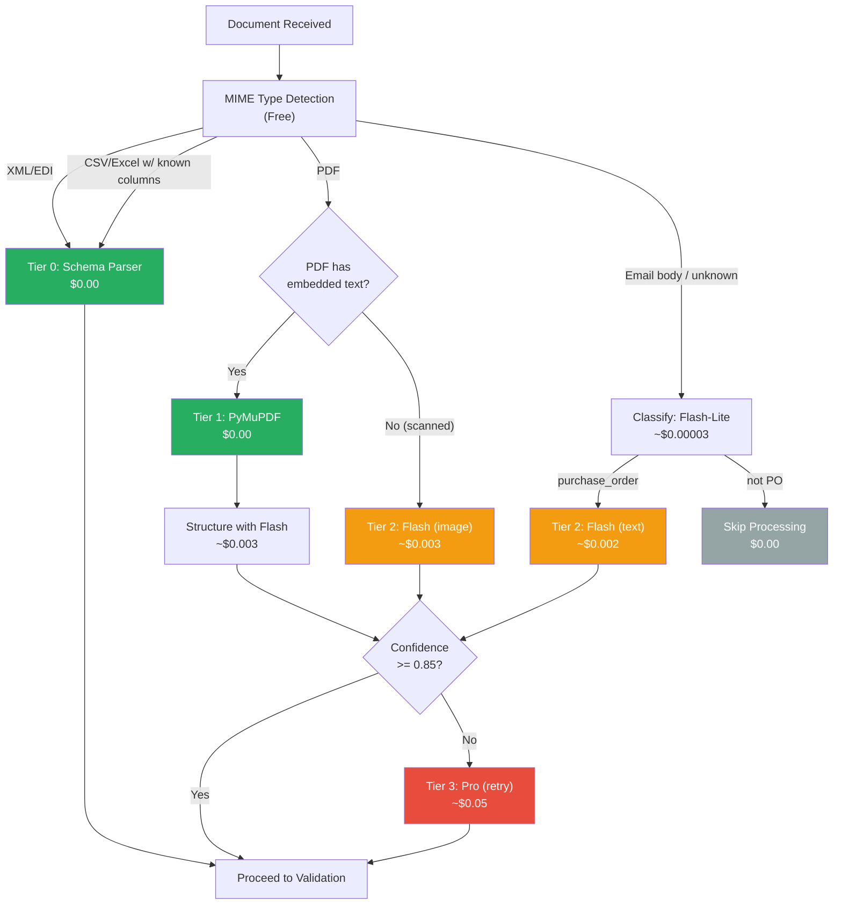

# Token Optimization Strategy

> [!info] Context — Part of [[Glacis-Agent-Reverse-Engineering-Overview]]. Depth level: 3. Parent: [[Glacis-Agent-Reverse-Engineering-Document-Processing]]

The naive implementation of a supply chain document processing agent sends every incoming email and attachment through Gemini Pro, parses the response, and moves on. It works. It is also 10-50x more expensive than it needs to be. At 1,000 orders per day, the difference between a naive pipeline and an optimized one is the difference between a $15/day token bill and a $750/day token bill. At enterprise scale (10,000+ orders/day), that gap becomes $150/day vs. $7,500/day — $2.7M/year in unnecessary LLM costs.

The key finding that drives the entire optimization strategy: **native text in PDFs is essentially free to extract without an LLM.** PyMuPDF pulls embedded text at zero token cost. The LLM only needs to see documents where deterministic extraction fails. This is the tiered extraction model from [[Glacis-Agent-Reverse-Engineering-Document-Processing]], now examined through the lens of cost engineering — which model, when, and how to minimize the bill without sacrificing accuracy.

---

## The Problem

### Token Costs Are the Dominant Variable Cost

In a Cloud Run + Firestore + Gemini architecture, the cost breakdown for processing a single order looks roughly like this:

| Component | Cost per Order | % of Total | Notes |
|-----------|:-------------:|:----------:|-------|
| Gemini API tokens | $0.005 - $0.50 | 60-85% | Varies 100x depending on model and document complexity |
| Firestore reads/writes | $0.0001 - $0.001 | 1-5% | ~10 reads + ~5 writes per order |
| Cloud Run compute | $0.001 - $0.005 | 5-15% | Sub-second for routing; seconds for extraction |
| Pub/Sub messages | $0.00004 | <1% | $0.04 per 100K messages |
| Email API calls | $0.0001 | <1% | Gmail API has generous free quota |

The Gemini API token cost is the only component that varies by an order of magnitude depending on implementation choices. Everything else is effectively fixed. Optimizing tokens is optimizing the bill.

### The Model Pricing Landscape (April 2026)

Google's Gemini API pricing has a steep gradient between model tiers:

| Model | Input (per 1M tokens) | Output (per 1M tokens) | Sweet Spot |
|-------|:---------------------:|:----------------------:|------------|
| Gemini 2.5 Flash-Lite | $0.10 | $0.40 | Classification, simple parsing |
| Gemini 2.5 Flash | $0.30 | $2.50 | Structured extraction, validation |
| Gemini 2.5 Pro | $1.25 (<=200K) | $10.00 | Complex multi-page, ambiguous docs |
| Gemini 3 Flash-Lite (preview) | $0.25 | $1.50 | Next-gen classification |
| Gemini 3 Flash (preview) | $0.50 | $3.00 | Next-gen extraction |
| Gemini 3 Pro (preview) | $2.00 (<=200K) | $12.00 | Next-gen complex docs |

The cost ratio between Flash-Lite and Pro is **12.5x on input and 25x on output**. Sending a document to Pro when Flash-Lite could handle the classification step wastes 12.5x the input tokens for that call. The optimization strategy is model routing: use the cheapest model that produces acceptable results for each step.

There is also a critical pricing trap: Pro models charge **2x for prompts exceeding 200K tokens**. A 50-page PDF at ~1,500 tokens per page is only 75K tokens — well under the threshold. But if you include a large system prompt with extensive few-shot examples, you can cross 200K without realizing it. Monitor prompt sizes.

---

## First Principles

Token optimization is a resource allocation problem. You have a budget (tokens, which map to dollars), a set of tasks (classify, extract, validate, route), a set of models (Flash-Lite, Flash, Pro), and a quality constraint (accuracy must exceed a threshold for each task). The goal is to minimize cost while meeting the quality constraint.

This decomposes into four strategies:

**Strategy 1: Avoid the LLM entirely when possible.** If you can extract the data without calling an LLM, the token cost is zero. PyMuPDF extracts text from digital-native PDFs. `openpyxl` reads Excel files. `csv.DictReader` parses CSV. `lxml` parses XML. Email bodies are already text. For well-structured inputs with known schemas, deterministic parsing is not just cheaper — it is more reliable than LLM extraction, because it does not hallucinate.

**Strategy 2: Use the cheapest model that works for each task.** Classification ("is this a purchase order or a shipping inquiry?") is a trivial task for Flash-Lite. Structured extraction from a clean PDF text dump is a Flash-level task. Only ambiguous, multi-format, or handwritten documents justify Pro. Route each task to the cheapest model that meets accuracy requirements.

**Strategy 3: Minimize input tokens per call.** Do not send a 50-page PDF when only pages 2-4 contain the purchase order lines. Do not include 20 few-shot examples when 3 are sufficient. Do not include the full product catalog in the prompt when only the relevant category is needed. Every unnecessary token in the input costs money.

**Strategy 4: Cache and batch where possible.** If the same supplier sends POs using the same template every week, cache the extraction prompt and template mapping. If 10 emails arrive in a 5-minute window, batch the classification calls into one request. The Gemini Batch API offers 50% off for asynchronous processing with up to 24-hour turnaround — excellent for non-urgent re-processing or historical analysis.

---

## How It Actually Works

### The Four-Tier Model

The tiered extraction model from [[Glacis-Agent-Reverse-Engineering-Document-Processing]] is the foundation. Here it is reframed as a cost optimization strategy with specific model assignments and cost estimates:

#### Tier 0: Format Detection (Near-Free)

Before any extraction, classify the input. This is two operations:

**MIME type detection** (completely free): The email's MIME type and attachment headers tell you the format. `application/pdf` is a PDF. `application/vnd.openxmlformats-officedocument.spreadsheetml.sheet` is Excel. `text/csv` is CSV. `text/xml` or `application/xml` is XML. No LLM needed.

**Document type classification** (Flash-Lite, ~$0.0001): For email bodies and ambiguous attachments, a Flash-Lite call classifies the content: "Is this a purchase order, a price inquiry, a shipping notification, or something else?" This is a 200-token prompt with a 20-token response. At Flash-Lite pricing ($0.10/1M input, $0.40/1M output), it costs $0.00002 for input + $0.000008 for output. Call it $0.00003. If the classification returns "not a purchase order," you skip all downstream processing — saving the entire extraction cost for that message.

```python
CLASSIFY_PROMPT = """Classify this email/document into one category:
- purchase_order: contains order line items (products, quantities)
- po_confirmation: supplier confirming/modifying a purchase order
- inquiry: question about pricing, availability, shipping
- other: anything else

Return ONLY the category name."""

async def classify_document(content: str) -> str:
    """Tier 0: Classify document type. Flash-Lite, ~$0.00003."""
    response = await client.models.generate_content_async(
        model="gemini-2.5-flash-lite",
        contents=[content[:2000]],  # First 2000 chars is enough
        config=types.GenerateContentConfig(temperature=0.0),
    )
    return response.text.strip().lower()
```

The `content[:2000]` truncation is deliberate. Classification does not need the full document — the first 2000 characters almost always contain enough context (letterhead, "Dear [Supplier]," "Please find attached PO #..."). Sending the full 50-page PDF for classification wastes tokens.

#### Tier 1: Non-LLM Extraction (Free)

For structured formats with known schemas, deterministic extraction costs zero tokens:

**Digital-native PDFs**: PyMuPDF extracts embedded text for free. The critical check: `page.get_text().strip()` returns non-empty text. If it does, you have the full document text without spending a single token. A 10-page PO with embedded text that would cost ~$0.01-0.05 via Gemini costs $0.00 via PyMuPDF.

**Excel files**: `openpyxl` reads the workbook, extracts headers and rows. If the customer's column mapping is known (stored in Firestore from a previous manual mapping), extraction is purely deterministic.

**CSV files**: `csv.DictReader` with a known schema. Zero cost, near-perfect accuracy.

**XML/EDI payloads**: `lxml` or `xmltodict` with a schema definition. The most reliable extraction — structured input to structured output with no interpretation needed.

**Email body text**: Already text. If the email body is the order (no attachment), it needs LLM parsing — but the text is already available at zero extraction cost. The LLM cost comes in Tier 2 for structuring.

```python
import fitz  # PyMuPDF

def extract_pdf_text(pdf_bytes: bytes) -> tuple[str, bool]:
    """Tier 1: Extract text from PDF. Returns (text, has_text).
    Cost: $0.00 — no LLM call."""
    doc = fitz.open(stream=pdf_bytes, filetype="pdf")
    pages_text = []
    for page in doc:
        text = page.get_text().strip()
        if text:
            pages_text.append(text)

    full_text = "\n\n".join(pages_text)
    has_text = len(full_text) > 50  # threshold for "meaningful text"
    return full_text, has_text
```

The economics: in a typical order inbox, 15-25% of documents are structured Excel/CSV/XML (Tier 0 extraction = free), and 20-30% are digital-native PDFs (Tier 1 text extraction = free). That means **35-55% of all documents never touch the LLM for extraction**. The remaining 45-65% need Tier 2 or Tier 3 — but even those benefit from the text already extracted in Tier 1 (you send the extracted text to the LLM as context alongside the image, reducing the LLM's workload).

#### Tier 2: Gemini Flash for Structuring (Cheap)

Documents that passed Tier 1 text extraction but need LLM help to parse into structured fields, plus email bodies with freeform order text, go to Gemini Flash. This is the workhorse tier — it handles 80-90% of all LLM extraction calls.

**Scenario A: PDF text extracted, needs structuring.** PyMuPDF gave you clean text. Flash parses it into the `ExtractedOrder` Pydantic schema. Input: ~1,500-5,000 tokens of extracted text + ~500 tokens of system prompt + ~200 tokens of schema. Output: ~500-2,000 tokens of structured JSON. Cost at Flash pricing: ~$0.002-0.005 per document.

**Scenario B: Email body order.** A freeform email like "Need 50 cases of Dark Roast 5lb by Friday, ship to our Dallas DC, PO #4420." Input: ~200-1,000 tokens of email text + system prompt. Output: ~300-800 tokens. Cost: ~$0.001-0.003.

**Scenario C: Scanned PDF, image processing.** This is the expensive case within Tier 2. The document image is sent to Flash as a multimodal input. At Gemini 2.5 Flash pricing, image tokens cost the same as text tokens. A single page image at medium resolution is ~256 tokens. A 5-page scanned PO: ~1,280 image tokens + ~500 system prompt tokens. Cost: ~$0.001-0.003. Cheap, but 3-5x more expensive than Scenario A (text-only).

```python
async def extract_with_flash(
    content: str | bytes,
    content_type: str,
    is_image: bool = False,
) -> ExtractedOrder:
    """Tier 2: Gemini Flash extraction. $0.001-0.005 per document."""
    parts = [EXTRACTION_SYSTEM_PROMPT]

    if is_image:
        parts.append(types.Part.from_bytes(data=content, mime_type=content_type))
    else:
        parts.append(content)  # Already text from Tier 1

    response = await client.models.generate_content_async(
        model="gemini-2.5-flash",
        contents=parts,
        config=types.GenerateContentConfig(
            response_mime_type="application/json",
            response_schema=ExtractedOrder,
            temperature=0.1,
        ),
    )
    return ExtractedOrder.model_validate_json(response.text)
```

#### Tier 3: Gemini Pro for Complex Documents (Expensive, Use Sparingly)

Pro is the last resort. It is invoked only when Flash extraction returns low confidence or when the document has characteristics that Flash handles poorly:

- **Multi-page POs with complex table layouts** spanning page breaks
- **Handwritten annotations** on printed POs (dock worker notes, quantity corrections)
- **Multi-language documents** (Japanese PO with English annotations)
- **Heavily damaged or low-quality scans** where OCR pre-processing is insufficient
- **Documents requiring cross-reference reasoning** ("same as PO #3340 but change delivery to next Thursday")

At Pro pricing ($1.25/1M input, $10.00/1M output), a 10-page complex PO costs ~$0.02-0.10. That is 10-20x more than Flash. The optimization is ensuring Pro handles less than 10% of total volume.

```python
async def extract_with_pro(
    content: bytes,
    content_type: str,
    context: dict | None = None,
) -> ExtractedOrder:
    """Tier 3: Gemini Pro extraction. $0.02-0.10 per document.
    Use ONLY for complex/ambiguous documents where Flash failed."""
    parts = [EXTRACTION_SYSTEM_PROMPT_DETAILED]

    # Include relevant context for cross-reference reasoning
    if context:
        parts.append(f"Reference context: {json.dumps(context)}")

    parts.append(types.Part.from_bytes(data=content, mime_type=content_type))

    response = await client.models.generate_content_async(
        model="gemini-2.5-pro",
        contents=parts,
        config=types.GenerateContentConfig(
            response_mime_type="application/json",
            response_schema=ExtractedOrder,
            temperature=0.05,  # Even lower for Pro — maximize determinism
        ),
    )
    return ExtractedOrder.model_validate_json(response.text)
```

### Model Routing Logic

The routing decision tree:



### Caching Strategy: Files API and Context Caching

Two caching mechanisms reduce repeated costs:

**Gemini Files API** for documents accessed multiple times. When a document enters the pipeline, upload it once via the Files API (which returns a file URI) and reference the URI in subsequent calls. The file persists for 48 hours. If the extraction fails and needs retry, or if the document needs re-processing with a different prompt, the file does not need re-uploading. This avoids sending the same document bytes multiple times.

**Gemini Context Caching** for repeated system prompts. The extraction system prompt (~500-1,000 tokens) is identical across all calls. Context caching stores the prompt on Google's servers and charges cached token rates: 10% of standard input pricing, plus a storage fee ($1.00/1M tokens/hour for Flash, $4.50 for Pro). For high-volume processing (100+ extractions/hour), the savings are meaningful:

Without caching: 100 calls x 1,000 prompt tokens = 100,000 input tokens = $0.03 (Flash)
With caching: 100 calls x 1,000 cached tokens @ 10% = $0.003 + ~$0.001 storage = $0.004 (Flash)

That is an 87% reduction on the system prompt portion. The document content is still charged at full rate (you cannot cache dynamic content), so the total savings depend on the ratio of system prompt to document content. For short documents, the savings are substantial. For long documents, they are marginal.

```python
from google.genai import types

# Create a cached prompt for reuse across extraction calls
cache = await client.caches.create(
    model="gemini-2.5-flash",
    config=types.CreateCachedContentConfig(
        system_instruction=EXTRACTION_SYSTEM_PROMPT,
        display_name="order-extraction-prompt",
        ttl="3600s",  # 1 hour cache
    ),
)

# Use cached prompt — system prompt tokens charged at 10% rate
response = await client.models.generate_content_async(
    model="gemini-2.5-flash",
    contents=[document_text],
    config=types.GenerateContentConfig(
        cached_content=cache.name,
        response_mime_type="application/json",
        response_schema=ExtractedOrder,
    ),
)
```

### Batch API for Historical Processing

The Gemini Batch API offers 50% off standard pricing for asynchronous processing with up to 24-hour turnaround. This is not useful for real-time order processing (orders need sub-minute response). It is useful for:

- **Historical re-processing**: Re-extracting old orders with an improved prompt to measure accuracy improvements
- **Nightly reconciliation**: Batch-validating the day's extractions against a second model as a quality check
- **Training data generation**: Processing a corpus of historical orders to build few-shot examples

At Gemini 2.5 Flash batch pricing (~$0.15/1M input), historical re-processing of 10,000 orders is roughly $7.50 instead of $15.00.

---

## The Tradeoffs

### Tiering Complexity vs. Cost Savings

The four-tier model saves 5-10x on token costs. It also adds ~200 lines of routing logic, format detection, and fallback handling. For a hackathon with limited engineering time, a simpler two-tier approach (deterministic where possible, Flash for everything else) captures 80% of the savings with 50% of the code. Skip the Pro fallback tier entirely — if Flash extraction returns low confidence, route to human review instead. You lose automated handling of the hardest 5-10% of documents, but you save days of engineering time and the cost of Pro calls.

### Flash vs. Flash-Lite for Classification

Flash-Lite is 3x cheaper than Flash for input tokens. For the classification task (200-token prompt, 20-token response), the per-call savings are fractions of a cent. At 1,000 classifications/day, Flash-Lite saves $0.04/day vs. Flash. The engineering overhead of maintaining a separate model configuration for classification may not justify $15/year in savings. Use Flash for both classification and extraction if simplicity matters more than marginal cost optimization.

### Context Caching: Worth It?

Context caching saves 90% on cached tokens but charges an hourly storage fee. For the extraction system prompt (~1,000 tokens), the storage cost at Flash pricing is $0.001/hour. If you process fewer than ~30 orders per hour, the storage fee exceeds the savings. The break-even point is roughly 30-50 orders/hour for Flash, 10-15 orders/hour for Pro (where the higher per-token pricing makes caching more valuable). For a hackathon demo processing 10-20 orders during a 5-minute demo window, caching is unnecessary. For production at enterprise scale, it is essential.

### Output Token Optimization

Research from multiple Gemini pricing analyses confirms that output tokens dominate costs in most LLM applications — "65-85% of total costs despite output volumes being lower than input volumes" — because output tokens are priced 2-8x higher than input tokens depending on the model. For extraction, this means the schema design matters: a verbose schema that asks the LLM to return explanations, confidence rationale, and alternative interpretations alongside the extracted data costs significantly more than a schema that returns only the fields and confidence scores. The Pydantic schema should include only the fields you need for downstream processing. Save verbose outputs for the Pro tier where you are already paying premium rates and want maximum information.

---

## What Most People Get Wrong

### Sending Everything Through Pro "Because Accuracy Matters"

Pro is not always more accurate than Flash for extraction tasks. Flash is specifically trained for structured output tasks and handles clean, well-formatted documents as well as Pro does. Pro's advantage is on genuinely ambiguous documents — handwritten annotations, multi-language content, complex reasoning. For a standard digital PDF purchase order, Flash extraction at $0.003 matches Pro extraction at $0.05 in accuracy. The 16x cost premium buys nothing for straightforward documents. Use Pro where it matters, not as a default.

### Ignoring the Free Tier for Prototyping

Google offers free-tier access to several Gemini models, including Gemini 2.5 Flash and Flash-Lite, with rate limits. For hackathon development and testing, the free tier handles hundreds of API calls per day at zero cost. Switch to paid tier only for the demo (when you need lower latency and higher rate limits) or production. Many hackathon teams burn through credits during development that they need for the demo.

### Not Measuring Token Usage

You cannot optimize what you do not measure. Every LLM call should log: model used, input token count, output token count, total cost, and the document that triggered the call. Without this data, you are guessing which tier handles which percentage of documents and whether the routing logic is working correctly. The [[Glacis-Agent-Reverse-Engineering-Metrics-Dashboard]] tracks token usage per model tier precisely for this reason — it turns token optimization from guesswork into engineering.

### Putting Few-Shot Examples in Every Call

Few-shot examples in the extraction prompt improve accuracy for edge cases. They also add 500-2,000 tokens of input to every call. At 1,000 calls/day with Flash pricing, that is $0.30-1.20/day in example tokens alone. Context caching mitigates this (examples are cached at 10% rate), but the better approach is to start with zero-shot extraction, measure accuracy, and add few-shot examples only for specific failure patterns. Gemini's structured output mode with a Pydantic schema is often sufficient without examples — the schema itself acts as implicit instruction.

### Treating Image Resolution as Fixed

Gemini's multimodal input accepts images at different resolution tiers. Low resolution (64-280 tokens per image depending on model) vs. medium resolution (256-560 tokens) vs. high resolution (1,120+ tokens). For a typical purchase order scan, medium resolution captures all text and table structure. High resolution is needed only for handwritten content or very fine print. Defaulting to high resolution quadruples the image token cost for no accuracy benefit on standard documents. Set resolution explicitly based on document type:

```python
# Low resolution for classification (just need to see document type)
# Medium resolution for standard extraction
# High resolution only for handwritten or fine-print documents

resolution = "MEDIUM"  # Default for most extraction
if doc_type == "handwritten":
    resolution = "HIGH"
elif task == "classify":
    resolution = "LOW"
```

---

## Connections

- **Parent**: [[Glacis-Agent-Reverse-Engineering-Document-Processing]] — the tiered extraction pipeline this optimization strategy applies to
- **Sibling**: [[Glacis-Agent-Reverse-Engineering-Prompt-Templates]] — prompt design directly impacts token count; concise prompts save money
- **Sibling**: [[Glacis-Agent-Reverse-Engineering-Generator-Judge]] — the judge step is an additional LLM call; routing it to Flash-Lite for simple validations reduces cost
- **Related**: [[Glacis-Agent-Reverse-Engineering-Metrics-Dashboard]] — token usage tracking as a metric for cost optimization feedback loop
- **Related**: [[Glacis-Agent-Reverse-Engineering-Overview]] — Glacis's cost-per-order targets ($1.77-5.00 vs. $10-15 manual)
- **Wiki**: [[gemini]] — Gemini model family, tiered model strategy
- **Wiki**: [[rate-limiting-and-token-budgets]] — token budget patterns applied to LLM cost management

---

## Subtopics for Further Deep Dive

1. **Prompt Compression Techniques** — Reducing system prompt token count without losing instruction quality; abbreviation strategies, reference-based prompts, Gemini's instruction-following efficiency at different prompt lengths
2. **Dynamic Model Routing with Confidence Feedback** — Using extraction confidence from Flash to decide whether to retry with Pro; setting the confidence threshold empirically; avoiding the "always retry" trap that doubles costs
3. **Cost Monitoring and Budget Alerts** — Real-time token cost tracking in the metrics dashboard; daily/weekly budget limits with automatic fallback to human review when budget is exceeded; cost attribution per customer/document-type
4. **Embedding Cost Optimization** — Vector similarity search for item matching from [[Glacis-Agent-Reverse-Engineering-Item-Matching]] uses embedding API calls; batch embedding vs. real-time; caching embeddings for known products; the `gemini-embedding-001` at $0.075/1M tokens via Batch API
5. **Multi-Model Ensemble for Critical Documents** — Running both Flash and Pro on high-value orders and comparing outputs; consensus-based confidence scoring; when the ensemble cost is justified by the error cost of getting a $500K order wrong

---

## References

- [Nicola Lazzari, "Gemini API Pricing Explained 2026"](https://nicolalazzari.ai/articles/gemini-api-pricing-explained-2026) — Flash-Lite ($0.10/$0.40), Flash ($0.30/$2.50), Pro ($1.25/$10.00) per 1M tokens; context caching at 10% of standard; Batch API at 50% off; Pro 2x pricing above 200K tokens
- [Google AI, "Gemini Developer API Pricing"](https://ai.google.dev/gemini-api/docs/pricing) — Official pricing including Gemini 3 preview models, free tier limits, image token costs by resolution tier, context caching storage fees
- [AIFreeAPI, "Gemini API Pricing 2026: Complete Per-1M-Token Cost Guide"](https://www.aifreeapi.com/en/posts/gemini-api-pricing-2026) — Output tokens dominate costs (65-85% of total despite lower volume), model routing as primary optimization strategy, batch processing patterns
- [CostGoat, "Gemini API Pricing Calculator"](https://costgoat.com/pricing/gemini-api) — 100-page contract analysis scenario costs, context length impact on pricing
- Glacis, "How AI Automates Order Intake in Supply Chain," Dec 2025 — Cost per order targets ($1.77-5.00 automated vs. $10-15 manual), tiered processing approach
- [[Glacis-Agent-Reverse-Engineering-Document-Processing]] — Tier 0-4 extraction architecture, PyMuPDF text extraction, Pydantic structured output, format detection logic
- Gemini API Documentation, "Context Caching" — Cached token pricing, TTL management, storage costs per model tier
- Gemini API Documentation, "Batch API" — 50% discount, 24-hour turnaround, use cases for offline processing
- PyMuPDF Documentation — `fitz.open()`, `page.get_text()`, zero-cost text extraction from digital-native PDFs
