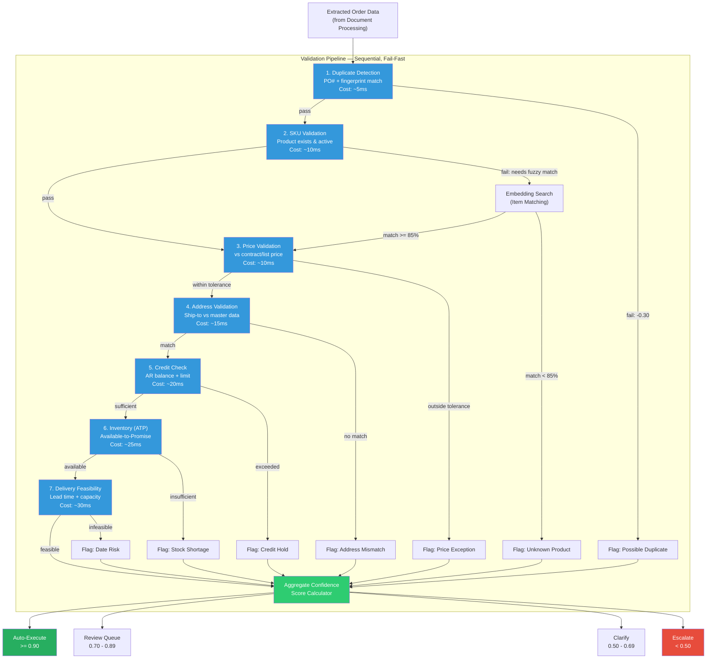

# Validation and Enrichment Pipeline

> [!info] Context — Depth level: 2. Parent: [[Glacis-Agent-Reverse-Engineering-Order-Intake-Agent]]

## The Problem

Extraction is not understanding. An LLM can pull "Dark Roast 5lb bag, qty 200, $14.50/unit" from an email body in under a second. That is the easy part. The hard part is answering seven questions about that line item before it becomes a sales order:

1. **Is this a real product?** The customer said "Dark Roast 5lb bag." Your ERP calls it `SKU-4492: Premium Dark Roast Arabica, 2.27kg`. The customer's description is not in your system. Neither is "5lb." You sell in kilograms.
2. **Is the price right?** $14.50/unit. The customer's contract says $14.25. Is that a 1.7% overage? A typo? A price increase they saw on a quote you forgot about? At one $10B manufacturer Glacis worked with, up to one-third of orders contained price exceptions.
3. **Do you have the inventory?** 200 units requested. Your Available-to-Promise shows 180 in the regional warehouse, 400 at the central DC. Can you fulfill from two locations, or does the customer require single-shipment?
4. **Can the customer pay?** Their credit limit is $50,000. Current outstanding AR is $47,100. This order is $2,900. It fits — barely. But there are two more orders in the queue from the same customer.
5. **Is this a duplicate?** Same customer sent a nearly identical order three days ago. Same PO number? Different PO number but same line items? Genuine reorder or accidental double-send?
6. **Can you deliver on time?** Customer wants delivery April 15. Your lead time for this SKU is 5 business days. Today is April 8. That is 5 business days. Feasible, but zero margin for error. Carrier capacity for that lane?
7. **Is the address valid?** Ship-to says "4th Floor, 200 Industrial Pkwy, Mississauga ON." Your master data has "200 Industrial Parkway, Suite 400, Mississauga, Ontario L5T 2V6." Same place? Probably. But "probably" is not good enough for a carrier manifest.

Each of these questions requires a different data source, a different validation technique, and a different tolerance for ambiguity. Get any one wrong and you create a downstream exception — a short shipment, a billing dispute, a returned delivery, a broken OTIF metric. The Glacis whitepapers quantify the cost: 1-4% error rate on manual entry, cascading into customer chargebacks, expedite fees, and eroded trust.

The validation pipeline is where extraction becomes understanding. It is the difference between an AI that reads documents and an AI that processes orders.

## First Principles

Validation is a **confidence-accumulation pipeline**. Each check does not simply pass or fail — it adds or subtracts confidence until a threshold is reached, and that threshold determines routing.

Think of it like a credit score for an order line item. A fresh extraction starts at some baseline confidence (say 0.5 — the LLM extracted something, but nothing is verified yet). Each validation check moves the score:

- SKU matches exactly in product master? +0.15
- SKU matched via fuzzy/embedding search at 92% similarity? +0.08
- Price within 0.5% of contract price? +0.12
- Price 5% above contract price? -0.10
- Customer has sufficient credit? +0.08
- Inventory available in requested warehouse? +0.10
- Delivery date feasible with 2-day buffer? +0.10
- Address matches master data exactly? +0.08
- Duplicate PO number detected? -0.30

After all seven checks, the accumulated score determines routing:

| Confidence Range | Routing Decision | Expected % of Orders |
|-----------------|------------------|---------------------|
| >= 0.90 | **Auto-execute**: Create sales order in ERP, no human touch | 60-80% (target) |
| 0.70 - 0.89 | **Review queue**: Pre-filled order with flagged fields, one-click approval | 15-25% |
| 0.50 - 0.69 | **Clarification**: Agent emails customer/supplier to resolve ambiguity | 5-10% |
| < 0.50 | **Escalation**: Full manual review, too many unknowns for automation | 2-5% |

This is the same pattern used by document processing platforms like Rossum and ABBYY — field-level confidence scores that route documents through tiered automation. The key insight from Glacis: the 0.8 confidence threshold is where enterprise operations find the sweet spot between automation rate and error tolerance. Below 0.8, you are routing too many orders to humans and defeating the purpose. Above 0.9, you are auto-approving orders that have unresolved ambiguity and creating downstream exceptions.

The accumulation model has a critical property: **independence**. Each check contributes its own delta. A perfect price match cannot compensate for a failed SKU match. This prevents the pipeline from rubber-stamping orders that happen to score well on easy checks while failing on hard ones. You can weight the deltas — SKU validation might contribute more than address validation — but no single check can override a failure in another.

## How It Actually Works

The pipeline runs seven checks in a specific sequence. Order matters: expensive checks (inventory lookup, credit check) run after cheap checks (duplicate detection, SKU validation). If a line item fails SKU validation, there is no point checking its inventory.

### Concrete Example: Tracing an Order Through All Seven Checks

A customer at "Pacific Coast Roasters" emails an order:

> PO# PCR-2026-0412
> 200 units — Dark Roast 5lb bag — $14.50/unit
> 150 units — Breakfast Blend 12oz — $8.75/unit
> Ship to: 4th Floor, 200 Industrial Pkwy, Mississauga ON
> Requested delivery: April 15, 2026

Here is what happens to line item 1 ("Dark Roast 5lb bag"):

**Check 1 — Duplicate Detection** (~5ms)
Query Firestore for PO number `PCR-2026-0412` in the last 90 days. No match found. Also compute a content fingerprint (hash of customer + SKU descriptions + quantities) and check against recent orders. No collision. Result: **PASS**. Confidence delta: +0.05.

**Check 2 — SKU Validation** (~10ms + ~50ms for fuzzy match)
Exact lookup of "Dark Roast 5lb bag" in the product master. No exact match — the system stores `Premium Dark Roast Arabica, 2.27kg` with SKU-4492. Fall through to [[Glacis-Agent-Reverse-Engineering-Item-Matching|embedding-based item matching]]. The embedding search returns SKU-4492 at 0.91 similarity (above the 0.85 threshold). The unit conversion module confirms 5lb = 2.27kg. Result: **PASS with fuzzy match**. Confidence delta: +0.08 (not the full +0.15 for exact match — fuzzy matches earn less).

**Check 3 — Price Validation** (~10ms)
Look up the active price agreement for Pacific Coast Roasters on SKU-4492. Contract price: $14.25/unit. Order price: $14.50/unit. Delta: +$0.25 (+1.75%). The tolerance band for this customer tier is +/- 2.0%. The price is within tolerance, but on the high side. Result: **PASS**. Confidence delta: +0.10 (reduced from +0.12 because it is near the boundary). A flag is attached: "price 1.75% above contract — verify with sales if intentional."

**Check 4 — Address Validation** (~15ms)
Normalize the ship-to address: "4th Floor, 200 Industrial Pkwy, Mississauga ON" becomes `200 INDUSTRIAL PARKWAY, UNIT 400, MISSISSAUGA, ON`. Master data shows `200 Industrial Parkway, Suite 400, Mississauga, Ontario L5T 2V6`. The normalized strings match at 94% after handling "4th Floor" -> "Unit 400" / "Suite 400" equivalence. Postal code is missing from the order but available in master data. Result: **PASS with enrichment** (postal code auto-filled from master). Confidence delta: +0.06.

**Check 5 — Credit Check** (~20ms)
Customer credit limit: $50,000. Current outstanding AR: $47,100. This line item: $2,900 (200 x $14.50). Running total with line item 2: $2,900 + $1,312.50 = $4,212.50. New projected AR: $51,312.50. That exceeds the limit by $1,312.50. Result: **FAIL**. Confidence delta: -0.15. Flag: "order would exceed credit limit by $1,312.50 — requires credit review or partial shipment."

**Check 6 — Inventory / ATP** (~25ms)
Query Available-to-Promise for SKU-4492. Regional warehouse (Mississauga): 180 units available. Requested: 200 units. Shortfall: 20 units. Central DC (Toronto): 400+ units available. Split shipment possible but customer profile says "single shipment preferred." Result: **CONDITIONAL PASS**. Confidence delta: +0.03 (reduced because fulfillment requires either split shipment or warehouse transfer). Flag: "20-unit shortfall at regional warehouse — split ship or transfer required."

**Check 7 — Delivery Feasibility** (~30ms)
Today: April 8, 2026. Requested delivery: April 15, 2026. That is 5 business days. Standard lead time for SKU-4492: 3 business days (if in stock at regional warehouse). But Check 6 flagged a shortfall — warehouse transfer adds 1-2 business days. Carrier capacity check for the Mississauga lane: available. Result: **CONDITIONAL PASS**. Confidence delta: +0.04 (reduced for tight timing). Flag: "feasible only if warehouse transfer completes by April 10."

**Aggregation**:

| Check | Delta | Running Score |
|-------|-------|---------------|
| Baseline | — | 0.50 |
| 1. Duplicate | +0.05 | 0.55 |
| 2. SKU (fuzzy) | +0.08 | 0.63 |
| 3. Price | +0.10 | 0.73 |
| 4. Address | +0.06 | 0.79 |
| 5. Credit | -0.15 | 0.64 |
| 6. Inventory | +0.03 | 0.67 |
| 7. Delivery | +0.04 | 0.71 |

**Final score: 0.71** — This falls in the **Review Queue** band (0.70 - 0.89). The order is pre-filled in the dashboard with three flagged fields (credit, inventory, delivery timing). A human reviewer sees the complete order with flags highlighted, approves or adjusts with one click, and the order flows to ERP. Without the pipeline, this order would have taken 8-15 minutes of manual processing. With the pipeline, the human spends 30 seconds reviewing pre-validated, pre-enriched data.

### The Two-Layer Architecture: Deterministic Then Semantic

A critical engineering pattern from both the Pallet blogs and modern LLM validation practice: **run deterministic checks first, use the LLM only for semantic understanding**.

**Layer 1 — Deterministic (Pydantic + business rules)**:
- Regex validation: date formats, PO number patterns, postal codes
- Range checks: quantity > 0, price > 0, dates in the future
- Lookup validation: customer ID exists, SKU exists, address in master data
- Arithmetic: line total = quantity x unit price, order total = sum of line totals
- Duplicate detection: exact PO number match, content fingerprint collision

These checks are fast (sub-millisecond), deterministic (same input always gives same output), and free (no API calls). They catch ~60% of issues. Pydantic models enforce the schema contract — if the LLM extraction produces a quantity of -5 or a date of "yesterday," it fails validation before touching any business logic.

**Layer 2 — Semantic (LLM / embeddings)**:
- Fuzzy SKU matching: "Dark Roast 5lb bag" -> SKU-4492 via embedding similarity
- Address normalization: "4th Floor" = "Suite 400" = "Unit 400"
- Intent disambiguation: "cancel and reorder" vs "modify existing order"
- Special instructions parsing: "do not stack pallets" -> handling code NOSTACK
- Cross-reference resolution: "same terms as last order" -> look up last order's terms

These checks are slower (50-500ms), probabilistic (confidence scores, not binary), and cost money (LLM API calls). They handle the ~40% of issues that deterministic rules cannot. The [[Glacis-Agent-Reverse-Engineering-Generator-Judge|Generator-Judge pattern]] applies here: Gemini Pro generates the semantic interpretation, Gemini Flash validates it against the deterministic rules.

This layering is not optional. Running everything through the LLM is slow and expensive. Running everything through deterministic rules misses the semantic cases that are the whole point of the AI agent. The hybrid approach — deterministic first, semantic second — gives you the speed and cost of rules with the intelligence of LLMs.

### Enrichment: Filling in What the Customer Did Not Say

Validation is half the pipeline. The other half is **enrichment** — adding data the customer did not provide but the ERP needs. In the example above:

- Postal code was missing from the ship-to address. Enriched from master data.
- Internal SKU code was not in the order. Resolved via item matching.
- Contract price was not referenced. Looked up from the price agreement.
- Carrier preference was not specified. Defaulted from customer profile.
- Payment terms were not mentioned. Pulled from the active contract.

Enrichment happens inline with validation. When the address validator confirms the ship-to matches master data, it simultaneously fills in the postal code, state/province code, and country code. When the SKU validator resolves the fuzzy match, it simultaneously attaches the internal item code, unit of measure, weight, and hazmat classification. Each validator is both a gatekeeper and a data provider.

This is why the pipeline is called "Validation **and** Enrichment" — by the time an order line exits the pipeline, it is a complete, ERP-ready record regardless of how sparse the original input was.

## The Tradeoffs

**Tolerance bands vs. automation rate.** Tighten your price tolerance from +/-5% to +/-1% and your exception rate doubles. Loosen it and you auto-approve pricing errors that cost real money. There is no universal right answer — it depends on your customer mix, contract complexity, and appetite for post-order corrections. The Glacis case studies suggest that enterprises start conservative (tight bands, more human review) and gradually loosen as the system proves itself. Glacis's $10B manufacturer went from ~30% auto-execute to 93% over months of threshold tuning.

**Sequential vs. parallel validation.** The pipeline described above is sequential — each check depends on the previous one (no point checking inventory for an unresolved SKU). But some checks are independent: credit check and address validation do not depend on each other. A production system would run checks 4 and 5 in parallel after check 3 completes. The tradeoff: parallel execution is faster but harder to debug when something fails, and the dependency graph becomes more complex to maintain.

**Field-level vs. document-level confidence.** The pipeline scores each field independently, then aggregates. An alternative is document-level confidence — one score for the whole order. Document-level is simpler but loses information. A field-level approach lets you flag "the price is wrong but everything else is perfect" rather than rejecting the entire order. Modern document processing platforms (ABBYY, Rossum, Extend) have converged on field-level scoring because it enables surgical human review — the reviewer sees exactly which field needs attention.

**Embedding cost vs. match quality for SKU resolution.** Pre-computing embeddings for your entire product catalog is a one-time cost that enables real-time similarity search. But embeddings degrade when product descriptions change, new products are added, or customer terminology shifts. You need a refresh strategy — nightly batch re-embedding, or event-driven re-embedding when the product master changes. Firestore's native vector search (cosine similarity on stored embeddings) handles the query side, but the freshness of the embeddings is your problem.

**Credit check timing.** Checking credit at order entry means you might block orders that would have been fine by the time they ship (customer pays an invoice in the interim). Checking at shipment means you might pick, pack, and stage an order for a customer who is over their limit. Most systems check at both points — a soft check at order entry (flag but do not block) and a hard check at shipment release. The pipeline handles the soft check; the ERP handles the hard check.

## What Most People Get Wrong

**"Validation is just if/else statements."** This is the most common misconception. Simple orders — EDI from a major customer with exact SKU codes and contracted prices — can be validated with if/else. Those orders are already 60-80% of volume and are already automated via EDI integration. The validation pipeline exists for the other 20-40%: the emailed PDFs, the free-text orders, the customers who use their own product names, the orders with missing fields. These require semantic understanding, fuzzy matching, and contextual enrichment. If validation were just if/else, Glacis would not exist.

**"Set the confidence threshold once and forget it."** The 0.8 threshold is a starting point, not a destination. Customer behavior changes. Product catalogs expand. Price agreements expire. A threshold that produces 75% auto-execute in month one might produce 60% in month six because new products were added without updating the embedding index, or because a major contract renegotiation changed price bands. The threshold needs continuous monitoring — track your auto-execute rate weekly, investigate drops, and adjust. The best systems auto-calibrate: when validation outcomes at a given threshold produce too many downstream exceptions, the system tightens automatically.

**"Price validation means exact match."** Almost no enterprise operates on exact price matching. Contracts have tiered pricing (different price per unit at 100 vs 1,000 units), promotional pricing (temporary discounts), currency fluctuations (orders in EUR, contract in USD), and rounding differences (customer rounds to 2 decimal places, contract specifies 4). Price validation means "within an acceptable tolerance band, considering the applicable pricing logic." That logic can be surprisingly complex — and it is the single largest source of order exceptions. Glacis found that up to one-third of orders at their $10B customer hit price exceptions. Handling this well is the difference between an 80% and a 95% auto-execute rate.

**"Fuzzy matching is unreliable."** Embedding-based matching with a well-tuned similarity threshold is more reliable than the human it replaces. A customer service rep seeing "Dark Roast 5lb bag" might guess it is SKU-4492, or might pick SKU-4488 ("Dark Roast Arabica, 1lb"). The embedding search returns a ranked list with similarity scores — 0.91 for SKU-4492, 0.67 for SKU-4488 — and the system picks the top match only if it exceeds the threshold. Below threshold, it escalates. The human guesses; the system quantifies its uncertainty. The system is not perfect, but it is consistently imperfect in a measurable, improvable way.

**"You need all seven checks from day one."** You do not. For a hackathon or MVP, start with three: SKU validation, price validation, and duplicate detection. These catch the highest-value issues. Add inventory, credit, address, and delivery feasibility in later iterations as you integrate more data sources. The pipeline architecture is designed for incremental addition — each check is an independent module that plugs into the sequence. Ship with three checks, prove value, add four more.

## Connections

- **Upstream**: [[Glacis-Agent-Reverse-Engineering-Document-Processing]] feeds extracted data into this pipeline. The extraction quality directly determines how many validation checks pass on the first attempt.
- **Item Matching (Child)**: [[Glacis-Agent-Reverse-Engineering-Item-Matching]] is Check 2 in detail — the embedding-based fuzzy matching system that resolves customer product descriptions to internal SKU codes. This is the most complex single check.
- **Generator-Judge (Child)**: [[Glacis-Agent-Reverse-Engineering-Generator-Judge]] describes the pattern used in Layer 2 (semantic validation) — Gemini Pro generates interpretations, Gemini Flash validates them against rules.
- **Exception Handling (Sibling)**: [[Glacis-Agent-Reverse-Engineering-Exception-Handling]] handles orders that the pipeline routes to Review Queue, Clarify, or Escalate. The flags generated by each validation check become the exception context.
- **ERP Integration**: [[Glacis-Agent-Reverse-Engineering-ERP-Integration]] consumes the validated, enriched order data and writes it to the ERP (Firestore in our build). The pipeline's output schema must match the ERP's input requirements.
- **SOP Playbook**: [[Glacis-Agent-Reverse-Engineering-SOP-Playbook]] defines the tolerance bands, threshold values, and routing rules as configurable SOPs rather than hardcoded logic. When a customer's pricing structure changes, you update the SOP, not the code.
- **PO Confirmation Agent**: [[Glacis-Agent-Reverse-Engineering-PO-Confirmation-Agent]] runs a parallel validation pipeline for supplier confirmations — same architecture, different checks (price/quantity/date against original PO rather than against master data).
- **Pydantic patterns**: The deterministic layer uses Pydantic schema validation as the first defense against malformed extraction — a pattern documented extensively in [Pydantic's LLM validation guide](https://pydantic.dev/articles/llm-validation) and the [MachineLearningMastery guide](https://machinelearningmastery.com/the-complete-guide-to-using-pydantic-for-validating-llm-outputs/).
- **Confidence scoring in industry**: Document processing platforms (Rossum, ABBYY, Extend) use the same field-level confidence + threshold routing pattern — see [Extend's confidence scoring guide](https://www.extend.ai/resources/best-confidence-scoring-systems-document-processing).
- **ATP systems**: The inventory check follows the standard ATP formula (QuantityOnHand + Supply - Demand) used by systems like Dynamics 365 and Redis-based real-time inventory — see [Redis ATP tutorial](https://redis.io/tutorials/howtos/solutions/real-time-inventory/available-to-promise/).

## Subtopics for Further Deep Dive

1. **[[Glacis-Agent-Reverse-Engineering-Item-Matching]]** — Embedding-based fuzzy matching: how to build the product catalog embedding index, similarity thresholds, unit conversion handling, and the cold-start problem when you have no customer-to-SKU mapping history.
2. **[[Glacis-Agent-Reverse-Engineering-Generator-Judge]]** — The Generator-Judge pattern applied to validation: Gemini Pro generates the semantic interpretation, Gemini Flash validates it against deterministic rules, disagreement triggers escalation.
3. **Price Validation Engine** — Tolerance bands, tiered pricing, promotional overlays, currency handling, contract term resolution. This single check is responsible for the largest share of exceptions and deserves its own deep dive.
4. **Address Normalization and Geocoding** — Parsing free-text addresses into structured components, matching against master data with fuzzy logic, handling international formats, enriching with postal codes and coordinates for carrier manifest generation.
5. **Confidence Score Calibration** — How to set initial thresholds, monitor drift, auto-calibrate based on downstream exception rates, and build the feedback loop that tightens or loosens automation over time.
6. **ATP Integration for Order Promising** — Real-time inventory availability checks, multi-warehouse fulfillment logic, split-shipment decisions, and the interaction between ATP and delivery date feasibility.
7. **Duplicate Detection Strategies** — PO number matching, content fingerprinting, temporal windowing, and handling legitimate reorders that look like duplicates.

## References

### Primary Sources
- Glacis, "How AI Automates Order Intake in Supply Chain" (Dec 2025) — $10B manufacturer case study, 1/3 price exception rate, 93% processing time reduction
- Glacis, "AI For PO Confirmation V8" (March 2026) — PO cross-reference validation, >99% accuracy at Knorr-Bremse

### Engineering Patterns
- [Pydantic LLM Validation Guide](https://pydantic.dev/articles/llm-validation) — Minimizing hallucinations with field-level validators and context-driven grounding
- [Complete Guide to Pydantic for LLM Outputs](https://machinelearningmastery.com/the-complete-guide-to-using-pydantic-for-validating-llm-outputs/) — Retry logic, extraction-then-validation pattern, framework integration
- [Pallet: Deep Reasoning in AI Agents](https://www.pallet.com/blog/deep-reasoning-in-ai-agents-moving-beyond-simple-llm-outputs-in-logistics) — Generator-Judge pattern, structured rules + semantic memories hybrid

### Confidence Scoring and Document Processing
- [Extend: Best Confidence Scoring Systems](https://www.extend.ai/resources/best-confidence-scoring-systems-document-processing) — Field-level vs document-level confidence, threshold calibration, feedback loops
- [Rossum: AI Confidence Thresholds for Automation](https://knowledge-base.rossum.ai/docs/using-ai-confidence-thresholds-for-automation-in-rossum) — Trade-off between automation rate and error rate
- [Parseur: Human-in-the-Loop AI Guide](https://parseur.com/blog/human-in-the-loop-ai) — 82% to 98% accuracy improvement with HITL on low-confidence outputs

### Inventory and Master Data
- [Redis ATP Tutorial](https://redis.io/tutorials/howtos/solutions/real-time-inventory/available-to-promise/) — Real-time ATP with atomic inventory updates, formula: ATP = OnHand + Supply - Demand
- [Profisee: Supply Chain Master Data Management](https://profisee.com/blog/supply-chain-master-data-management/) — 70% of manufacturers still enter data manually, duplicate/inconsistent records as root cause

### Product Matching
- [Databricks: Fuzzy Item Matching](https://www.databricks.com/solutions/accelerators/product-matching-with-ml) — ML-based product matching at scale
- [Databricks: Product Fuzzy Matching with Zingg](https://www.databricks.com/blog/using-images-and-metadata-product-fuzzy-matching-zingg) — Multi-modal matching using images + metadata + text embeddings
