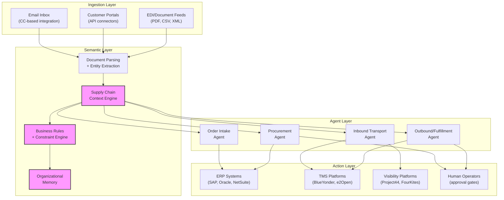

# Glacis — AI Agents for Supply Chain Execution

> [!info] Context
> Part of [[Supply-Chain-Solution-Challenge-Overview|Google Solution Challenge SCM]] deep dive.
> Competitive analysis of Glacis (glacis.com) — an AI-native platform targeting supply chain execution workflows.

## Why Glacis Matters

Supply chain execution is the graveyard of good intentions. Companies spend millions on ERP systems, TMS platforms, WMS solutions, and procurement tools. They configure them meticulously. They train their teams. And then the actual work — the daily churn of processing orders, chasing carriers, matching shipments, following up on late POs — still happens in email inboxes, spreadsheets, and phone calls. The systems of record exist, but the systems of action are humans copying data between screens.

Glacis recognized this gap and built directly into it. Rather than replacing existing enterprise software, they wrap around it. Rather than asking companies to migrate data or change workflows, they read the emails already being sent, parse the documents already being exchanged, and write records into the ERPs already deployed. This is a fundamentally different approach from building yet another platform that demands adoption, and it carries lessons for anyone designing [[agentic-ai|agentic systems]] in complex enterprise domains.

The strategic relevance to [[Supply-Chain-Solution-Challenge-Overview|our hackathon project]] is direct: Glacis is proving that the agent-per-workflow pattern works at enterprise scale, that email is the universal integration layer, and that a semantic understanding of supply chain context is the moat — not the LLM itself.

## Architecture: The Non-Invasive Wrapper

Glacis does not replace anything. This is the single most important architectural decision they made, and it explains their "2 weeks to go live" claim. Traditional supply chain software implementations take 6-18 months because they require data migration, workflow redesign, user training, and system integration. Glacis sidesteps all of that by positioning itself as a layer that sits above and between existing systems.

The architecture has three tiers:

**Ingestion Layer.** The entry point is deliberately low-friction. The primary integration mechanism is email — companies CC a Glacis address on their existing communications with customers, suppliers, and carriers. No API integration required for day one. Glacis reads the emails, extracts structured data from natural language, and begins processing. This is brilliant from a go-to-market standpoint because it requires zero IT involvement to start. A supply chain manager can begin using Glacis by adding a CC address to their Outlook rules. Additional integrations — direct API connections to portals, EDI feeds, document ingestion — layer on top once the basic flow is proven.

**Semantic Layer.** This is where Glacis claims their moat lives, and they are probably right. Raw LLMs can parse an email and extract fields. What they cannot do without context is understand that "the Maersk vessel from Shanghai" refers to booking MSKU1234567 on vessel MSC Anna, which carries three containers for customer Acme Corp under PO-2024-5678, which is already three days late against the original ETA. The semantic layer maintains a graph of supply chain entities — orders, shipments, containers, carriers, facilities, customers, suppliers — and their relationships. When a new email arrives, the system does not just parse text. It resolves entities against the graph, identifies which business processes are affected, and routes to the appropriate agent with full context.

The business rules engine is the second half of the semantic layer. Every company has implicit rules: "Acme Corp POs over $50K need VP approval," "Always use FedEx Ground for East Coast residential," "Flag any shipment from Supplier X that deviates more than 2 days from commitment." These rules are encoded as constraints that agents check before taking action. This is what separates a useful agent from a dangerous one — the agent does not just do what seems right, it does what the business has defined as right.

**Agent Layer.** Four specialized agents, each owning a distinct workflow domain. This is the agent-per-workflow pattern — not one general agent trying to handle everything, but focused agents with deep domain knowledge operating within their scope. Each agent reads from the semantic layer, reasons about its domain, and writes actions back to the action layer.

**Action Layer.** Agents write records to ERPs, update TMS platforms, query visibility providers, and route decisions to humans for approval. The human-in-the-loop design is not a limitation — it is a feature. Glacis explicitly gates high-risk actions (rerouting a $200K shipment, accepting a non-standard order term, approving a new supplier) behind human approval while auto-executing low-risk actions (updating an ETA, logging a delivery confirmation, sending a follow-up email).

## The Four Agent Types

### Order Intake Agent

The order intake problem is deceptively complex. A customer sends an email saying "Please ship 500 units of SKU-A to our Dallas warehouse by next Friday." A human reading that email checks the customer account, verifies the SKU exists, confirms inventory is available, checks the price against the contract, validates the ship-to address, calculates the delivery timeline, and creates an order in the ERP. This takes 10-30 minutes per order and is the kind of work that degrades as humans get tired, distracted, or backlogged.

Glacis's Order Intake Agent automates the full workflow. It parses inbound orders from email, PDF, or portal submissions. It resolves the customer, validates SKUs against the product master, checks pricing against contract terms, confirms inventory availability, validates shipping addresses, and creates clean records in the ERP. Critically, it detects mismatches — the customer ordered SKU-A but their contract only covers SKU-B, the requested delivery date is physically impossible given current lead times, the shipping address does not match any known facility for this customer. Mismatches get flagged for human review rather than silently accepted.

### Procurement Agent

Procurement communication is overwhelmingly email-based, even in 2026. A procurement team sends POs, receives acknowledgments, tracks shipment notifications, handles change orders, and follows up on late deliveries — mostly through email threads with dozens of suppliers. The volume means things fall through cracks. A supplier acknowledges a PO but changes the delivery date in the fine print. A critical component ships but nobody updates the ERP. A follow-up email goes unsent because the buyer was handling three other fires.

Glacis's Procurement Agent monitors the supplier email inbox. It matches incoming emails to open POs, extracts status updates (shipped, delayed, partial fill, price change), updates the ERP, and auto-generates follow-up emails when suppliers miss committed dates. The key capability is PO-to-email matching across messy, inconsistent supplier communication formats. Supplier A sends a formal shipping notification with a tracking number. Supplier B replies to the original PO thread saying "running 2 weeks late." Supplier C sends a PDF ASN attached to a blank email. The agent must handle all three.

### Inbound Transport Agent

Inbound logistics is where supply chain complexity concentrates. A single inbound shipment might involve a factory, a freight forwarder, a container line, a port, a drayage carrier, a warehouse, and a customs broker — each with their own system, their own update cadence, and their own communication format. The [[Supply-Chain-Demurrage-Economics|demurrage and detention]] problem alone costs the industry billions annually because companies lose track of container dwell times across handoff points.

Glacis's Inbound Transport Agent aggregates carrier updates from email, visibility platforms ([[Supply-Chain-AIS-Vessel-Tracking|Project44, Shippeo, FourKites]]), and direct carrier feeds. It matches updates to open shipments, calculates ETAs, and flags risk. The critical differentiator is demurrage and detention risk flagging — the agent monitors container dwell times against free time allowances and alerts operators before charges accrue. This is the same problem space that [[Supply-Chain-Port-Intelligence-Overview|our Port Intelligence project]] addresses, which makes Glacis a direct reference architecture for our approach.

### Outbound / Fulfillment Agent

The outbound side handles parcel, LTL, and truckload shipments from warehouse to customer. The agent monitors carrier tracking, detects delivery risks (weather delays, carrier exceptions, missed pickups), and recommends rerouting when shipments go off-plan. For parcel shipments, this means monitoring hundreds or thousands of packages daily. For truckload, it means managing carrier communication for appointment scheduling, detention tracking, and proof-of-delivery collection.

The rerouting recommendation capability is where the agent pattern proves its value. A human monitoring 500 active shipments cannot simultaneously detect that shipment #347 is going to miss its delivery window, identify three alternative carriers with capacity, calculate cost and time tradeoffs, and present a recommendation — not while also handling the other 499. An agent can, and it can do it continuously rather than reactively.

## Integration Approach

Glacis's integration strategy is a masterclass in meeting enterprises where they are:

| Integration Tier | Systems | Method | Time to Live |
|---|---|---|---|
| Tier 0: Email | Any system that sends email | CC-based, zero IT | Hours |
| Tier 1: ERP | SAP, Oracle, Dynamics 365, NetSuite | API connectors | 1-2 weeks |
| Tier 2: SCM Platforms | BlueYonder, Kinaxis, e2Open, Manhattan | API connectors | 1-2 weeks |
| Tier 3: Procurement | Jaggaer, GEP, Coupa | API connectors | 1-2 weeks |
| Tier 4: Visibility | Project44, Shippeo, FourKites | API connectors | 1-2 weeks |
| Tier 5: Productivity | Microsoft 365, Salesforce | API connectors | Days |

The tiered approach is key. Tier 0 (email) requires nothing from IT. A supply chain team can start using Glacis this afternoon by CC-ing an inbox. This gives Glacis a foothold inside the organization. Once value is demonstrated, IT gets involved to add Tier 1-5 integrations, which deepen the data available to agents and expand the actions they can take. This is a bottom-up enterprise sales motion disguised as a product architecture decision.

The breadth of named integrations — SAP, Oracle, Dynamics, NetSuite, BlueYonder, Kinaxis, e2Open, Manhattan, Jaggaer, GEP, Coupa, Project44, Shippeo, FourKites, Microsoft 365, Salesforce — signals that Glacis is targeting large enterprises with heterogeneous tech stacks. These are companies that have 5-15 systems involved in supply chain execution and no single pane of glass across them. The agent layer becomes that pane of glass, not by replacing systems but by reading from and writing to all of them.

## Enterprise Governance

Glacis positions heavily on enterprise readiness:

- **SOC 2 Type II** — the standard audit for SaaS security controls, independently verified
- **ISO 27001:2022** — information security management, the latest revision
- **GDPR compliance** — required for any European supply chain data
- **Role-based access control** — operators see their workflows, managers see dashboards, admins configure rules
- **Approval gates** — high-risk actions require human authorization before execution
- **Audit trails** — every agent action logged with reasoning chain, input data, and outcome

This governance stack is table stakes for enterprise supply chain — these companies handle proprietary pricing, supplier relationships, and logistics data that is competitively sensitive. But it is also the architectural pattern that makes the human-in-the-loop design work. Approval gates are not just governance theater; they are the mechanism by which the system gradually earns trust. When an agent routes 100 decisions to a human and the human approves 95 without changes, the business gains confidence to move those 95 to auto-execute. Trust is earned incrementally, not declared.

## Competitive Position

Glacis is backed by investors behind Flexport, Databricks, and Perplexity. This investor profile tells a story: these VCs have conviction in supply chain (Flexport), data platforms (Databricks), and AI-native products (Perplexity). Glacis sits at the intersection of all three. The VC backing also signals validation — these are funds that have seen hundreds of supply chain and AI pitches and chose this one.

The competitive positioning against incumbents is interesting. Glacis does not compete with SAP or Oracle — it wraps around them. It does not compete with Project44 or FourKites — it consumes their data. It does not compete with BlueYonder or Manhattan — it orchestrates actions across them. The competitive frame is "the AI layer that makes your existing stack smarter" rather than "replace your existing stack with ours." This is a much easier sale because it does not require a rip-and-replace decision or a multi-year implementation.

## What We Can Learn for Our Project

Glacis validates several architectural decisions that are directly applicable to [[Supply-Chain-Solution-Challenge-Overview|our hackathon project]] and the broader [[Supply-Chain-Exception-Triage-Overview|Smart Exception Triage]] design:

**1. Non-invasive architecture wins.** The wrapper-over-existing-systems approach eliminates the biggest objection to new enterprise software: "We cannot migrate." For our project, this translates to designing agents that read from standard data formats (CSV, JSON, email) rather than requiring custom integrations. The easier it is to feed data into the system, the faster someone can evaluate it.

**2. Email-first ingestion is underrated.** Email remains the universal integration layer in supply chains. Documents, status updates, exceptions, and approvals all flow through email regardless of what systems a company uses. Building an agent that can parse supply chain emails is immediately useful without any other integration. For our hackathon demo, an email ingestion capability would be uniquely demonstrable — send an email, watch the agent process it in real-time.

**3. Agent-per-workflow, not agent-per-task.** Glacis does not have a "parsing agent" and a "routing agent" and a "writing agent." They have an Order Intake agent that does everything related to orders, a Procurement agent that does everything related to POs, and so on. Each agent owns a complete workflow end-to-end. This maps to how supply chain teams are actually organized — by function, not by micro-task. Our [[Supply-Chain-Action-Engine|action engine]] should follow this pattern: agents organized by exception type (delay, quality, compliance) rather than by technical capability.

**4. The semantic layer is the moat.** The LLM is commodity infrastructure. What makes Glacis's agents useful is the supply chain context layer — the entity graph, the business rules, the organizational memory. Without context, an LLM parsing a shipping email is just doing text extraction. With context, it is doing supply chain execution. For our project, investing in the domain model (the [[Supply-Chain-Network-Graph|network graph]], the [[Supply-Chain-Impact-Assessment|impact assessment]] logic, the exception classification taxonomy) is more valuable than optimizing prompt engineering.

**5. Human-in-the-loop is a feature, not a limitation.** Glacis does not apologize for requiring human approval on high-risk actions. They market it as enterprise governance. The graduated autonomy pattern — auto-execute low-risk, flag medium-risk, require approval for high-risk — is exactly the [[Supply-Chain-Graduated-Autonomy|graduated autonomy]] model we are designing. Glacis proves this pattern is commercially viable, not just academically sound.

**6. Speed to value matters more than feature completeness.** "2 weeks to go live, ROI by week 6" is a go-to-market statement, but it also reflects an architectural choice. Glacis chose to be useful quickly (email CC integration, pre-built ERP connectors) rather than comprehensive eventually. For a hackathon, this principle is even more critical — the demo must show a complete, working workflow, not a partially built platform.

## Connections

- **[[Supply-Chain-Solution-Challenge-Overview]]** — Parent overview for this competitive analysis
- **[[Supply-Chain-Pallet-Analysis]]** — Companion analysis of Pallet, covering deep reasoning and memory layer patterns that complement Glacis's semantic layer approach
- **[[Supply-Chain-Exception-Triage-Overview]]** — Our exception triage design shares the agent-per-workflow pattern and graduated autonomy model
- **[[Supply-Chain-Graduated-Autonomy]]** — Glacis's approval gates are a commercial implementation of our graduated autonomy concept
- **[[Supply-Chain-Network-Graph]]** — Glacis's semantic layer is architecturally similar to our supply chain network graph
- **[[Supply-Chain-Port-Intelligence-Overview]]** — Glacis's inbound transport agent addresses the same demurrage/detention problem space
- **[[Supply-Chain-Competitor-Analysis]]** — Broader competitive landscape context for hackathon positioning
